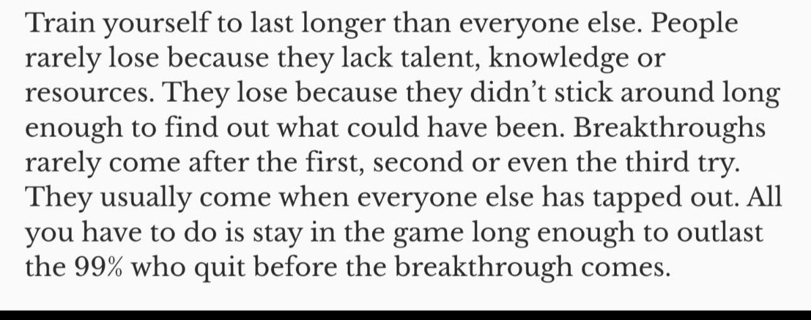
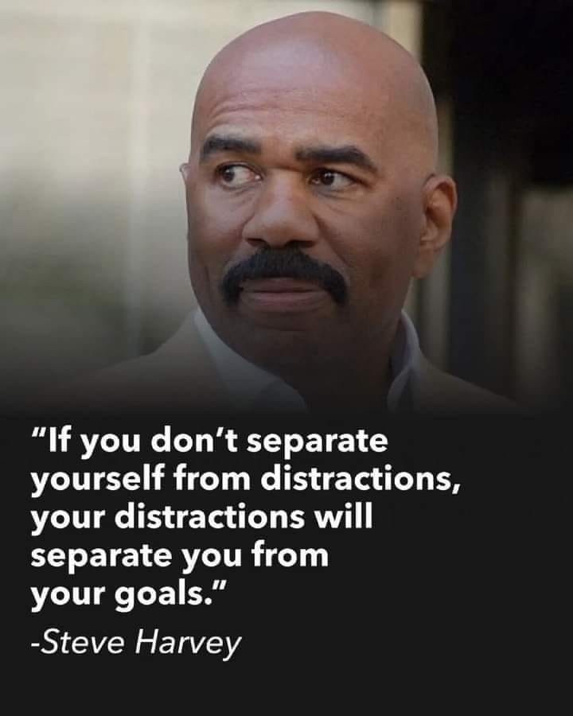
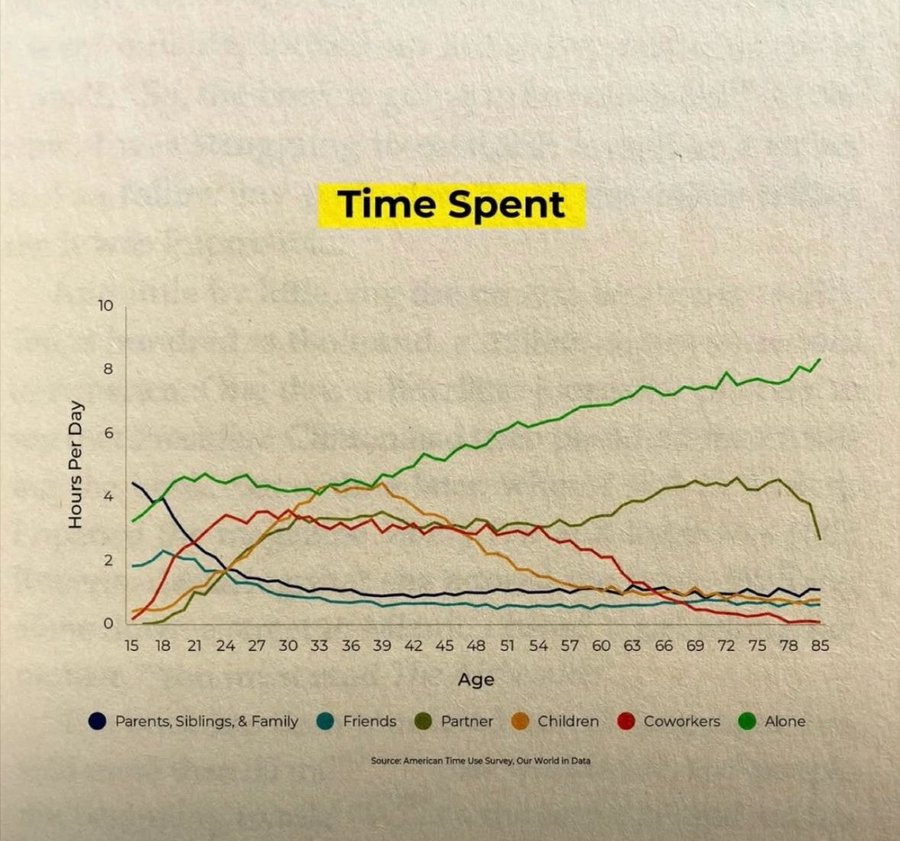
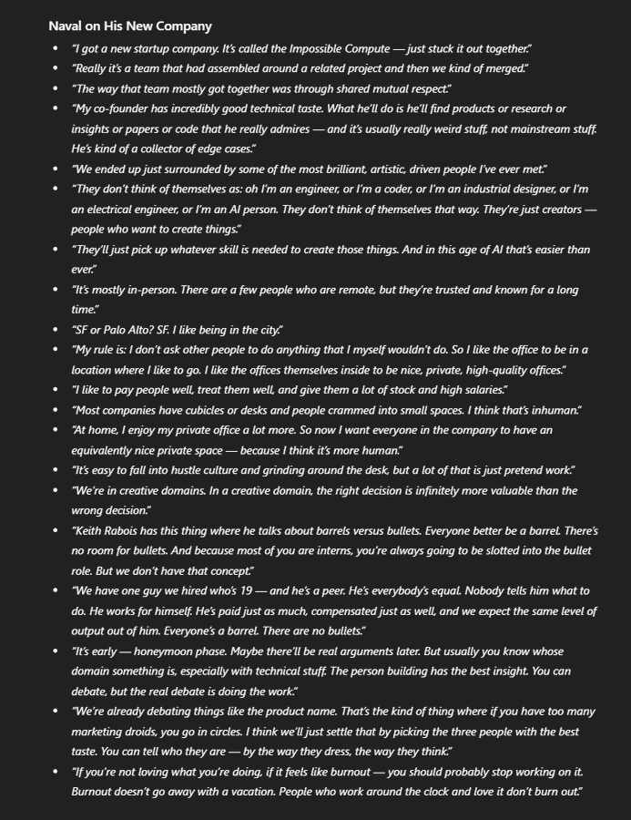

# General Vault

## [Shankar Sharma's Gurus](https://x.com/1shankarsharma/status/1943318848272261630)

I have admired, even revered 🙏, just 3 people in life: Imran Khan, Muhammad Ali, Arnold Schwarzenegger.
Business people & Investors are largely mediocre : one hit product, 1-2 lucky stock picks that made a lot of money. Almost no skill. Largely luck.
But sports? All skill.
My Gurus, as above, have had multiple acts: Immy: greatest all rounder after Sobers, philanthropist via Cancer hospital, politician; Ali: biggest comeback artist ever, after fighting US govt, winning back his crown in boxing old age.
Arnie: greatest bodybuilder ever. Superstar. Politician.

These are my Gurus. They have skill. Almost no enduring luck.
Baki sab tukka kings.

## [Happiness and Focus](https://x.com/JEverettLearned/status/1940952313398808609)

Happiness is highly linked to how focused you are on what you're doing.

A wandering mind is an unhappy mind.


## [What you want](https://x.com/thedankoe/status/1940098937521922213)

Life is hard because you don't know what you want. That's 90% of the battle. Once you have extreme clarity on what you want, after 5-10 calculated risks, everything else is quite simple. If you can reach that before you turn 25, you're in the top 1%.

## [Naval's Advise](https://x.com/naval/status/1254177712945500160)

Fast, lift, sprint, stretch, and meditate.

Build, sell, write, create, invest, and own.

Read, reflect, love, seek truth, and ignore society.

Make these habits. Say no to everything else.

Avoid debt, jail, addiction, disgrace, shortcuts, and media.

Relax. Victory is assured.


## [Last Longer](https://x.com/UmarAshraf/status/1957109481923371114)

One of the best pieces of advice.



## [The Art of Business Wars](https://x.com/Iamsamirarora/status/1880894226835337242)

Finished "The Art of Business Wars"- If you want to read stories about different businesses/companies in an easy to read format, sorted by topics.

It is OhhK.

## [Money Trap & Masa Son's Bio](https://x.com/1shankarsharma/status/1881625679428464849)

Just finished reading Masa Son's bio by @lionelbarber. Good read.
Also read @alok_sama's Money Trap, on his times with Masa. A Liar's Poker style book, well written, even though I had to reach  for my dictionary more than once & I have decent vocab!
Masa comes across as a Tukka - fluke King. Throw a lot of money ( @ near 0 rates too) at futuristic ideas. Some will work. And it is no big deal to evangelize , ie,  " Vision" about EVs, AI, Solar etc.
We have known these themes for 50 years and at some point some will indeed become real, as they have now.
Overall, both excellent reads.


## [Choose Your Problem](https://x.com/tightvcptrader/status/1966719085170868538)

9–5 feels suffocating, freelancing feels unstable.

Single feels empty, relationships feel heavy.

Money problems are hard, managing wealth is harder.

Life is just trade-offs.

Choose the set of problems you can live with.

## [Separate From Distraction](https://x.com/MarketScientist/status/1966338133672505459)

Frame this quote in your mind as soon as possible 😇

This is one of my all time favourite quote & learning in life..

Gratitude 🙏



## [Time Spent Graph](https://x.com/connectgurmeet/status/1965958125657403608)

A friend shared this and it really got me thinking

1. In our teens, we spend max time with family & friends
2. In 30s and 40s, coworkers & children
3. mid-life, our life partner
4. Towards the end there’s a sharp rise in time spent alone.

When u finally have money, assets - u r alone!

Don't ignore friends n family . That blue n green line should remain steady !!



## [Big Filters of Life](https://x.com/ShaanVP/status/1965536032121913571)

the big filters:

- what you put in your body (food)
- what you put in your mind (media/social media)
- who you spend time with (friends)
- what you choose to give a f*ck about (what you let bother you)
- 
```
A better life starts with a better filter. Change who and what you allow into your world, and the peace will follow.
```

## [Naval's Startup](https://x.com/naval/status/1965472901760782366)

Fake news as usual. Better summary of what I actually said:

```
@naval is building a new company, here's a non-clickbait summary
```


https://x.com/naval/status/1972484269567275487

To understand human nature, read the older books. To develop specific knowledge, stay on the bleeding edge, read newer (technical) books.

The best authors - Deutsch, Schopenhauer, Borges, Ted Chiang - write with very high density. The best authors respect the reader’s time.

https://x.com/moneyworks4u_fa/status/1972693430896918847

We live in an era of over sharing our personal lives. Yet I've found that making goals public creates a powerful, positive sense of accountability. It puts skin in the game. As I celebrate my 45th birthday today, these are the five core goals that will define my next chapter:

1) Heath & Fitness: Run a half marathon every year, summit a 6000m mountain, and improve sleep by optimizing my circadian rhythm.
2) Family Bonding: One international trip annually, a monthly date night, and a quarterly weekend getaway with my wife.
3) Business Leadership: Build a second-tier leadership team at Moneyworks4u.
4) Intellectual Pursuit: Master Python programming and learn one musical instrument.
5) Financial Milestone: Hit a nine-figure personal portfolio.

