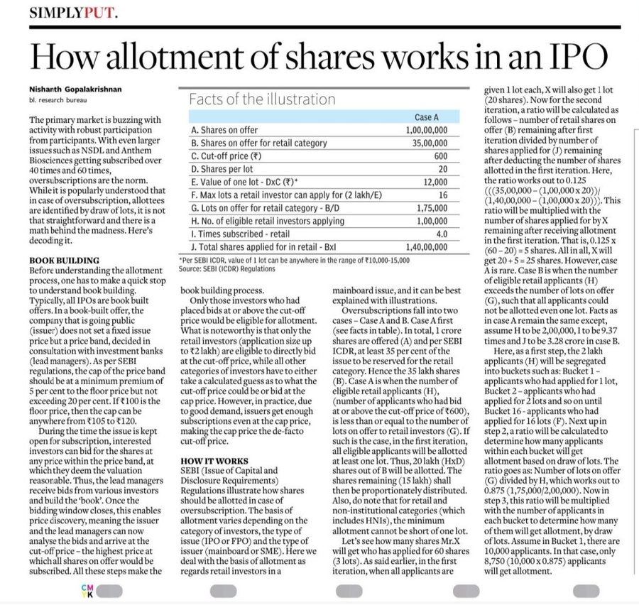
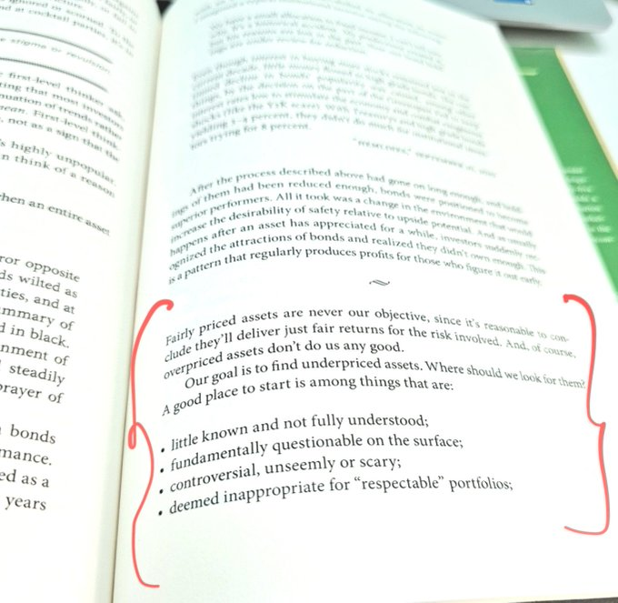
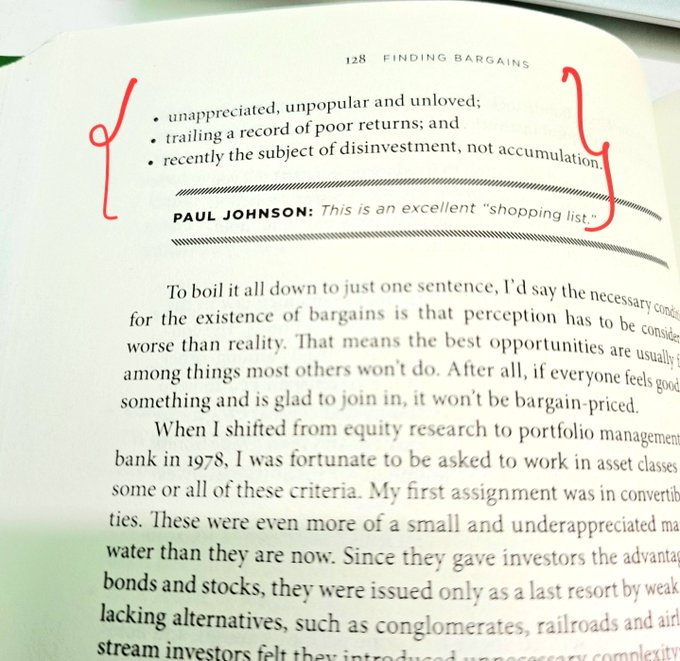
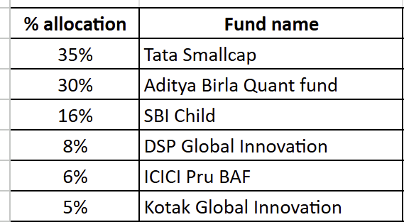
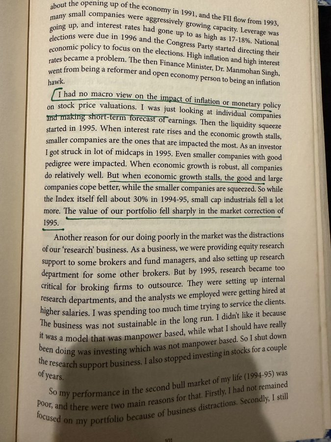

# **Investing Vault**

## [Atul Singh Asan](https://x.com/Atulsingh_asan)
[Long Term Investing](https://x.com/investorniti/status/1937081329822093519)

High and consistent dividend payout companies with no debt on balance sheet is the best bet for long term investment.

Two more additional points :-

No contingent liability and pledge by promoters will give confidence about good corporate governance.
-Regular Dividend payout without debt showing company are earning really without accounting manipulation,

since investor having less information about micro cap , these two points are most significant to watch.

## [Chander Bhatia](https://x.com/ChanderBhatia01)
[Investing Books](https://x.com/ChanderBhatia01/status/1943319838832640502)

Anyone who wants to understand equities and compound his/her wealth, do read these two books and apply in your investing journey-

1- One Up on Wall Street- by Peter Lynch
2- A Wealth of Common Sense- by Ben Carlson.

## [Suresh KBN](https://x.com/SureshKBN)
[Beaten Down Sectors](https://x.com/SureshKBN/status/1954053211016359992)

Sectors and companies really beaten down due to just 1 quarter or one season’s bad performance can easily give 25–30% XIRR over 3 years. 
Funds have already started accumulating. Summer-related stocks are down due to a short summer.

Just imagine if you had picked agrochem and fert stocks after the bad monsoon 2 years ago many have delivered 30%+ XIRR with capex ready.
Just saying who are not active but works at peace.


## [Anand Ragn](https://x.com/anandragn)
[Stanley Druckenmiller](https://x.com/anandragn/status/1953630991773577600)

Stanley Druckenmiller on his mentor, George Soros:
“He taught me to never invest in the present. Visalize 18 months out, that’s where the price will be.”
Building this edge, the ability to see ahead is the game.
Work!

## [Varinder Bansal](https://x.com/varinder_bansal)
[Investment Strategy](https://x.com/varinder_bansal/status/1952965403447099557)

"Always visualize where a company or market will be 18 months ahead, because stock prices reflect future expectations – 'never, ever invest in the present... if you invest in the present, you’re going to get run over' Drunckenmiller

## [Nithin Kamatha](https://x.com/Nithin0dha)
[Position Sizing](https://x.com/Nithin0dha/status/1952690739118571991)

"Druckenmiller: What I actually learned is that position sizing is probably 70 to 80 per cent of the equation. It's not just about being right or wrong, it's about how much you make when you're right."

## [Deven Mehta CFA](https://x.com/devenmehta14)
[Zerodha Tijori Alerts](https://x.com/devenmehta14/status/1949698911708356671)

#Zerodha led @Tijori1
launched alerts last week and it has completely changed how I follow markets! Been receiving timely price and mgmt updates, in the form of summarised 1-pagers with insights and commentary highlighted.

Loving the experience so far! 😍

## [Ujjwal Kumar](https://x.com/ujwal_kr)
[Reading Con Calls](https://x.com/ujwal_kr/status/1957803125009682554)

90% problems of the retailers will get solved if they just start reading concalls of their portfolio companies and learn basic financial modeling and technical analysis.

[Multibagger Stock](https://x.com/ChanderBhatia01/status/1835916760580514265)

If you want 10, 20 or 50 bagger stock-
Be ready for deep research, huge drawdowns, volatility, and holding period of one to two decades.
Life-changing outcomes don’t fall into your lap easily.

[Interesting Data by Devina Mehra](https://x.com/ActusDei/status/1893505478807752767)

Only 17 cos in the entire listed universe have grown their profits every year for the last 10 yrs. 
If you look at 20 yrs, only 1 company has done it. There's no alternative to having a portfolio (multiple bets) - you don't know what will work. 
Interesting study by @devinamehra

## [Arvind Datta](https://x.com/datta_arvind/status/1873765177369538642)
[Valuation Metrix](https://x.com/datta_arvind/status/1873765177369538642)

I would evaluate on two other metrics

2. Mcap to Sales.
2. Mcap to CFO

To get a better view if they are over valued or under valued
PE doesn't give the right measure of valuation

[Free Cashflow Basics](https://x.com/IFB_podcast/status/1886037856314896807)

Free cash flow basics from Aswath Damodaran
Hard to believe this is all free!

## [Utkarsh Singh](https://x.com/Utkarshsingh107)
[Mohnish Pabrai Podcast](https://x.com/Utkarshsingh107/status/1960342918352552353)

“The biggest risk in life is not doing what your heart wants. You need to get your music out.”
“Maximise doing what makes you the happiest and not what makes you the most money.”

- @MohnishPabrai

A must watch podcast - https://youtube.com/watch?v=qgeQ5kMVwRA

## [Vinay](https://x.com/ItsVinay01)
[Best Market Discussion](https://x.com/ItsVinay01/status/1960991627117543908)

One of the best discussion ever.
It may have everything one needs for Markets.
Great work @_soniashenoy
Loved the discussion and even did a lot of Past winners tests to build an understanding.

https://www.youtube.com/watch?v=9rTFDi7NjSg

## [Ashish Kacholia](https://x.com/LuckyInvest_ARK)
[Investing lessons from role models](https://x.com/LuckyInvest_ARK/status/1960930299455660531)

Investing lessons from a legend and one of my role models from early days in market…very deep, witty and light hearted in equal measure

How To BUILD WEALTH With Stock Market! | Ft. Vinod Sethi | KwK #211 https://youtu.be/N_7vYnskFG8?si=wJzpPm_3p5eUxuQD via @YouTube

## [Pankaj Parekh](https://x.com/DhanValue)
[IPO Allotment Process](https://x.com/DhanValue/status/1964525373456339294)

IPO Allotment Demystified:
How Shares Are Actually Distributed Among Investors
From oversubscription to lucky draws — here’s how the process really works.

Source: Businessline



## [Suresh](https://x.com/SureshKBN)
[Other Income](https://x.com/SureshKBN/status/1963994177232056740)

Screener P/E can mislead.
One big ‘other income’ & P/E looks cheap.
Exclude it & valuation doubles.
For examine Izmo

Sometimes P/E looks inflated due to one-off losses  but core business is strong.
Always check operating earnings, not just reported EPS

Any examples ?? 😊

## [Smart Sync Services](https://x.com/SmartSyncServ)
[The most important thing illuminated](https://x.com/SmartSyncServ/status/1963618982952370386)

"A great place to look for bargains is on the pile of things other people won’t touch, because, by definition, their prices embody no optimism."

~Howard Marks

```
Ignored by many, obvious with common sense, that’s where undervalued opportunities hide. 

Read it twice👇
```





[Style Drift in Investing](https://x.com/ishmohit1/status/1966561554100613369)

Late Night Learnings before going to sleep: Style Drift

Investors often get frustrated when their preferred style of investing stops working. This isn’t unusual—it’s something that happens across cycles.

Take bottoms-up investing for example-  An investor may identify multiple leaders in small caps showing strong PAT growth. This framework tends to work well over time. But there inevitably comes a phase when large caps—with slower growth—start outperforming, driven largely by flows and fund hoarding.

In such phases, I’ve noticed many investors drift from their original style. They chase performance, even if it means buying companies at ₹3–4 lakh crore+ market caps—far from where they began.

The reality is: bottoms-up investing comes with lumpy returns. Between 2018 and 2019, there was a 14-month stretch when many quality businesses moved sideways. Those same businesses became super-winners from late 2019 to 2021.

Yet, many who de-boarded the train during the lull never managed to get back on.

The lesson is simple—stick to your process of finding good businesses at reasonable valuations. As a retail investor, time is your biggest advantage. You don’t have to deal with institutional constraints or the pressure of publishing a NAV every day.

Avoid style drift. Stay flexible within your process. That discipline is what ultimately creates convexity in investing...

[Biharilal Interview, Co-founder of Abakkus Asset Managers](https://x.com/sourabhsiso19/status/1976251690631430277)

“You don’t need to chase fancy strategies. The basics, done right and done consistently, build fortunes.”

“Even if you pick stocks with your eyes closed if you stay invested for 10 years, there’s a 97% chance you’ll make money.”

“Value without growth becomes deep value. The real winners are those that grow steadily and stay undervalued.”

“The 15-15-15 Rule: 15% ROE, 15% earnings growth, and below 15 PE simple, rare, and powerful.”

“Mistakes are the best teachers. Our investment philosophy is built on not repeating them.”

https://www.youtube.com/watch?v=HclkE1m7W7w

[Arvind Datta Book Recommendation](https://x.com/datta_arvind/status/1976179791528357935)

The other day in the spaces I had mentioned I will recommend some book to read.
This one is a must read

1. The Little Book that Beats the Market by Joel Greenblatt


(https://x.com/ChanderBhatia01/status/1973000294142259429)

Five of my favourite quotes which I apply in my personal and professional life-

"It only takes a handful of big winners to make a lifetime of investing worthwhile." Peter Lynch

“In the stock markets, a small percentage of people end up being successful in the long run, whereas the majority of people, in spite of being successful in the short run, end up losers in the long run” Parag Parikh

“The bulk of your professional success comes from doing one task exceptionally well.”
From the book “Deep Work”

“The big money is not in the buying and selling, but in the waiting." Charlie Munger

"Anyone who stops learning is old, whether at twenty or eighty. Anyone who keeps learning stays young. The greatest thing in life is to keep your mind young." Henry Ford

Your favourite quote?


https://x.com/moneyworks4u_fa/status/2001583090192556454

My family SIP plan

1/3 in a Smallcap fund
1/3 in an LC/MC heavy multi-factor fund
16% for kids
6% in a conservative fund (substitute for FD/PPF/EPF)
13% in global funds with dynamic multi-country, multi-theme mandates.

For the core funds, the bet is on the fund managers.
For global funds idea is to diversify and get exposure to themes like innovation that don't have adequate representation in Indian markets. Never been a fan of gold, never will be.

Please don't treat this as a recommendation.
This may not be 'the best SIP plan', but it works well for my situation and my mindset.



https://x.com/manishlalwani9/status/1999769521356493250

Thinking fast and slow is one of my fav. Books!
Helped me a lot to recognise and hopefully avoid these bias.

```
Investment Biases (1)

Investing is as much about understanding businesses, analysing numbers/valuations, as it is about mastering our psychological behaviour & biases.

Sharing a few common investment biases, which are very common, do check them out, and share which one dominates your decision.

#biases #investmentbiases #pyschology #investmentframework
```

https://x.com/ishmohit1/status/2001559789332238492

Rajasekhar Iyer on market cycles

