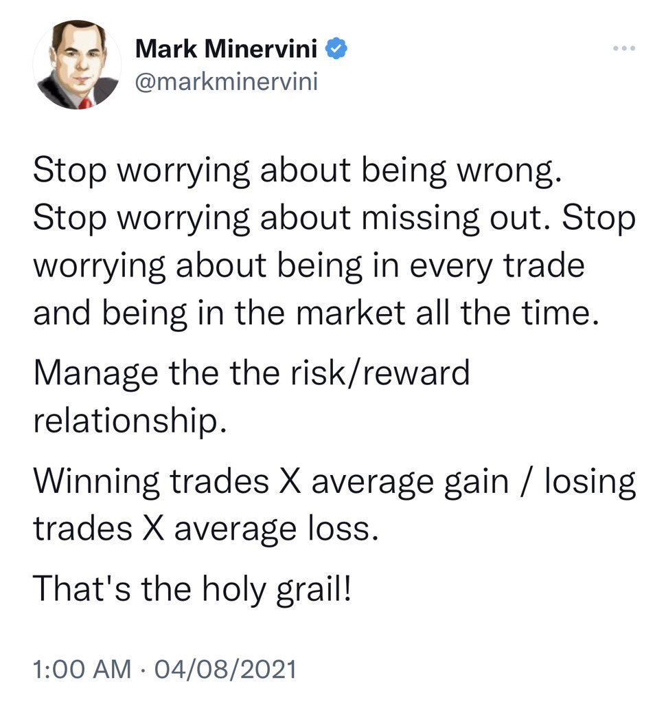
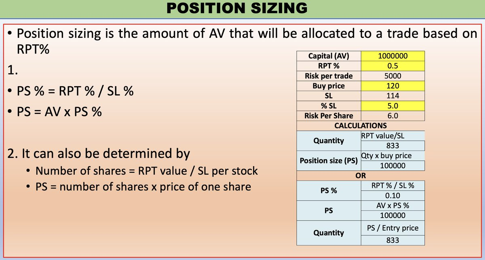
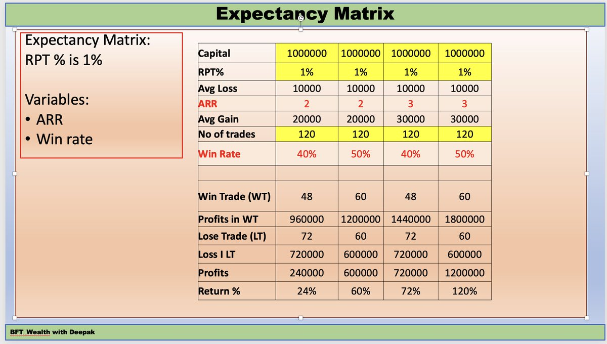
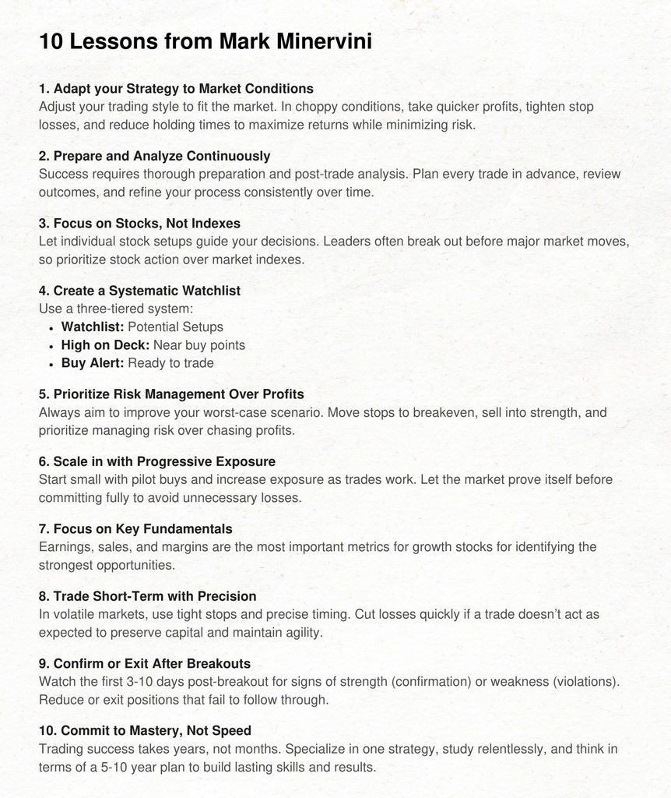

https://x.com/TmarketL/status/1960960842997850601

https://x.com/TheTradeScout/status/1956978956998951093

The tag a trader carries can act as a psychological barrier. If they say they’re a “Swing trader” or a “Momentum burst trader” it is assumed that they’ve to be associated with the daily TF only. I believe it is a restriction people put on themselves.

Swing and MB are just styles of trading. The former is all about trend-following in momentum stocks. Whether one follows the trend by trailing with some moving averages, or price structure, or any other indicators, is their choice. Similarly, momentum burst is nothing but the central tendency of price to move from contraction to fast expansion in the form of back-to-back 3-5 candles.

If we think about it from an open mind and a wider perspective, these methods can be used on all timeframes, be it the daily, weekly or the 1/3min timeframes. If we hide the price & volume labels on the chart of a liquid stock, we won’t be able to find the timeframe of that chart because price action works the same in most cases.

It is your job to find where the market is providing high odds of making money. In which timeframes does it make sense to deploy your style/strategy as per the market conditions. If you are a full-time trader, then you have to make it work. Don’t let anybody stop you from reaching your potential.

Simply find the stocks in momentum (stage-2), wait for low risk entries, follow the trend until it bends, exit on momentum loss. OR, find a pause in momentum, wait for contraction to happen, and play the expansion (burst).

The timeframe you trade on and make money off should not be a limitation until unless your primary job/business or your mental/physical health forces you to stick to the higher timeframes. Explore all possibilities for yourself first, then do what works.

Important note: Trading on the lower timeframes is tough as it requires you to be faster in spotting opportunities and making decisions. But it is not impossible. So many people all over the world are doing it successfully, why can't you? Just be sure to first gain some experience on understanding price behaviour, conduct thorough backtesting/deepdives and then only try intraday, that too with small capital first. Increase capital only when you have proven to yourself that you can consistently make profits.

[Sajal Kapoor](https://x.com/AI_Feb21/status/1956726547924369816)

Opportune time to visit this interaction with @unseenvalue sir.

Via Negativa! Volatility is not a risk!

https://www.youtube.com/watch?v=mnNYHKZwwmU

[Rajiv Khanna Interview](https://x.com/MeetshahV/status/1956742020866695421)

Rare Video of Rajiv Khannaji (Dolly Khanna). 

Must Watch. Sharp Mind full of optimism & energy.

https://www.youtube.com/watch?v=Zv7CMnw2u2g

[Kuntal Shah Interviw](https://x.com/MeetshahV/status/1956399048069640456)

Must watch. Kuntal Shah's rare video on when & how to sell stocks.

https://www.youtube.com/watch?v=IkSedJ52ZzU

[Trading vs Investing](https://x.com/deepakdgy/status/1918762715319066693)

Trading Management
There are more people thriving for trading compared to investing.

Trading can generate higher returns than investing, but still most traders make losses (SEBI & Zerodha broker records),

Q. How many traders work with proper risk management?
A. It may be very few

There is system to be followed for trading:
1. Account Value i.e. capital
2. RPT - Risk per trade, it could be 0.5 to 1% of AV
3. SL % - % of stop loss that is fixed for each trade
   SL% will determine the SL value on buy price,

This will calculate:
a. Position size (PS)
b. number of shares

This calculations shall be applied on full capital that is put for trading..
Determine position sizing with formula given here

How the risk management to be handled?
ARR is matrix for Average Reward - Risk ratio of all trades
WR is matrix for % of winning vs % of losing trades,

Trading always will involve losses which shall be controlled by SL %age,
One can remain profitable even if WR is 40-50% (see slide),
it is very very important to control ARR by average gain & loss per trade,
Run calculations yourself..

[Mohnish Pabrai Interview](https://x.com/anand_rkrishnan/status/1956734052863516741)

Mohnish Pabrai. The surprising truth about doing less and achieving more. Worth a watch.

https://www.youtube.com/watch?v=MZ9JD-3o6FY

[Rajiv Thakkar Interview](https://x.com/ETMONEY/status/1957087899263861085)

If you liked what you read, you can watch the entire podcast here:
https://www.youtube.com/watch?v=A-0_hQ6CMpg

https://x.com/Stockeens/status/1961674016017846727

10 Lessons from Mark Minervini

