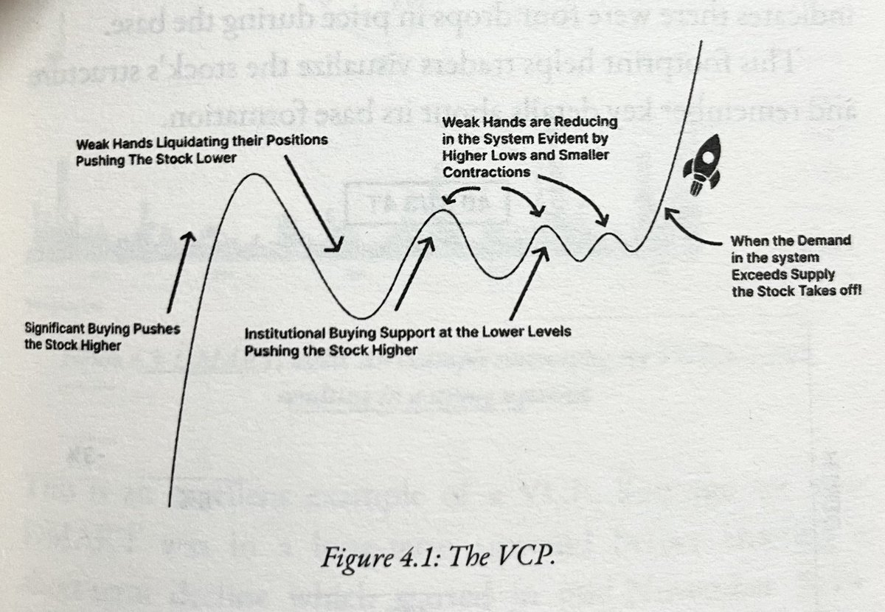
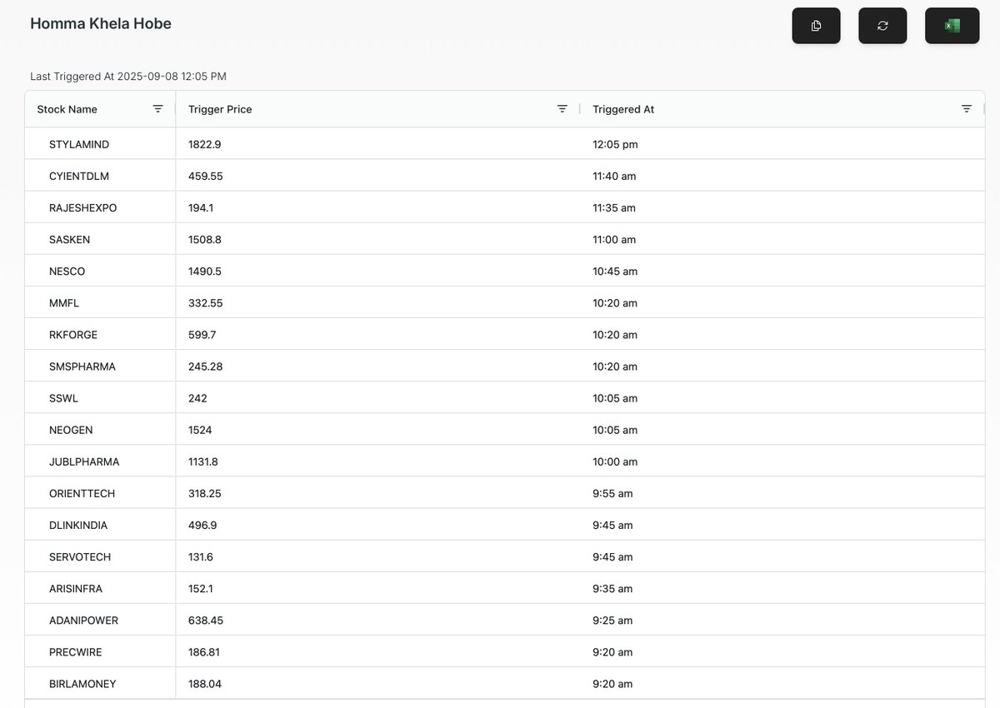

# **Trading Vault**

## Scanning Criteria


## Trading Style


## Recommended Trading Resources

## [Shubham Gupta aka Investorniti](https://x.com/investorniti)
[IPO Trading](https://x.com/investorniti/status/1937081329822093519)

⭐️ IPO TIP :

In a situation, where multiple IPOs flock together, in most of them, listing gains if any, will be limited, unless the IPO is a valuation bomb.

👉In such a case, Keep track of all the good IPOs, listing with lesser gains or below expectation listing.

Out of those, within next 6-12 months, At least 1-2 IPOs will give big breakout & might also double itself in the said duration.

SAVE IT and remember it.


[IPO Proceeds Use](https://x.com/investorniti/status/1944012134645436885)

If IPO proceeds, are used for either...

🔸Debt Repayment or
🔸Capacity expansion

such IPOs are usually attractive by default.

👉 Analysis then falls back to:

🔸Nature of Business
🔸Management Plans
🔸Regulatory Support

If you can get the first two points spot on, you will rarely make mistake in IPO analysis because anyway, 3rd point is not in your hands.

(of course while keeping other things constant like financials, promoter background etc)

Save it. Use it as a theme to analyse IPOs if you do.

#IPOAlert

## [Mohit aka ishmohit](https://x.com/ishmohit1)
[IPO Trading](https://x.com/ishmohit1/status/1936438214367346723)

Simple framework

20-30 Pe or Below 1.5 times Peg

Top 3 in the market it operates in

Clean cash flows

Triggers for growth

Stage analysis + EPS & RS rating

That’s it..

[Screener Screens](https://x.com/ishmohit1/status/1857437243373228465)

Made all these screens at @screener_in
which includes multiple fundamental aspects to filter stocks.

Free to use

https://screener.in/user/145178/

## [The Chartians](https://x.com/chartians)
[+-2 % Range](https://x.com/chartians/status/1933079422862819626)

#Protip #Stocks

Look or stocks not breaking 2 days low.
Looks for stocks that are closing in 2%[+/-] range.

Once the market settles - they will lift off 💚

[Big Money](https://x.com/chartians/status/1942083418520723538)

The "Big money" is waiting for the Trade deal ✅

Without their presence, breakouts will fail, moves will be slow, markets will be choppy.

Don't lose your patience in this phase. Stay calm.

[VCP Pattern](https://x.com/chartians/status/1954565096358760926)

If you’re a swing trader stick to stocks that are following this pattern.

These are the ones most likely to lead the rally when the trend flips.

#StockMarketIndia


[TI (Tilaknagar Ind) - 5 Star Setup ⭐️](https://x.com/chartians/status/1956940236417839538)

+ Prior Upmove
+ Clean consolidation
+ Vol & Price contraction
+ Respect of EMAs

Catalyst : Imperial Blue brand acquisition


[TC 2000 Platform](https://x.com/chartians/status/1665680226909835264)

The Indian markets need a power packed product like the TC2000.

We pay separately for charts
Separately for Intraday data
Separately for live market softwares
Separately for scans
Separately for EOD scans

There is not a single product that offers one stop solution like the #TC2000

Do you have any such software that you use ?

[NSDL Setups](https://x.com/chartians/status/1964962249434616149)

If you have studied past winners, NSDL is doing almost a replica of 2 setups.

#AWL in 2022
#IREDA in 2024

Similar IPO bases and tightness near highs

[Urgency Gaps](https://x.com/chartians/status/1964976757821542564)

Not necessary for stocks. Stocks show urgency via gaps, if they get filled then the urgency is over !

## [Ravi Sharma](https://x.com/StocksNerd)
[Demand/Supply zones](https://x.com/StocksNerd/status/1933029111561130200)

The game gets way easier once you start decoding price structures & spotting those Demand/Supply zones.

It’s no longer just Bars/ Candles on a chart, it’s a conversation between buyers and sellers.

Read it right and you are already ahead of the crowd.

## [Anand Shah](https://x.com/Anand_shah07)
[Play the Market Like Yourself](https://x.com/Anand_shah07/status/1945503416098173238)

The highest chance of consistent success in markets comes from making decisions aligned with your personality—not someone else’s playbook.
This may sound obvious. But in practice, it's incredibly rare.
Most investors don’t lose money because they’re wrong. They lose because they’re out of sync—with the market, with their process, and most importantly, with themselves.
They mimic others. They chase the “smart money.” They adopt strategies that look great on paper but feel terrible in practice. They try to be traders when they're wired to be investors. Or they hold through pain when their temperament screams for exits.
Eventually, something breaks.
Markets are ruthless amplifiers. They expose every crack in your emotional architecture. If you're not built for volatility, it will find you. If you hate being wrong, it will rub your face in it. If you’re drawn to excitement, it’ll tempt you into noise.
The only protection is fit.
You don’t need the best strategy. You need the one that fits your nature.
Are you methodical? Play long games.
Are you intuitive? Build around feel.
Are you impatient? Find faster cycles or stay out altogether.
Are you obsessive? Channel it into research, not revenge trades.
The market doesn’t reward cleverness. It rewards durability. And the only way to stay durable is to be at home in your own process.
So stop trying to win someone else’s game.
Play yours

## [The Spiritual Trader](https://x.com/ArindamPramnk)
[Swing Trading Indicators](https://x.com/ArindamPramnk/status/1944276292477800677)


My indicators are simple for swing trading😍:

1)Exponential Moving Average(20,50,100 and 200)
2)RSI
3)MACD
4)Volume Indicator

☝️I use multiple timeframes that gives me an edge for screening stocks for swing/momentum play and also long term play

💠Monthly and Weekly timeframe breakout is a must for selecting that stock for trade or long term purpose

☝️Here breakout means breaking out important or major resistance level in charts that has not been broken for years sometimes 5-10 years also

☝️Daily breakout confirms that it is ready in short term for entry

👉Keeping stoploss at 7-8% is a must in every swing trade
👉Medium term stoploss must be 15-20%
👉Long term stoploss 40-50%

💠Stocks generally takes time once stoploss hits to again continue rally so better to exit though your selection is good

## [Gaurav Vasshisht](https://x.com/gauravvasshisht)
[Dan Zanger Quote](https://x.com/gauravvasshisht/status/1941280886076604582)

“I test the waters on a lot of stocks that break out, and I probably sell at least 50 percent of them either a minor gain or loss because they aren’t acting the way I want them to. 
It’s just like fishing — you never know when you’ll get a big fish on the line. One thing is certain — if you don’t step in and buy the stock on the breakout, you won’t have a chance to know what you’ve got. So I do a lot of fishing.” - Dan Zanger

## [My Stocks](https://x.com/mystocks_in)
[Trading Journey](https://x.com/mystocks_in/status/1940433967544426539)

At the age of 20 I leave my collage, go for job to support family in 2018,
My first salary was 4500 per month in toyota service centre.

And now in 1.5 Years i made this 👇🥺


In this journey i made many mistakes , my capital in start of 2022 is 7-8 lakhs only then i add some capital also , i learn many thinks in this 2-3 years from my frnds @stocksgeeks @DSS_Rajput007 @stonkssguy @selfunmade

and biggest thanks to my brother @Breakout_trades for supporting many thinks i learn a lot from you. 🥰

## [Trader’s Handbook](https://x.com/yadav_s_tannu/status/1940103779887788518)

The Trader’s Handbook is a must-read for building your trading system & mindset.
My personal part is Risk management n detailed annotated charts & bonus webinars to understand in deep.
Big thanks to the authors @RichardMoglen @TraderLion_ @AmeetRai_ @NickSchmidt_

## [Mathematics and Einstein](https://x.com/ut_mishra/status/1940328745367458143)

Mathematicians and Einstein: “god does not play dice”, there are causes within causes and reasons for everything

Godel: but God doesn’t share  its secrets, and may well keep them hidden forever!


## [Advait Arora](https://x.com/WealthEnrich)
[Multibagger Stocks](https://x.com/WealthEnrich/status/1940237877574861012)

What's your 2x or 3x stock that you are still holding ?


## [Nick Schmidt](https://x.com/NickSchmidt_)
[Watching Market](https://x.com/NickSchmidt_/status/1940035754505224200)

I used to think watching the market all day  gave me more control but now I know it just gives me more time to lie to myself. give me six hours staring at the screen and I’ll turn any chart into a reason to buy or sell.

[Book Recommendation](https://x.com/NickSchmidt_/status/1868789898750443822)
Every trader should read these books.

What would you add?


[Last Week's Low](https://x.com/NickSchmidt_/status/1960518452604526809)

Last week felt like the beginning of a correction until Friday. The last 3 days have been so far positive action.

The more time we spend above last week’s lows increase the odds that it was just a shakeout. And shakeouts arent random, they happen before big rallies.

A lot of leaders have been stalling for the past few weeks which is why despite the indexes going up it’s been harder to make progress… and then we get a week like last week and the selling on top of the no progress makes you get defensive.

Most of the leaders have recovered in 3 days right back into their base and it can’t be ignored because the negative expectations (so far) has been broken.

If it was just a shakeout, then the leaders that we see with big hammer candles last week are coming up the right side of their base and getting ready to rally again.


## [BrkoutGeek](https://x.com/BrkoutGeek)
[How to Become Best in Trading](https://x.com/BrkoutGeek/status/1952646436618645764)

How to Become Best in Trading :

1. Watch One Good Video around a length of 1.5 or 2 Hour
   My Recommendation : @TraderLion_ Youtube Channel

2. Watch 200 Charts which are up more than 20% in a Week and up more than 50% in a month

In 6 Month you will start seeing lot of changes.

## [Lone Stock Trader](https://x.com/LoneStockTrader)
[Reward-to-Risk and Win Rate](https://x.com/LoneStockTrader/status/1948084243982340274)

Important #trading insight:

I’ve reviewed my trades countless times, experimenting with tighter and tighter stops.

The win rate always drops—but the returns always go up, significantly.
That’s because the relationship between reward-to-risk and win rate isn’t linear.

What holds most people back from mind-blowing results is the lack of mental toughness to handle being wrong again and again… me included.

## [Vijay Thakkar](https://x.com/VijayThk)
[Breaking Rules in Trading](https://x.com/VijayThk/status/1947955643018801530)

In Trading & Investing

📉 Breaking rules & losing = Good
📈 Breaking rules & profiting = Dangerous
Why?

Because profit after breaking rules feels rewarding.
But it trains your mind to repeat indiscipline.

In the long run, market should punish rule-breakers that’s healthy.

## [JulianKomar](https://x.com/BlogJulianKomar)

[Managing Winning Trades](https://x.com/BlogJulianKomar/status/1954882750395150799)

Managing Winning Trades: How to Let Profits Run Without Giving Them Back 👇


[10 Clues Institutions Are Buying 👇](https://x.com/BlogJulianKomar/status/1953130212348113118)


[10 Similarities of the Biggest Stock Market Winners in the Last 100 Years 👇](https://x.com/BlogJulianKomar/status/1954942150845542605)


[The Power of Patience in Trading 👇](https://x.com/BlogJulianKomar/status/1959290795451662394)


[The Boredom Trap: Why Trading for Action Destroys Accounts 👇](https://x.com/BlogJulianKomar/status/1966538554722373682)


## [Sakatas Homma](https://x.com/SakatasHomma)

[Sakatas Homma Articles](https://x.com/SakatasHomma/status/1947722876779483576)

Long indepth article on http://sakatas.substack.com

Join 7888 peak traders now, for FREE

https://x.com/SakatasHomma/status/1949776300832604357

The greatest AHA moment of every losing trader who finally turned the corner?

It wasn’t better entries.
It wasn’t more discipline.
It was this:
“I was so obsessed with risk management... I ended up chasing low RS setups. The chronic under-performers, thinking they were 'safe'.”

In trying to avoid pain, they chose mediocrity.

As Merton said:
“The more you try to avoid suffering, the more you suffer, because smaller and more insignificant things begin to torture you in proportion to your fear of being hurt.”

Managing Risk in Bad Market Environments, or in Laggards and expecting to make money is the same as expecting to build a fit body by only doing Bicep Curls.

here is the real heirarchy:


## [Richard Moglen](https://x.com/RichardMoglen)
[2025 TraderLion Conference](https://x.com/RichardMoglen/status/1947032889599943148)

I've put all the 2025 @TraderLion_
Conference streams in 1 place for easy access.

🔁 Retweet and share 🔁

[Trend Template ----Mark Minervin](https://x.com/RebellioMarket/status/1956509689614598303)


[Position sizing](https://x.com/TmarketL/status/1956517721882923128)


Types of correction in market

@thechartist26


[The VCP](https://x.com/Stockeens/status/1959885328967176412)



## [Vijay Marathe](https://x.com/Fintech00)
[Exit First, Analyse Later](https://x.com/Fintech00/status/1879784719291998649)

Despite of strong guidance and expansion
#Yatharth is bleeding.

Despite of strong guidance and good pace of sales growth
#Kalyan is bleeding

No one knows about the company beyong certain things Thats where stop loss comes into play.

Exit first Analyse later

## [Zafar Shaikh](https://x.com/InvesysCapital)
[Index Death Cross](https://x.com/InvesysCapital/status/1877230246354665802)

A potential #DeathCross on the #Nifty500 Index is developing & worth watching

What is a Death Cross?

A Death Cross occurs when the 50-day moving average (DMA) crosses below the 200-day moving average (DMA).

On weekly charts, it's the 10-week moving average (WMA) crossing below the 40-week WMA.

Historically, it has marked the transition from a bull market to a bear market

Key Observations from History
When it Matters: Particularly impactful after a strong overbought bull run.

Outcomes: Such events led to long correction or consolidation phases, lasting anywhere from 37 weeks to 88 weeks.

Exception: The only failure occurred in 2006, when markets continued their uptrend despite the signal.

If the Death Cross is triggered investors should prepare for potential market headwinds.


## [Kaushal Thapa](https://x.com/ChartistEdge)
[Contraction / HTF setups](https://x.com/ChartistEdge/status/1960951352139387083)

The best contraction / HTF setups share the same traits:

🔸Clean up move before consolidation
🔸Tight, compact range
🔸Highs/lows holding strong
🔸Volume dries up in contraction
🔸Breakout comes with good volume

Master these traits & spotting quality setups gets simple🥂


## [Mohit Rai](https://x.com/mohitrai55)
[Manas Arora Trades](https://x.com/mohitrai55/status/1960308636410110357)

📊 I went through all of @iManasArora
2021 𝙩𝙧𝙖𝙙𝙚𝙨 & 𝙘𝙤𝙢𝙥𝙞𝙡𝙚𝙙 𝙡𝙚𝙖𝙧𝙣𝙞𝙣𝙜𝙨 𝙞𝙣𝙩𝙤 𝙖 𝙋𝘿𝙁. 🚀

𝘾𝙝𝙚𝙘𝙠 𝙞𝙩 𝙤𝙪𝙩 👇https://drive.google.com/file/d/1HSu8rHoW7n_vHKZBmw7BAA9VTnjOTKaS/view?usp=drivesdk

Follow @mohitrai55 for more research-driven breakdowns & trading insights 🔥

## [Rahul Punia](https://x.com/itrendfollower)
[Earnings EP](https://x.com/itrendfollower/status/1956761962290831499)

I’ve done deep dives on the biggest winners, IPO bases, news-driven big movers, and Earnings EP.
If you ask me which one stands out, my answer is clear go for "Earnings EP."

It’s been a game changer for me, working like a charm even in this choppy market. 

All credit goes to @PradeepBonde @prabhakarkudva @Qullamaggie

Thanks, Pradeep, for introducing this concept to the trading community.

## [CA Arpit Goyal](https://x.com/Arpit1223)
[Trading Setups](https://x.com/Arpit1223/status/1963890864960225481)

Train your eyes to spot setups like this.

Don't fall in the race of getting most early entry,  people trying that are currently out of the market.


## [Nich Schmidt](https://x.com/NickSchmidt_)
[Biggest Breakthrough](https://x.com/NickSchmidt_/status/1964131045067849741)

My biggest breakthrough wasn’t learning anything new. It was realizing I already knew enough I was just sabotaging myself with unnecessary stuff. I was doing too much and adding complexity when I just had to do less.

[#1: Moving Averages.](https://x.com/RebellioMarket/status/1963287240521527609)


## [Mystocks](https://x.com/mystocks_in/)
(https://x.com/mystocks_in/status/1962097896335331539)

📈If market recover then we this stocks is in priority
bookmark this so you don't to search again and for study. 👇

Priority
Denta Water |  Stallion | Nsdl | endurance | Ssegl

secondary
Acutaas Chemical | Hindware | Vimta Labs | Usha Martin | Nava | Rossell techsys | Jeena Sikho | diffusion | Avl | Godfrey

Fno - Kaynes |  Ab Capital | Cipla | L&T Finance | Dixon

https://x.com/SakatasHomma/status/1964951616433582559

Ather Energy:

As a pozitional + breakout trader,
Homma Khela Hobe's work well.

As choopy stock, PBCs were there as well.

Today another Small Base TBO entry as well.

Have an arsenal that contains all kinds of entry techniques. It will only enhance your trading.


https://x.com/SakatasHomma/status/1964951616433582559

```
Homma Khela Hobe is updated realtime on my website for FREE. Link in bio
```



## [Buy Before Breakout](https://x.com/VCPSwing)

[Earning Table Indicator](https://x.com/VCPSwing/status/1963222728246215156)

Every time I post charts, I get asked about that table 👀
It’s my Earnings Table Indicator — packed with:
• Daily & Weekly MAs
• ADR & ATR
• Bull Snort
• Extensions, Inside Bars, Mini Coils & more

✅ Fully customizable 💯 Completely FREE

I built it for the community. Share so it reaches the right traders 🙌

Trading View Indicator: [https://tradingview.com/script/lOyrYoOX-Quaterly-Earnings-Sectors-Industry-Moving-Averages/]


[Francesco](https://x.com/FranVezz/status/1966591027160002851)

In his @chatwithtraders interview, @Qullamaggie said he grew tired day trading because you're always so close to the danger point - your entry, and your stop.

He loved the freedom of not being at the screen all day, watching every tick. Building cushion, trimming, trailing.

I started as a day trader an experienced the exact same evolution. To me, this is the beauty of being a swing trader.

Took mom to lunch today with my wife and son. Living life, whilst doing what I love. Priceless.

[Jeff Sun, CFTe](https://x.com/jfsrev/status/1966511757910032579)

If you’ve accepted that your win rate will often be below 35% in most months, the only way to consistently finish positive on those months is by having a non-discretionary sell rule to hold onto your winning trades for as long as possible, while also cutting losing trades within a limited -R as soon as possible.

Be patient with the factor of time on winning trades that are very far from your average price. Remember, a chart has both a y-axis and an x-axis, don't be fixated on wanting the upward price movement every single day, it doesn't happen, at least most of the time.

You can always sell some into strength to cushion the anxiety of any potential unrealized profit loss, that's the most beautiful thing about holding them.

```
Buying is relatively easy because you can find tight spots to manage risk, selling into strength is slightly tough but doable as you can sell some at multiple of your R like 2,3,4 
but holding a piece for larger move and trusting extensions or 10MA rule , now that's a whole another level of skill - not conceptually but emotionally cause you see your open P/L, you are feeling excited, 
you are anxious you don't want to give back too much, but this is where you make up for 10-25 losses at once or more , just by trusting the process - TY for sharing in real time Jeff!
```

[SL getting hit](https://x.com/ItsVinay01/status/1965802504236728338)

Why are my trades not working when indices looking strong?

Breadth is strong but my SL getting hit?

How to approach current environments ?

Here is a One stop answer to all the problems 👇👇


[21 EMA Range](https://x.com/PrimeTrading_/status/1966318533798764975)

This is a script we developed and shared for free to give that moving average more context and flexibility, I use a 21-day EMA structure, built from the lows, highs, and closing prices.

This creates a dynamic zone — not just a single line — that helps me visualize trend, momentum, and risk. It gives enough room for natural volatility, while still keeping me anchored to the trend.

Here's the code if you want. Cheers!

https://traderslab.gitbook.io/primetrading/tools/21dma-structure-tv-script


[SME Manipulation by Flippers](https://x.com/srir54/status/1966134056770572549)

#sugslloyd one flipper has 5 lakh position and another now has 5 lakh position


[Twitter Space on Trading Vault](https://x.com/MaiHoonSaurabh/status/1974412243669573951)

This is one of our Best Space Sessions packed with loads of knowledge.

@iDavinderK bhai was very kind to spare time for all and share his experience.

@tightvcptrader did an amazing job Hosting this Space.

Here's the Recording: https://x.com/MaiHoonSaurabh/status/1973756849922166852

https://x.com/stonks_sensei/status/1972705919109578946

This is why 99% of traders never make it:


[Understand Trading](https://x.com/stonks_sensei/status/1953704251831492685)

If you're nothing without trading, you haven't understood trading at all:


[Common Biases](https://x.com/TheOneLanceB/status/2001714080273268785)

One of my favorite common biases and part of why I love the psychology of money.

People greatly overweight costs that are:
explicit | certain | now.

People greatly underweight costs that are:
implicit | uncertain | later

```
The other question is to ask: What are the hidden costs of not paying for something?

No gym membership/exercise -> chronic health issues and doctor/drug costs later on

Don't buy books/courses/education -> miss out on all the upside more skills you would have gotten
```

### [Size in A+ Setup](https://x.com/BrkoutGeek/status/2001646434974875983)

"Your A+ Setup with A+ Entry should have A+ Size"

@TheOneLanceB
somethimes a single line change the way you think about trading and this is that line for me.

Thak you Buddy.

### [IPO Trading](https://x.com/HiteshUnadkat89/status/1997280204579127610)

No #IPO Allotment?
The Real Game Begins After Listing!

Most people think the excitement of an #IPO ends on listing day…

but the Real #strategy actually starts after the listing.
Even without an allotment, you can still capture Good moves —
all you need is the right stock, the right timing, and the right approach.


It’s the post-listing price action that decides which IPO can turn into a future #Multibagger.

I’ve created a complete #PDF with 25 IPO-based setups —
including #Entry rules, #StopLoss placement, #Profit-booking methods,
and exactly how to Trail your #Winners like a pro.

Link Is Here :
https://drive.google.com/file/d/1JeBLmfONQEzUbfw8Jc9R7iNIxTtTbpR8/view?usp=drive_link

If you Find it valuable, don’t forget to #LIKE, #SHARE & #FOLLOW —
your support keeps the knowledge flowing!

 


### [Hiren's analysis of base quality](https://x.com/Charts_Maze/status/2000532549286945192)

How to analyse Base Quality?

Most traders mistake every base with tightness on the right as a feasible setup❌

A clip from @Hirengabani23 podcast, on the kind of price action to look in a base before tightness✅

1 year to this podcast, comment for more from @Hirengabani23 👇

Link to full podcast

https://www.youtube.com/watch?v=au-63eeA8IA

### [Book for Position Sizing](https://x.com/sourabhsiso19/status/2002282240093663622)

Simple Guide to Position Sizing for Trading Success  By Van k. Tharp
A thread 🧵


### [Chartians fav podcast](https://x.com/chartians/status/2000885957239955632)

Personal Favourite podcast so far !

@prvkhvr taking the lead to change the Podcast scene in 🇮🇳 🫡❤️


### [Trade Journaling](https://x.com/Charts_Maze/status/1998726568869507416)

What’s the Trader’s version of repairing nets?

Trade Journalling✅

Stop chasing setups and save your financial & mental capital.

Focus on sharpening your systems instead💯

Try your first journal here:
https://tradejournal.chartsmaze.com/add-trade-book


Tutorial on how to journal👇

https://www.youtube.com/watch?v=re2zTJyJqDg

### [How to grow small account](https://x.com/BasedTrader_/status/1995856864916242604)

High ADR + High RS + Liquidity Rush + MA Undercut + VCP 3T + Double/Triple Cheat Entry is the recipe for growing Small Accounts.

You don't need anything else!


### [Technical Guide to understanding Volumes](https://x.com/Charts_Maze/status/1995006731026620909)

Came up with a blog after long time🤠..

A Technical Guide to understanding Volumes📊

Do checkout👇

https://chartsmaze.substack.com/p/a-technical-guide-to-understanding


## [Hitesh Unadkat](https://x.com/HiteshUnadkat89)

https://x.com/HiteshUnadkat89/status/2004137546234974463

Price moves fast and reacts to emotion,

But Anchored VWAP reveals the true cost basis
showing where real buyers and sellers are positioned,
and where price is most likely to react next.

-Brain Shannon


https://x.com/HiteshUnadkat89/status/2003019737316684159

Risk is the only thing you can control — so control it ruthlessly.

Larry Hite


https://x.com/HiteshUnadkat89/status/2000452704653750583

The best stocks are the strongest stocks — not the cheapest.

William o'Neil


https://x.com/HiteshUnadkat89/status/1999018314211938359

“Tight risk and clean pivots don’t just protect you
they position you for the biggest moves of your career.”

Oliver Kell


https://x.com/HiteshUnadkat89/status/1997600288681984462

“Price shows you WHERE the market is going…
but volume shows you WHY.”

Anna Coulling


