# **Ankur Patel Trading Vault**

## [Ankur Patel](https://x.com/AnkurPatel59)
[Linear Vs Choppy Base](https://x.com/AnkurPatel59/status/1946412429539262607)

Most traders treat every base the same.

But there's a BIG difference between a choppy base and a linear base. One leads to clean breakouts, the other traps you again and again.

Video Out Now - https://youtu.be/zjWXtOKgPAo

[TradingView Layout](https://x.com/AnkurPatel59/status/1940402831560974762)

My Exact TradingView Layout – Tools, Indicators & Setup

Video Out Now -  https://youtu.be/ZZOPvH77QZU

[Day End Trader Interview](https://x.com/AnkurPatel59/status/1954022574821892144)

@dayendtrader shares how he goes from 0% to 100% invested and back.

If you struggle with when to go all-in or all-out, don’t miss this one.

Watch here: https://youtu.be/M-7P848WSLU

[Trading](https://x.com/AnkurPatel59/status/1953770412695072858)


[Sell Rules](https://x.com/AnkurPatel59/status/1953830055794364767)


[4T VCP](https://x.com/AnkurPatel59/status/1952335960693444786)

4T VCP breakout in action - Textbook Setup📚

#Trading


[Lessons from Best Loser Wins](https://x.com/AnkurPatel59/status/1950455546907111662)

#Trading


[Brain Programming](https://x.com/AnkurPatel59/status/1955118309768118340)

Your brain is literally programmed to lose money in markets.

The same mental patterns that make you successful in life will destroy you as a trader.

Mark Douglas figured out how to rewire your trading psychology.

Here are his 10 insights:


[80% Stock Selection](https://x.com/AnkurPatel59/status/1957789286176014468)

Swing trading is 80% stock selection, 20% execution.

These 10 rules are how pros separate winners from the noise.


[#Trading](https://x.com/AnkurPatel59/status/1956366771847377373)


[#Trading](https://x.com/AnkurPatel59/status/1954857827874623580)


[#Trading](https://x.com/AnkurPatel59/status/1955157804492394553)


[#Trading](https://x.com/AnkurPatel59/status/1960988728748659149)


[#Trading](https://x.com/AnkurPatel59/status/1960916192928870657)


[#IPOBASE](https://x.com/AnkurPatel59/status/1961370854744600918)


[Two Brains](https://x.com/AnkurPatel59/status/1963971948251078892)

Every trader has two brains: one that wants to act now, and one that wants to think. Most losses happen when the first brain wins.

Lessons from Thinking, Fast and Slow for traders 👇


[#Trading](https://x.com/AnkurPatel59/status/1963614528567910641)


[#Trading](https://x.com/AnkurPatel59/status/1963599680832438671)


[#Trading](https://x.com/AnkurPatel59/status/1966483936764219836)


https://x.com/AnkurPatel59/status/1965788855430418741

Setups keep repeating. They were there 10 years ago, they are here now, and they will be there 10 years later too.
Market conditions may change, but patterns don’t.

So instead of jumping from one setup to another, just stick to one. Learn it inside out.
Especially when the market is slow or not offering much that’s the best time to sharpen your skills.

Because when the market heats up again, it’s not the “new setup” that will help you, it’s your old one practiced and perfected.
#Trading


https://x.com/AnkurPatel59/status/1965729212683428141

Beyond the Lines

Decoding FACT’s Big base breakout and the liftoff that followed.


https://x.com/AnkurPatel59/status/1965759160303091917

Mark Douglas coached traders for 18 years.

He discovered that trading success is 80% psychology, 20% technique.

Here are his 10 most important lessons:


[#Trading](https://x.com/AnkurPatel59/status/1965426468110082536)


https://x.com/AnkurPatel59/status/1965428378204323922

A lot of people still struggle to build a proper watchlist. Without it, you end up chasing random stocks and missing real opportunities.

Here are a few simple steps  follow them and most of the time you’ll end up with good stocks on your list.

Everything Steps I shared here, I’ve already explained in detail on my YouTube channel.

Watch and Learn.. Good Luck


https://x.com/AnkurPatel59/status/1965441316290224262

Q - How do I know if I’m chasing a stock too late?
It’s so hard to tell when it’s already gone up so much.

A - That’s where base analysis helps you see through the noise.

A stock doesn’t go up in a straight line  it runs, rests, then runs again. These resting zones are called bases. The first two bases usually come early in the trend that’s where the real money is made.

But by the time a stock is building its fourth base, it's already run a long marathon.

At base 1, institutions are loading.
At base 2, smart traders are still early.
Base 3 is where retail starts noticing.
By base 4 the crowd has arrived. The stock's been stretched, the growth’s priced in, and expectations are sky-high. Risk is no longer worth the reward.

People think they're buying momentum.
They’re actually buying exhaustion.

So Move on when you  find a stock at base 4.
It’s already had its party. Don’t be the guy who shows up when the DJ’s packing up.


https://x.com/AnkurPatel59/status/1976268407713456623

How to get Better at Trading ?

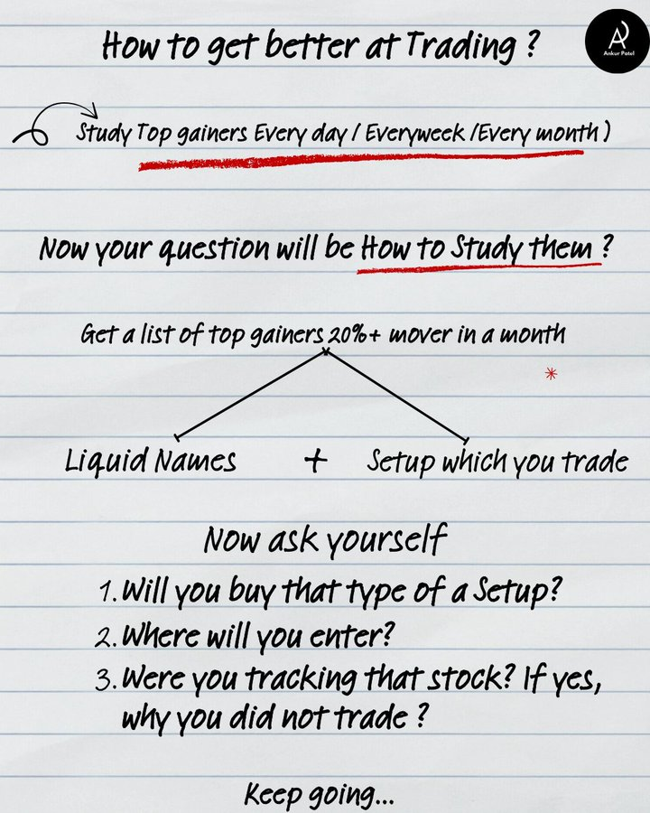

https://x.com/AnkurPatel59/status/1975528531997106648

Took me years to learn this: The difference between winning and losing trades in swing trading isn't the stock you pick - it's when you get in. Day 1 entries changed everything for me.

#Trading

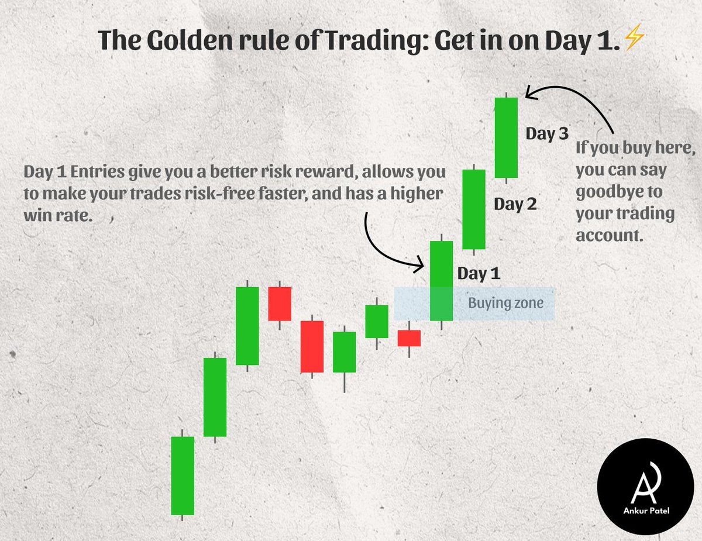

#Trading

https://x.com/AnkurPatel59/status/1975151296245023227

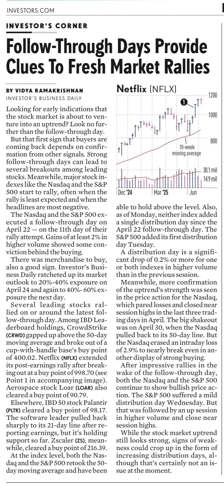

https://x.com/AnkurPatel59/status/1975056187306717544

Confused about when to use your full capital in trading? Read this first

Q: I have capital but I am not using my full capital. Am I doing it right or wrong?

A: When you are just starting out, even if you know some basics and have a setup, I would never suggest using your full capital. The reason is simple. Charts and patterns are easy. The bigger challenge is handling yourself, and that takes time. For some it takes six months, for some one year, and for some people even ten years are not enough.

So my advice is to start with one tenth of your capital. If you have 10 lakhs, keep 9 lakhs aside and trade with only 1 lakh for the first six months or one year.

Q: But why so less? With 1 lakh, how will I make money?

A: The idea is not to make money in the beginning. The idea is to buy yourself time to learn. When you trade for 30 days, 50 days, or 100 days, you start to know two things. First, how the market works. Second, how you behave.

You will learn about sectors, cycles, and rhythms. But most importantly, you will see your own habits. Saying “I will follow my stop loss” and actually following it are two very different things. Trading small protects your capital while you go through this learning process.

If you lose, you lose only from that 1 lakh, not the 9 lakhs sitting safely aside. Your drawdown stays small. And if you are disciplined, you may not even lose the full 1 lakh. Instead, you gain the kind of experience no book or pattern can teach you.

Q: Then when can I start adding the remaining capital?

A: You should add only when you feel comfortable. Trading with 1 lakh and trading with 10 lakhs are two different games. So once you feel you are in sync with the market, once you stop panicking and doubting yourself too much, once you can hold trades properly, then you can add.

But not all at once. If you were trading 1 lakh, increase it to 5 lakhs. Trade like that for some time, maybe 15 to 20 trades. If you are still comfortable, then add more. Step by step you can reach your full capital.

But never start directly with 10 lakhs. Because if the loss is big, the time to recover will also be very big. And that is what you want to avoid.

#Trading

https://x.com/AnkurPatel59/status/1974404435309949235

Your Weekend Learning is here..

https://youtu.be/n-UO-py43Ug?si=2BATcBpKO7O45cj4

```
Market never moves in straight lines it runs in cycles. The mistake most investors make is changing their strategy again & again without knowing when their strategy actually works best.

In this podcast with @pratikpatel939, we go deep into:

https://youtu.be/n-UO-py43Ug?si=2BATcBpKO7O45cj4

Why market cycles (every 3 years, 18–20 month rolling returns) are the hidden key to spotting multi-baggers.
How to recognise frustration phases vs real bull runs.
Why not cutting winners is more powerful than always cutting losses.
How to use simple signals like 52-week highs + con-call reading to find mispriced gems.
Real case studies: TARIL, Force Motors Urbania, Paytm, Reliance Infra & more.

The difference between market perception vs business reality and how that gap creates outsized opportunities.

This episode is full of practical frameworks, real trade breakdowns, and timeless wisdom on conviction & allocation. If you want to stop chasing noise and learn when to play big in markets this one is a must-watch.

#MasterInOne
```


There's a pattern to every explosive move. Every 50%, 100%, 200% runner shows the same signs before it takes off.

The setup is always there. You just need to know what actually matters.

Here's what they all have in common:

1. They're almost always young trends
   The biggest money is made at the beginning of a trend, not the end. You want to catch them fresh off a major base, when the move is just starting to breathe. By the time everyone notices it, you're already in.

2. They respect the moving averages
   Watch how price treats the 10 and 20 EMA - it's everything. The real runners bounce off these levels like they're made of steel. When a stock holds its MAs session after session without violation, that's your tell that big money won't let it break.

3. Volume confirms everything
   The tape tells you who's in control before price does. Massive green bars on the push, then volume dries up completely on any pullback. That’s how you know the big money is interested in the stock.

4. First or second consolidation after the base
   This is where fortunes are made. The initial structure right after a big base breakout is your high probability setup zone. You're early, you're positioned, and if the position works in your favor, the risk reward equation becomes absurdly skewed.

5. Strong follow-through days
   One big green bar means nothing - it could be a trap. But when you see three, four, five days of relentless buying with tight closes near the highs, that's a conviction you can trust. That's when you know it’s actually big money. Don’t ignore such signs.

#Trading

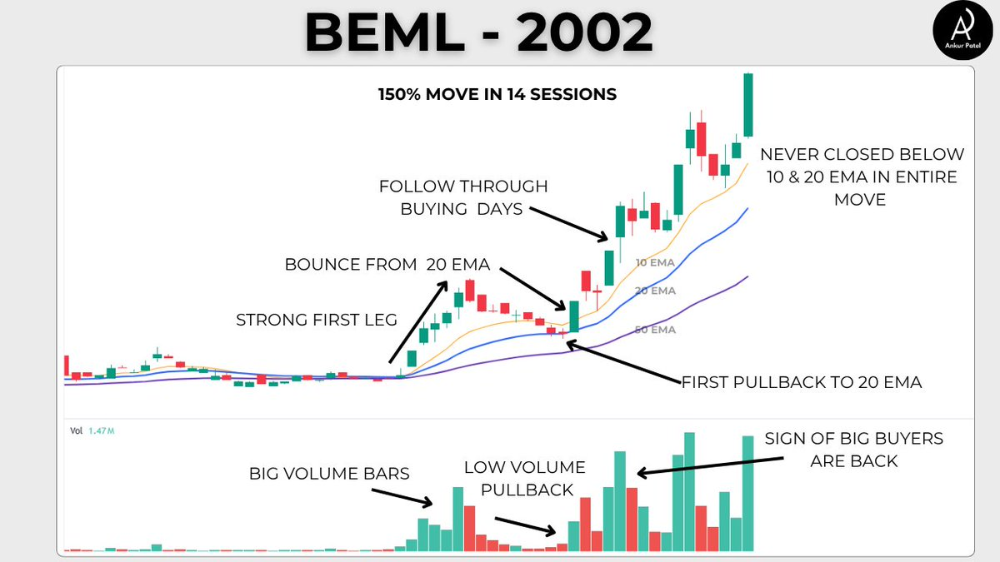


https://x.com/AnkurPatel59/status/1971587060935852427

David Ryan turned $16K into $1.6M in 3 years and won the US Investing Championship 3 times.

Here are the 10 lessons that changed everything.

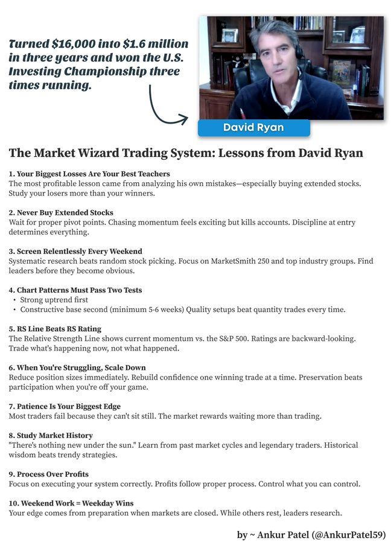

https://x.com/AnkurPatel59/status/2001243222899560462

How did Oliver Kell post a +941% return and win the U.S. Investing Championship? By following ten simple principles without exception.

This guide breaks them down:

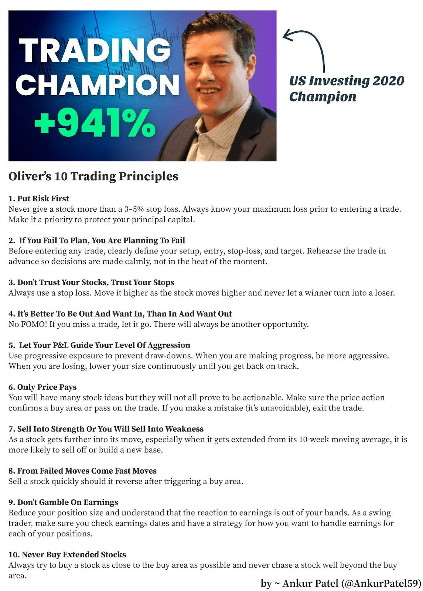

https://x.com/AnkurPatel59/status/2001605610480242855

How to become a top 1% trader:


https://x.com/AnkurPatel59/status/2000880835369762820

Most traders waste time scanning thousands of stocks with no clear criteria.

Minervini's method that helped him generate a 33,554% return over 5 years is different: a systematic 8-point filter that automatically helps you focus only the highest-probability setups.

This framework shows you exactly what to look for.

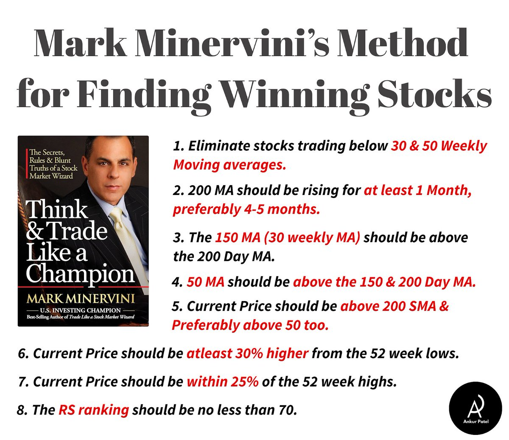

https://x.com/AnkurPatel59/status/2000578090049917069

The secret to growing a small account?

Speed and capital efficiency. Focus on high ADR momentum stocks, execute A+ setups only, cut losers ruthlessly at 2-4%, and scale position size as your account grows.

This one-pager breaks down the five essential pillars:

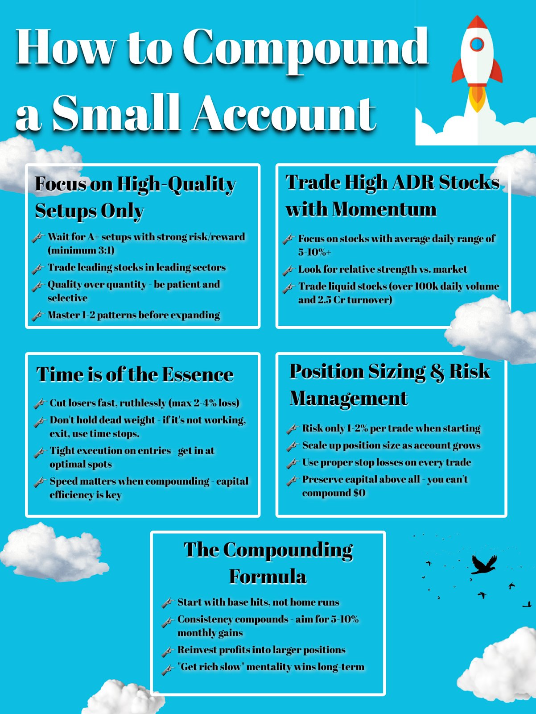

https://x.com/AnkurPatel59/status/2000518447348727981

David Ryan won the U.S. Investing Championship three times not by luck, but by following a disciplined system he learned from the best.

This one-pager breaks down his exact five-rule framework: how to find winning stocks, follow institutional money, size positions based on conviction, and exit before emotions take over.

Proven rules that consistently beat the market.


https://x.com/AnkurPatel59/status/1999077773508534590

Momentum trading simplified — Qullamaggie style.

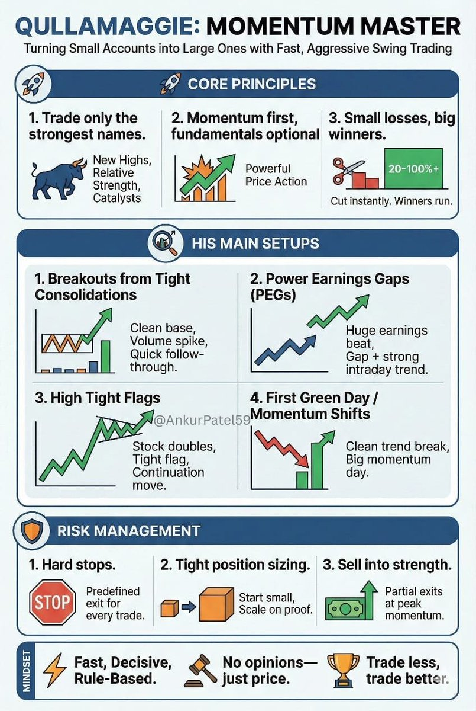

https://x.com/AnkurPatel59/status/1998730520214339821

6 Entry Types Every Swing Trader Should Know

Entries are one of the first things traders learn because they decide when you get involved in a trade. A good setup can still fail if the entry is poor, and a simple setup can work beautifully if the timing is right.

In this writeup, here are six practical entry types every swing trader should know, along with when and why they work.

1. PDH Entry
   Price moves above the Previous Day’s High. It shows strength continuing from the last session.

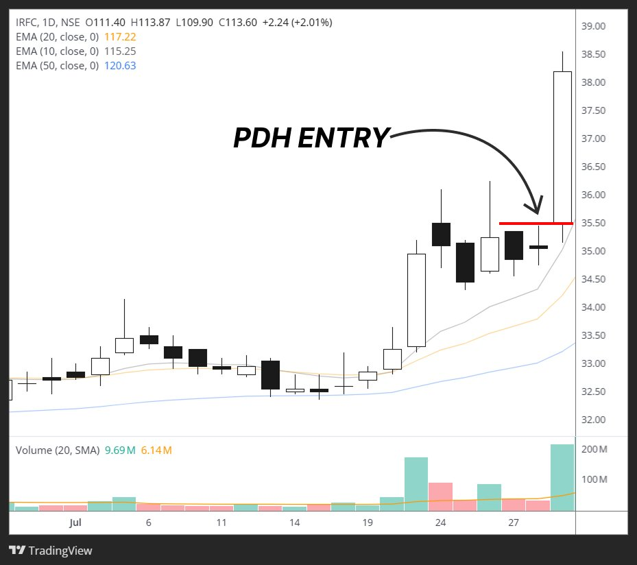

2. Strong Start Entry
   A stock opens well and shows clear strength and high volumes in the first few minutes. After the initial push, a break of any range formation could be used as an entry . Useful in leading stocks.

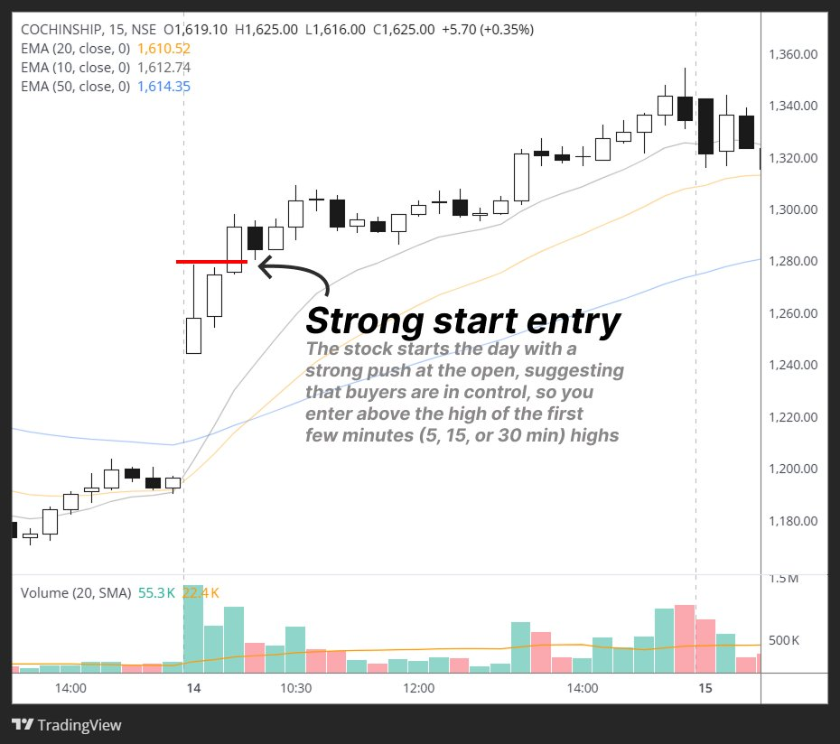

3. Pivot Break Entry
   Price breaks a level that has been rejected multiple times. This suggests sellers at that level are finally out of the way. A clean breakout candle usually confirms it.

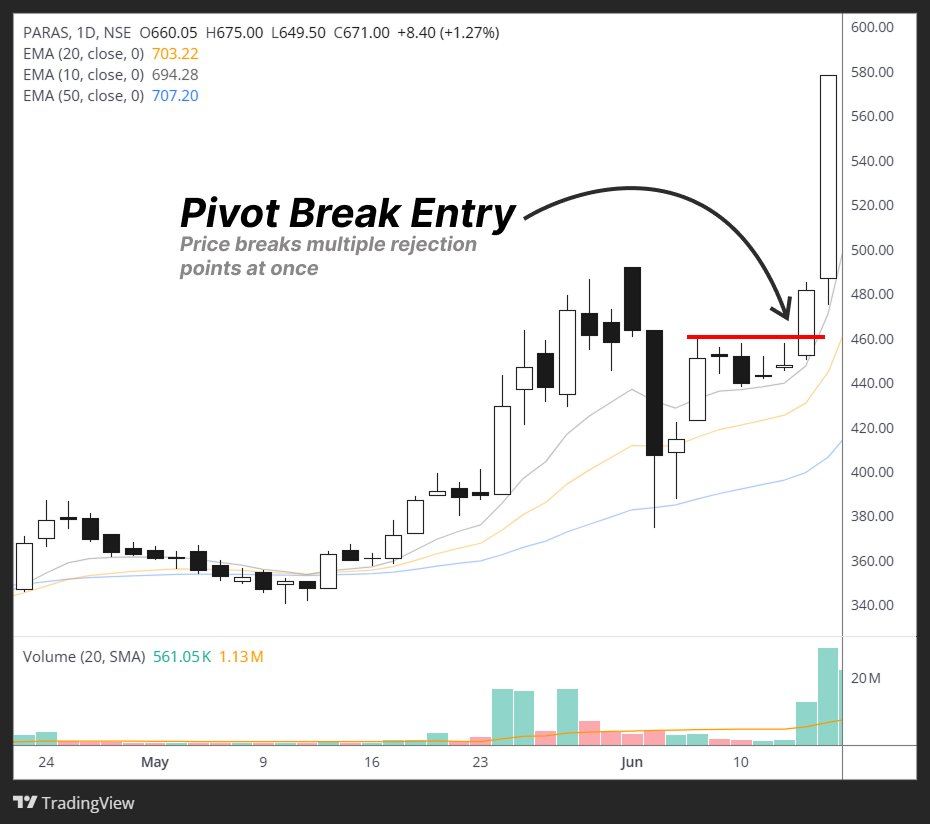

4. Anticipation Entry
   Entering slightly before a breakout, usually inside a tight consolidation on a day where price has gone pretty tight, at EOD. The structure should already be strong so the breakout has a higher chance of happening. Gives better risk–reward.

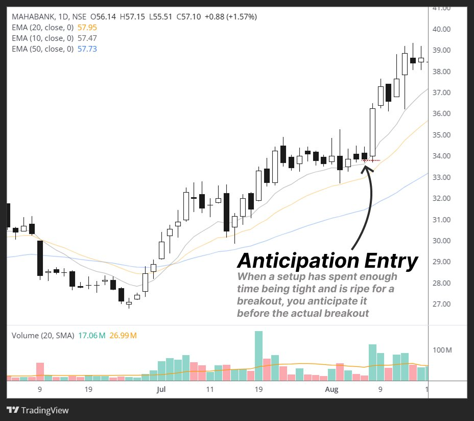

5. Pullback Entry

Buying a stock that’s already leading when it dips to an EMA, trendline, or support zone. The pullback should be controlled, not aggressive.

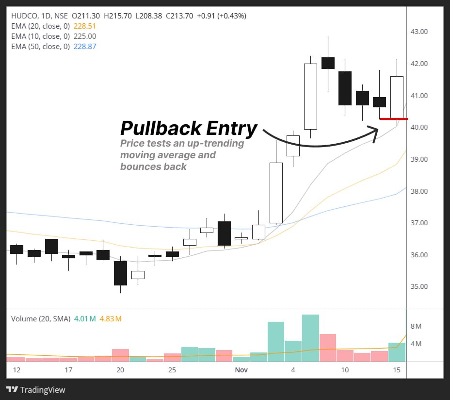

6. Inside Day Entry

Price stays within the previous day’s range, showing contraction. When it breaks the inside day high the next day, it often leads to a clean continuation move.


https://x.com/AnkurPatel59/status/2001967998253367737

Why are the 20 and 50 day moving averages special?

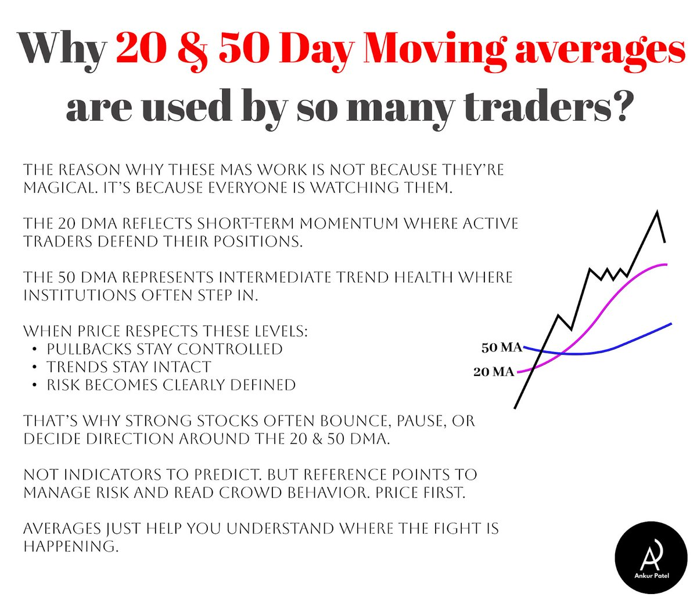