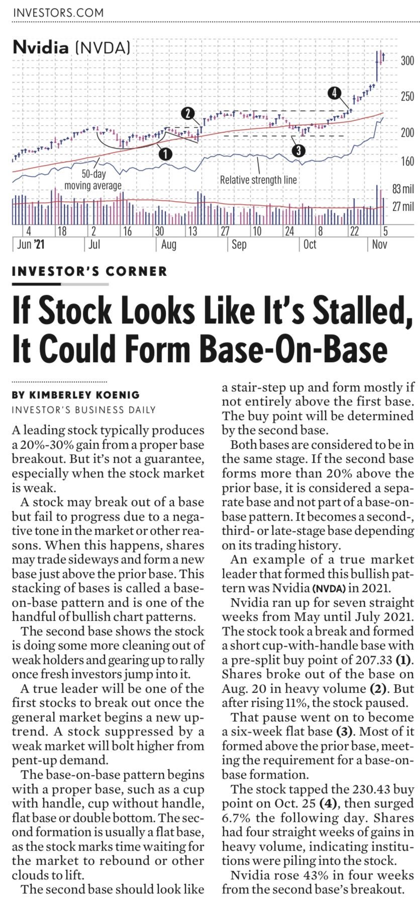

# **Ankur Patel Trading Vault**

## [Ankur Patel](https://x.com/AnkurPatel59)
[Linear Vs Choppy Base](https://x.com/AnkurPatel59/status/1946412429539262607)

Most traders treat every base the same.

But there's a BIG difference between a choppy base and a linear base. One leads to clean breakouts, the other traps you again and again.

Video Out Now - https://youtu.be/zjWXtOKgPAo

[TradingView Layout](https://x.com/AnkurPatel59/status/1940402831560974762)

My Exact TradingView Layout – Tools, Indicators & Setup

Video Out Now -  https://youtu.be/ZZOPvH77QZU

[Day End Trader Interview](https://x.com/AnkurPatel59/status/1954022574821892144)

@dayendtrader
shares how he goes from 0% to 100% invested and back.

If you struggle with when to go all-in or all-out, don’t miss this one.

Watch here: https://youtu.be/M-7P848WSLU

[Trading](https://x.com/AnkurPatel59/status/1953770412695072858)

[Sell Rules](https://x.com/AnkurPatel59/status/1953830055794364767)

[4T VCP](https://x.com/AnkurPatel59/status/1952335960693444786)

4T VCP breakout in action - Textbook Setup📚

#Trading

[Lessons from Best Loser Wins](https://x.com/AnkurPatel59/status/1950455546907111662)

#Trading

Your brain is literally programmed to lose money in markets.

The same mental patterns that make you successful in life will destroy you as a trader.

Mark Douglas figured out how to rewire your trading psychology.

Here are his 10 insights:

Swing trading is 80% stock selection, 20% execution.

These 10 rules are how pros separate winners from the noise.

#Trading

#Trading

#Trading

