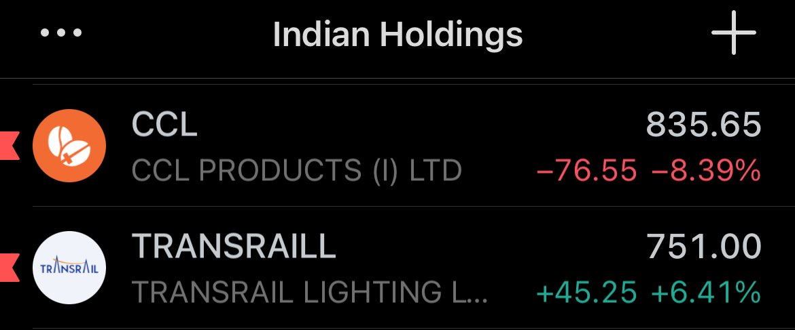
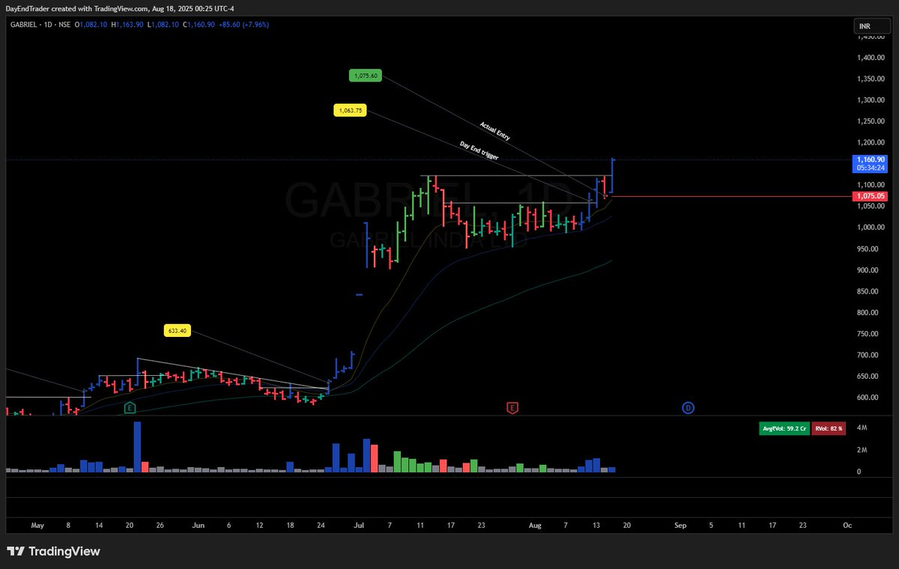
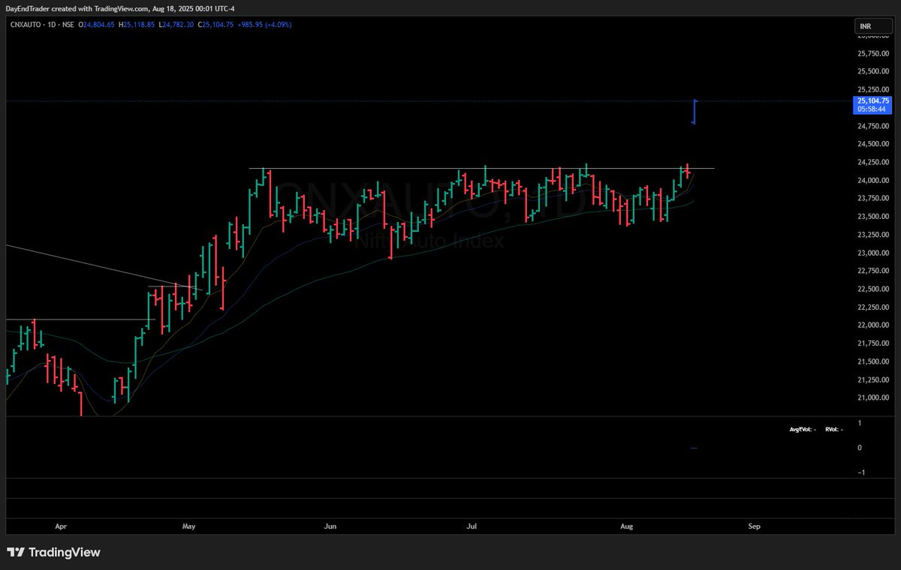
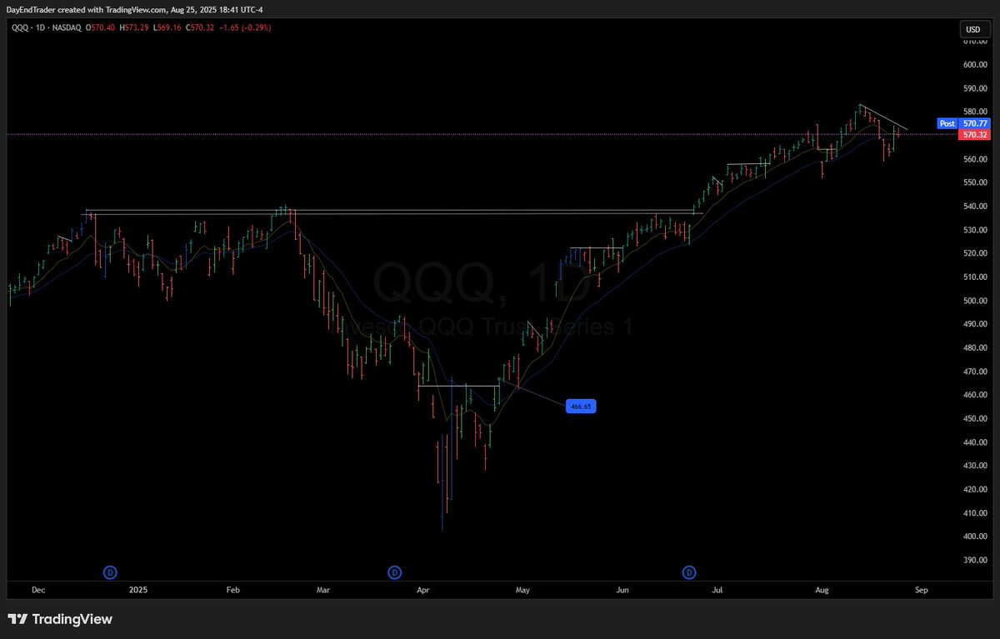

# **Day End Trader Trading Vault**

## [Neel aka Day End Trader](https://x.com/dayendtrader)
[Price have all the answers](https://x.com/dayendtrader/status/1946045641970368542)

What to buy?
Whatever price tells you to buy.

When to buy?
Whenever price tells you to buy.

How much to buy?
As much as risk allows you to buy.

When to sell?
When price tells you to sell.

Price doesn’t simply have all the answers, she is the answer. 🙏

[Powerful IPO Scan](https://x.com/dayendtrader/status/1942725642186805405)

A simple yet powerful IPO screen:
1. MCap > 500cr
2. IPO within one year
3. Volume > 5cr
4. % from 52 Week High < 20%

Only 30 names. Have fun!🙏

[Learning Resources](https://x.com/dayendtrader/status/1845958859355312212)

William O Neil: How to make money in stocks.
Stan: Profiting in bull and bear markets
Qullamaggie Swing Trading Videos
Dan Zanger Newletters (60k pages)
Jim Roppel Videos
Patrick Walker Tweets
@_chartitude
Course/Tweets
Super Performance Stocks Richard Love

[Earning Gamble](https://x.com/dayendtrader/status/1952939481281286456)

Earnings are simply a gamble.
Don’t give in to greed.

[Price is God](https://x.com/dayendtrader/status/1957298207987241346)

Price is God and Gabriel was the archangel with the power to announce god's will to mankind.

[Price is screaming now. Did you listen when she was whispering?](https://x.com/dayendtrader/status/1957291863410360802)

(https://x.com/dayendtrader/status/1960270245139992983)

Moved to massive cash positions as breadth cracked.

Overall 1.5% Capital Lost

Loss making positions: TI, Hirect, ABSLAMC, JG Chem

Profitable positions: Exlerx, Gabriel, Nesco

Exited at or around cost: Vimta, Crizac, Nifty Futures

Notes:
Only 3 green days  post 14th August. After which the market tried going sideways but that has clearly not sustained.

Since the breadth has broken down before it barely got a lift I have booked profitable positions as well so as to protect them and lock in my drawdown.

https://x.com/dayendtrader/status/1960124200644956314

How I study winning groups and capture superperformance (US version)

Although the current uptrend seems far from over it has been around 90 days since the tariff mayhem ended and the market breadth successfully recovered and gave the first buy signal on 23rd and 24th of April 2025.

Let's see what has happened since in different groups and compare it to the benchmark $SPY and $QQQ. FYI: I work with 90 group ETFs that are representative of clear industry groups and liquid enough to trade with ease.

Following are the returns in the past 90 days:
$SPY: 19.5%
$QQQ: 24.5%

It goes without saying that anything that has underperformed the above are clear laggards.
I'll go a step ahead and say anything underperforming the $QQQ can be discounted as well, even if it did outperform the $SPY.

So here goes...

