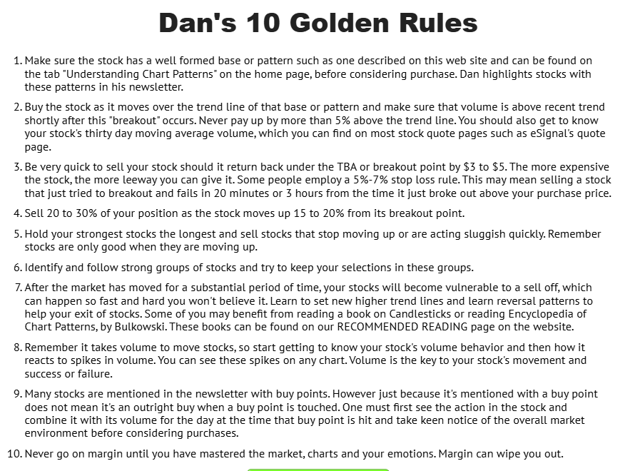
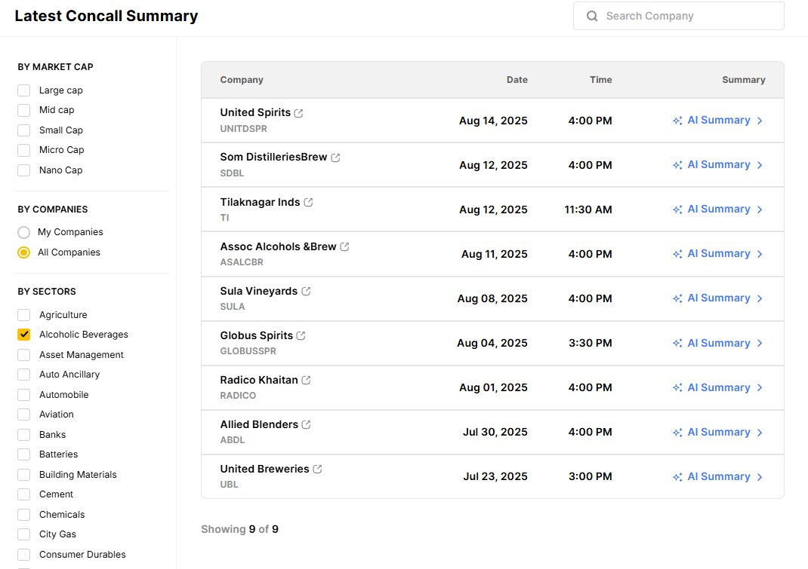
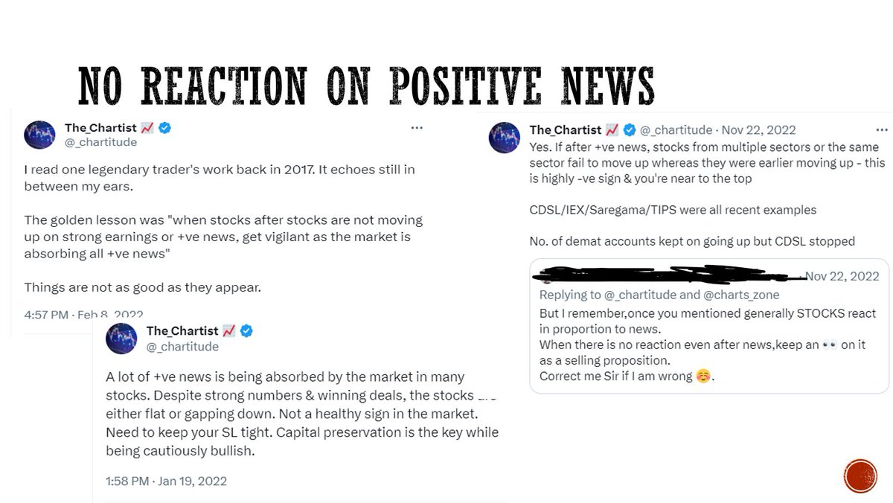

# **Himanshu Sharma Trading Vault**

## [Himanshu Sharma aka The Chartist](https://x.com/_chartitude)

[Earning Charts](https://x.com/_chartitude/status/1936225795011494333)

Not all good earnings will have good charts

Not all bad earnings will have bad charts

It is for you to decide the level of headache you need in your life

[Price is right](https://x.com/_chartitude/status/1936229630584988127)

You need to have your system.

Profit with labor is the bliss. Have a system that eliminates the names, and you independently analyze the rest and take a bet.

If there is a divergence between story and the price - the price is right

[What's Squat](https://x.com/_chartitude/status/1940426112485736744)

Imagine the stock is in range of 96 to 100 for many weeks and it suddenly breaks above 100

Now, if it falls back below 100 without touching 96, and then recovers back to the upside, it is called as a squat

Squat is also called as hard pullback in technical analysis

If during even the base formation, the stock breaks below 96 and within a couple of days, come quickly back above that level on high volume, it is called as a shakeout

Shakeout are also called as bear traps in technical analysis by Sir Richard Schabacker in 1930s

They have been discussed by William Jiler as well in his book - “How chart patterns help you in the stock market”

[Squats and Risk Management](https://x.com/_chartitude/status/1943166215612174756)

I buy a stock as it comes out from its base with a 10% position size keeping base low as SL

If it squats, I trim by half to protect the downside with SL for the rest of the half at the original base low.

If it squats and recovers later, I add back the sold half.

If it falls and hit the SL - I lose 0.5-0.7% per trade.

If it flies high in the air - I have a full 10% size.

[Catch Multibaggers](https://x.com/_chartitude/status/1943106863664632192)

If you want to catch the multibaggers - free advice

Look for earnings surprise.
If you spotted suprise in the previous quarter - then look for the earnings acceleration.

[Clean Charts](https://x.com/_chartitude/status/1940028757143593231)

Analyse clean charts if you are a beginner. Don't intend to draw anything. Price structure or you can say that the law of supply & demand is supreme.

[RS Scan](https://x.com/_chartitude/status/1843890757767422024)

Firstly, I am talking about RS and not RSI.

Secondly, any stock that will move 5-6X will display outperformance compared to the benchmark. This is basic mathematics and will stay forever.

So any stock that has to move 500% will first move 30% and pass the RS scan

[Prepare Chart Database](https://x.com/thechartist26/status/1951483446590840972)

Three ways to prepare your chart database

1. Past winners yearwise (List on @Charts_Maze)
2. Trades of @markminervini @DanZanger , model books by @TraderLion_ and many others
3. Your own trading journal and printout of your own trades

[Dan's 10 Golden Rule](https://x.com/thechartist26/status/1951629302220349683)

This....

[About Day End Trader](https://x.com/thechartist26/status/1954714300947554724)

I came across @dayendtrader in 2022 and it has been a journey full of learning with him. Tonnes of calls to discuss the system.

Must see this interview. That’s years of refinement.

https://x.com/_chartitude/status/1877761226769412266

Appreciation post

After I returned to India, I started teaching here as well and in the process came across brilliant sharp minds like
@simatricks @igauranggandhi @VPA_trader @dayendtrader @TheChartKnight 
@mukeshchauhan @Triyambak_CA @narang_gp @SailorTrader03

and many more I can’t even recall all of them
Most of them have been doing exceptionally well. Many I keep on learning from in some closed groups.

[Faulty Base](https://x.com/thechartist26/status/1957067767795847483)

Mark Minervini called this trade a faulty base.
Any idea why?
And why I never posted about Anant Raj breakout

https://x.com/thechartist26/status/1961248620331839695

This one feature by @Tijori1 gives me a quick summary of the entire sector by reading a few concalls

[Risk Management Class](https://x.com/thechartist26/status/1961061091406143845)

Just in case you are new to following me:

I have a free class on Risk Management on my website.

[Module of Course](https://x.com/thechartist26/status/1963471121195696370)

This is just one slide of what I teach in the module

[Trade the price](https://x.com/thechartist26/status/1963464990683529299)

Just one message: Trade the price & not the news

Price and volume is the only truth and that makes money

[Gap Filling Process](https://x.com/thechartist26/status/1965266943268749789)

Gap filling is a two-step process

Merely closing is the first step. the next is to have a strong follow-through which IOLCP is doing now

But that Gap filled 3 times. Are we taking it that every BO attempt makes the resistance weaker?

https://x.com/thechartist26/status/2000752173765026182

