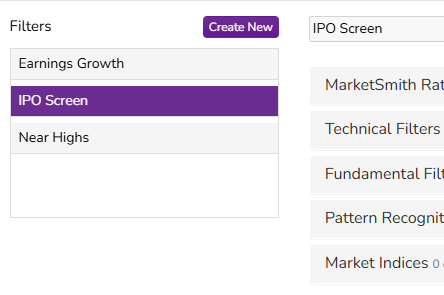
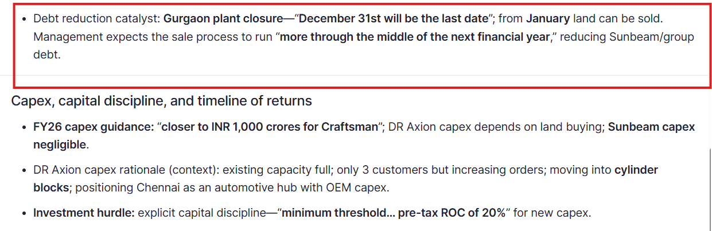
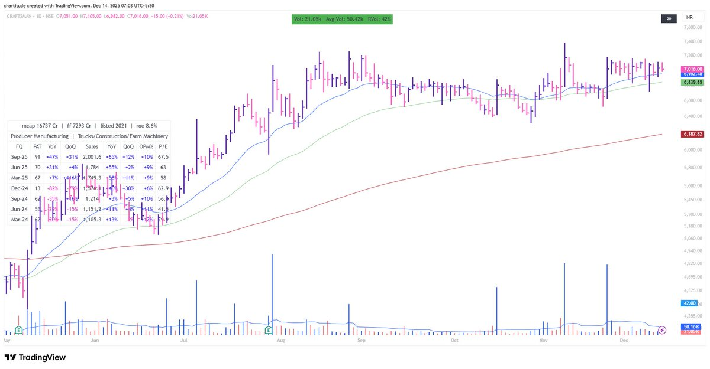

## Scanning Criteria

[Buyable List](https://x.com/_chartitude/status/1931337683059568904)

First I run EPS scan. Looking for the stocks that have earnings or RS scan that has good technical charts

Then I see which one is immediately buyable and put that to the buyable list/focused list

Preference: Mcap = 1000-10000 cr
Sector/Industry - bunch of stocks tell me that

For instance in April 2nd week - GRSE, Cochin, Mazdock told me there is something in Defence

After that I read the basics of the business and finalise a few names

[Catch Multibaggers](https://x.com/_chartitude/status/1944205493590794284)

If you want to catch multi-baggers - you need just three scans:

EPS
Relative Strength
IPO stocks (listed within a year)

That’s it

More than this will create a lot of overlap with hardly a fewer uncommon names & a lot of confusion

Keep it simple

[Price Volume and Earnings](https://x.com/_chartitude/status/1931294280208777473)

I still guarantee you that this is the only thing you need

Price, volume & earnings with a catalyst

You give this on platter to anyone & he/she will still need some more scanners & some more names.

The issue is not in the process but in the discipline. Thats why hardly a few succeed.

No one is here to learn the process but just interested in the stock names. :)

[Filtering Tools](https://x.com/thechartist26/status/1965387708056174896)

ChartsMaze and Market Smith India

```
Which site do you use for filtering stocks.. you have mentioned before ... Forgot to note down...
```

https://x.com/thechartist26/status/2001870841412489330

Just 3 screens that I run everyday



https://x.com/thechartist26/status/2002265396548915362

I use ChartsMaze, but when the market is really weak, and I have to check the whole CANSLIM for a stock, nothing beats the layout of MS.

It feels like playing cards in a nearby park on a sunny day. You got a lot of time.

```
I thought you use Chartsmaze
```

https://x.com/thechartist26/status/1999749951010824429

No

But I do see smoothness of previous run and range of those moves

I guess most of the stocks I trade will have less ADR at the time of buy as they come from long consolidation or tightness

I believe many of them will see increasing ADR

```
Do you use ADR% or something like that? Not for checking volatility per say , but to go with stocks with high range of movement.
```

https://x.com/thechartist26/status/2000016400363225522

Craftsman Automation -

Only if the daily chart is buyable, I zoom out to see on the weekly scale to check where the price is. If the weekly is also having lesser overhead supply - i look forward to reading the business for a few minutes to glance for a catalyst.

Sometimes, it is mentioned clearly.

the first thought is - what is that catalyst that will change something ahead because with the current speed - the chart can not be buyable like this.

 

