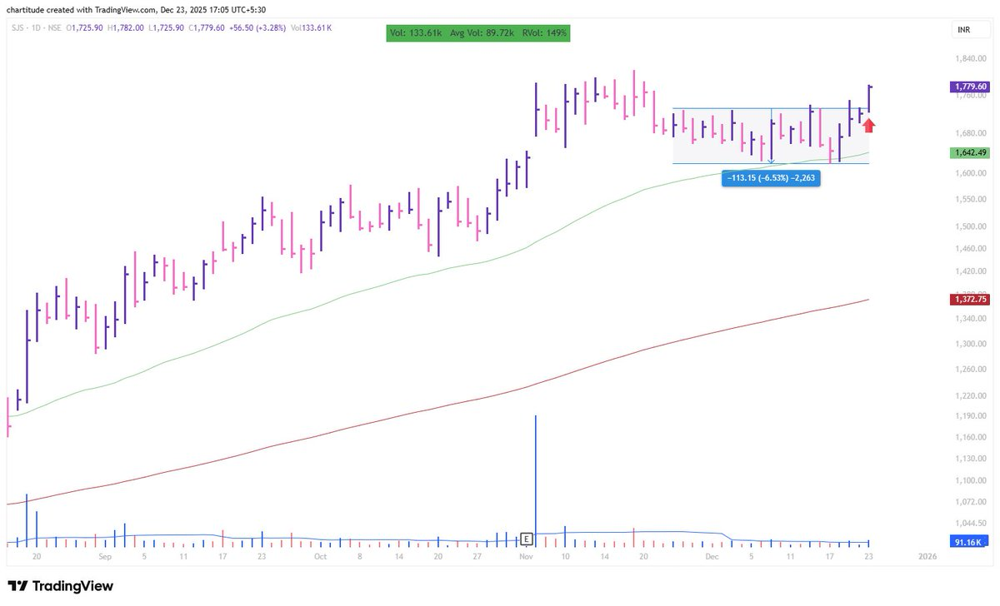
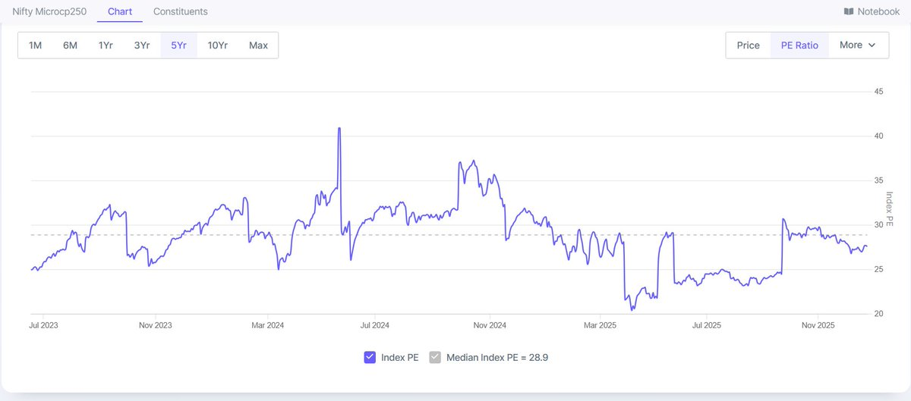

## Trading Style

[Trading Rules](https://x.com/thechartist26/status/1964246135712969000)

Max trades 8
%risk 0.5% to 1
Risk reward minimum aim 5
Yearly return - no expectation
```
Pls Answer these
1. How many trades are generally open at one point of time?
2. In each trade how much % of portfolio risk do you take?
3.Minimum risk reward you keep?
4.What’s your yearly returns target?
5.What’s your avg holding period?
```

[Selling Winners](https://x.com/_chartitude/status/1932448173060165847)

Never sell your winner in one go if it is above your buy price

Sell in the parts


[Beginner Trading Process](https://x.com/thechartist26/status/1976306856919241182)

If you are a complete beginner

Learn the zone of supply and demand equilibrium, which is often called as consolidation zone on the chart

Look for the stocks consolidating in a tight range

The consolidation range should be less than 5 to 6% and the stock should have a prior uptrend

Select the stocks that are close to their highs and from the strong sector

Buy the stock as it comes out of the consolidation zone by risking not more than 0.25% of your capital on a single trade

Place your stop loss near the consolidation zone low

Keep on repeating the process, till you are comfortable with it

You will fail miserably, if you end up, deciding how much the RBI will cut the rate or just in case you want to be the mediator in Russia-Ukraine war


[1/4 entry system](https://x.com/thechartist26/status/1975181925959823518)

For the stock that has not yet broken out, but I intend to take an entry based on anticipation - I buy 1/4 of the total position size that is permissible

The permissible position size is dependent on where I place the stop loss

If the SL is 4% deep, the maximum permissible position size is 25, so I will take 6.25% position size in anticipation

```
Please elaborate on your 1/4 entry system
```


[Buying Process](https://x.com/thechartist26/status/1971438968584667563)

My buying process

https://open.substack.com/pub/thechartist/p/buy-rules?r=tv3fh&utm_campaign=post&utm_medium=web&showWelcomeOnShare=false

21, 50 and 200 EMA
```
Which are these 3 MA?
```


[Buying Dip](https://x.com/_chartitude/status/1933365984007500001)

Free advise

If you want to buy the dips - switch to the weekly charts so you can see one higher swing low being made whenever a stock turns back up after the dip and you can buy it.

[Not Using RSI](https://x.com/_chartitude/status/19326344201646370660)

I don't use RSI.

If there are too many stocks meeting my criteria, firstly, there are not many that are immediately buyable as my criteria to look for in a chart is strict.

Smooth upmove and then some consolidation, OR long base, or some gap filling.

Out of these 12-15 setups - I come down to 7/8 and then buy the ones in the order of the breakout

https://x.com/thechartist26/status/1998582004963750106

One day bounce doesn’t change anything unless confirmed by a strong follow through

This is a typical bounce after an oversold reading

The main thing I am looking for, is the stock setups that meet my criteria, and unless I see a lot of of them, breaking out and following through, I won’t be aggressive. In this process, I have practised a lot over the years to control my FOMO, so there is no FOMO as such.

In order to make money, I need a healthy market and not just a market where the higher probability itself is dicey


https://x.com/thechartist26/status/1996213407171985593

It depends on a lot of factors

Number one factor is if the range is pretty long of over 14 to 15 trading days without hitting my stop loss, and in this case, I try to trim my position by half if I have another opportunity

If I don’t have any other opportunity, and the existing name is not troubling me at all, but not moving to the upside as well. I tend to stick with it.

Now all this depends on market condition as well. If the market is healthy and the trade is not moving up for as I said 14 to 15 days, I generally move on to the next name and in some cases, I trim half even before 14 days.

So to summarise, I have a time stop being a swing trader

```
@thechartist26
if the stock remains range bound without hitting the SL, how you handle it?
```

https://x.com/thechartist26/status/2003429775457796342

If the whole base is less than 6-7% deep - I am ok with it

```
If you exclude last 3,4 days, the consolidation quality or SJS doesn’t seem clean to me..am I wrong here? Asking for learning purpose
```



https://x.com/thechartist26/status/2004163541377699900

Chapter 18, How to make money in Stocks by William O Neil

```
Investment without SL ??? Doesn't quite sound like your trading style. Please clarify sir
```

Below  PE 25 - I will start picking this Microcap 250 in my portfolio

Below PE 21 - I will be a blind thief here.

I am invested right from the start till now



https://x.com/thechartist26/status/2003614210887123257

Two or three times you will give back all the gains you made and will realise the pain of winning back. Nothing else can teach the importance of process.

No book can ever shape up the psychology than to see your stocks fluctuating. Automatically with experience the market teaches what matters. You will be over FOMO by making losses & by giving everything back what you made

```
Many setups fly without coiling that gives me fomo and when I take entry in anticipation it trfgers SL. 
What to do?
```
Free advice:

Don't force the trades. Let the setup come to you.

You will see a lot of setups. No point going in for low-grade buys

