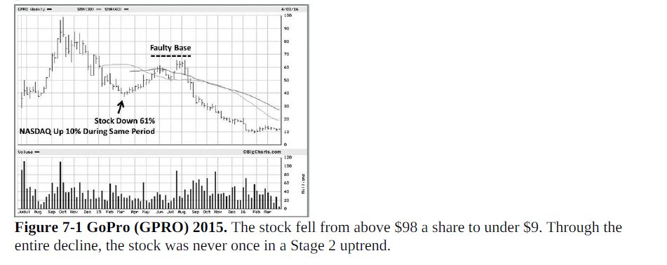

# **Himanshu Sharma Trading Vault**

## [Himanshu Sharma aka The Chartist](https://x.com/_chartitude)
[Earning Charts](https://x.com/_chartitude/status/1936225795011494333)

Not all good earnings will have good charts

Not all bad earnings will have bad charts

It is for you to decide the level of headache you need in your life

[Price is right](https://x.com/_chartitude/status/1936229630584988127)

You need to have your system.

Profit with labor is the bliss. Have a system that eliminates the names, and you independently analyze the rest and take a bet.

If there is a divergence between story and the price - the price is right


[Buying Dip](https://x.com/_chartitude/status/1933365984007500001)

Free advise

If you want to buy the dips - switch to the weekly charts so you can see one higher swing low being made whenever a stock turns back up after the dip and you can buy it.

[Not Using RSI](https://x.com/_chartitude/status/19326344201646370660)

I don't use RSI.

If there are too many stocks meeting my criteria, firstly, there are not many that are immediately buyable as my criteria to look for in a chart is strict.

Smooth upmove and then some consolidation, OR long base, or some gap filling.

Out of these 12-15 setups - I come down to 7/8 and then buy the ones in the order of the breakout

[Selling Winners](https://x.com/_chartitude/status/1932448173060165847)

Never sell your winner in one go if it is above your buy price

Sell in the parts

[Price Volume and Earnings](https://x.com/_chartitude/status/1931294280208777473)

I still guarantee you that this is the only thing you need

Price, volume & earnings with a catalyst

You give this on platter to anyone & he/she will still need some more scanners & some more names.

The issue is not in the process but in the discipline. Thats why hardly a few succeed.

No one is here to learn the process but just interested in the stock names. :)

[Buyable List](https://x.com/_chartitude/status/1931337683059568904)

First I run EPS scan. Looking for the stocks that have earnings or RS scan that has good technical charts

Then I see which one is immediately buyable and put that to the buyable list/focused list

Preference: Mcap = 1000-10000 cr
Sector/Industry - bunch of stocks tell me that

For instance in April 2nd week - GRSE, Cochin, Mazdock told me there is something in Defence

After that I read the basics of the business and finalise a few names

[What's Squat](https://x.com/_chartitude/status/1940426112485736744)

Imagine the stock is in range of 96 to 100 for many weeks and it suddenly breaks above 100

Now, if it falls back below 100 without touching 96, and then recovers back to the upside, it is called as a squat

Squat is also called as hard pullback in technical analysis

If during even the base formation, the stock breaks below 96 and within a couple of days, come quickly back above that level on high volume, it is called as a shakeout

Shakeout are also called as bear traps in technical analysis by Sir Richard Schabacker in 1930s

They have been discussed by William Jiler as well in his book - “How chart patterns help you in the stock market”


[Squats and Risk Management](https://x.com/_chartitude/status/1943166215612174756)

I buy a stock as it comes out from its base with a 10% position size keeping base low as SL

If it squats, I trim by half to protect the downside with SL for the rest of the half at the original base low.

If it squats and recovers later, I add back the sold half.

If it falls and hit the SL - I lose 0.5-0.7% per trade.

If it flies high in the air - I have a full 10% size.

[Catch Multibaggers](https://x.com/_chartitude/status/1944205493590794284)

If you want to catch multi-baggers - you need just three scans:

EPS
Relative Strength
IPO stocks (listed within a year)

That’s it

More than this will create a lot of overlap with hardly a fewer uncommon names & a lot of confusion

Keep it simple

[Substack Inc](https://x.com/_chartitude/status/1943496791128969667)

@SubstackInc is the great tool for reading about the companies while travelling

Please let me know the top blogs you follow over there

[Newsletters Compilation](https://x.com/_chartitude/status/1942405283415810316)

⭐️⭐️⭐️ For the interested learners

The December-March 2025 compilation of the newsletters for the learning purpose is now uploaded on my website

http://chartitude.com

You can download the attachment & take a printout

Please give your valuable feedback as well.

[Reading Books](https://x.com/_chartitude/status/1940632023124922546)

If you are an investor - read Stan Weinstein

If trader - two books by Mark Minervini


[Trader Lion Conference](https://x.com/_chartitude/status/1946751765640102089)

You must watch all the days of
@TraderLion_
conference by now

Free resource & hear out from a lot of participants their own perspective of the market

If you still ask in another 6 months - where should you start - you admit you’re lazy

[Trader Lion Conference](https://x.com/_chartitude/status/1940911923719295319)

@TraderLion_
conference is just about to start

For any beginner - this is one of the best free resources to learn from the greats. Thankful to the team to democratise the financial education beyond the borders.

Make the maximum use of it.


[Catch Multibaggers](https://x.com/_chartitude/status/1943106863664632192)

If you want to catch the multibaggers - free advice

Look for earnings surprise.
If you spotted suprise in the previous quarter - then look for the earnings acceleration.

[Clean Charts](https://x.com/_chartitude/status/1940028757143593231)

Analyse clean charts if you are a beginner. Don't intend to draw anything. Price structure or you can say that the law of supply & demand is supreme.

[Dan Zanger's Letters](https://x.com/_chartitude/status/1948034881633812704)

Dan Zanger’s letters will be the goldmine for the upcoming generations forever.

85,000+ pages & still counting

No jargons
Simple lines drawn on the stocks with good earnings or relative strength

Pure wisdom


[RS Scan](https://x.com/_chartitude/status/1843890757767422024)

Firstly, I am talking about RS and not RSI.

Secondly, any stock that will move 5-6X will display outperformance compared to the benchmark. This is basic mathematics and will stay forever.

So any stock that has to move 500% will first move 30% and pass the RS scan


[Prepare Chart Database](https://x.com/thechartist26/status/1951483446590840972)

Three ways to prepare your chart database

1. Past winners yearwise (List on @Charts_Maze)
2. Trades of @markminervini @DanZanger , model books by @TraderLion_ and many others
3. Your own trading journal and printout of your own trades


[List of Books](https://x.com/thechartist26/status/1951154138768875669)

Original account @_chartitude is hacked.

I am writing again the list of books that one should read as a beginner in trading/investing.
@InvestmentBook1 might share the link with you for them.

1. How I made 2,000,000$ in the Market by Nicolas Darvas - any cover you find on Amazon is ok. This book covers the basics, so you'll need to read it multiple times.
2. You can still make it in the market by Nicolas Darvas - here, he will explain in detail his concepts.
3. How to Make Money in Stocks - William O Neil
4. Trade Like a Stock Market Wizard by Mark Minervini
5. Thing and Trade Like a Champion by Mark Minervini
6. Secrets for Profiting in Bull & Bear Markets by Stan Weinstein
7. Two books on Jessie Livermore

Reminiscences of a Stock Operator
How to Trade in Stocks

In 2022 I wrote a blog on Substack mentioning all the books

https://open.substack.com/pub/thechartist/p/books-recommendations?r=tv3fh&utm_medium=ios

[Past trades of Mark Minervini](https://x.com/thechartist26/status/1950814421032575015)

Past trades of Mark Minervini (not compiled by me)

https://puzzled-savory-63c.notion.site/24fb0b88f4fc42248d726505dad2b596?v=a426b5c5100149a88150fc6fe13649c1

Bookmark and RT for others

[Chartitude Learning](https://x.com/thechartist26/status/1952615979516563751)

65 hours+ of learning over here with more than 100s of doubts


[Dan's 10 Golden Rule](https://x.com/thechartist26/status/1951629302220349683)

This....


[About Day End Trader](https://x.com/thechartist26/status/1954714300947554724)

I came across @dayendtrader in 2022 and it has been a journey full of learning with him. Tonnes of calls to discuss the system.

Must see this interview. That’s years of refinement.

https://x.com/_chartitude/status/1877761226769412266

Appreciation post

After I returned to India, I started teaching here as well and in the process came across brilliant sharp minds like
@simatricks @igauranggandhi @VPA_trader @dayendtrader @TheChartKnight 
@mukeshchauhan @Triyambak_CA @narang_gp @SailorTrader03

and many more I can’t even recall all of them
Most of them have been doing exceptionally well. Many I keep on learning from in some closed groups.

[David Ryan Interview](https://x.com/_chartitude/status/1865732266153869677)

1,379% Return in 3 years | Interview with David Ryan | 3X US Investing C... 
https://youtu.be/ZK5cnVQ2V3Q?si=Vvcnci3aeDUu0V2D via @YouTube

The only interview I have watched almost 5X By @TraderLion_
Keep it simple

https://x.com/_chartitude/status/1825306968984113352

A great resource to learn

Model Books

```
‼️ Study the biggest winners this weekend 🚨

Model Books from the past 6 years from @TraderLion_👏

2018
https://traderlion.com/checkout-2018-traderlion-model-book/
2019
https://traderlion.com/checkout-2019-traderlion-model-book/
2020
https://traderlion.com/checkout-2020-traderlion-model-book/
2021
https://traderlion.com/checkout-2021-traderlion-model-book/
2022
https://traderlion.com/checkout-2022-traderlion-model-book/
2023
https://traderlion.com/checkout-2023-traderlion-model-book/
```

[Free Webinar](https://x.com/thechartist26/status/1957405456646783099)

Recording available for the Free Webinar held on "CMT Examination" details

You can see it over here: http://chartitude.com >> Start Learning >> after signing up for it.


[Faulty Base](https://x.com/thechartist26/status/1957067767795847483)

Mark Minervini called this trade a faulty base.
Any idea why?
And why I never posted about Anant Raj breakout



https://x.com/thechartist26/status/1961248620331839695

This one feature by @Tijori1 gives me a quick summary of the entire sector by reading a few concalls


[Risk Management Class](https://x.com/thechartist26/status/1961061091406143845)

Just in case you are new to following me:

I have a free class on Risk Management on my website.

[Trading Rules](https://x.com/thechartist26/status/1964246135712969000)

Max trades 8
%risk 0.5% to 1
Risk reward minimum aim 5
Yearly return - no expectation
```
Pls Answer these
1. How many trades are generally open at one point of time?
2. In each trade how much % of portfolio risk do you take?
3.Minimum risk reward you keep?
4.What’s your yearly returns target?
5.What’s your avg holding period?
```

[Module of Course](https://x.com/thechartist26/status/1963471121195696370)

This is just one slide of what I teach in the module


[Trade the price](https://x.com/thechartist26/status/1963464990683529299)

Just one message: Trade the price & not the news

Price and volume is the only truth and that makes money

[Categories of breakouts](https://x.com/thechartist26/status/1966741149470912938)

Written a short and crisp blog on

Categories of breakouts and which one I prefer to hold

http://chartitude.com

Newsletter No 86 is uploaded now


[Filtering Tools](https://x.com/thechartist26/status/1965387708056174896)

ChartsMaze and Market Smith India

```
Which site do you use for filtering stocks.. you have mentioned before ... Forgot to note down...
```

[Gap Filling Process](https://x.com/thechartist26/status/1965266943268749789)

Gap filling is a two-step process

Merely closing is the first step. the next is to have a strong follow-through which IOLCP is doing now

But that Gap filled 3 times. Are we taking it that every BO attempt makes the resistance weaker?

[Dan Zanger Free Charts](https://x.com/thechartist26/status/1964920916678426651)

To those asking me where to find the Dan Zanger's letters - I bet 99% of them haven't even gone through his FREE charts posted on his X handle.
@DanZanger