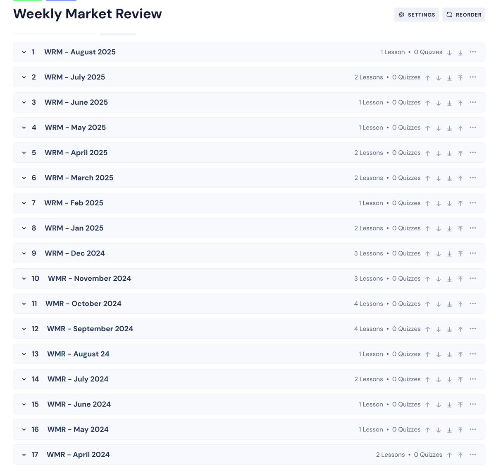
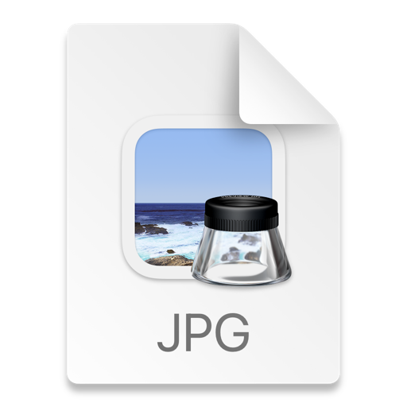

## Recommended Trading Resources

[Substack Inc](https://x.com/_chartitude/status/1943496791128969667)

@SubstackInc is the great tool for reading about the companies while travelling

Please let me know the top blogs you follow over there

[Newsletters Compilation](https://x.com/_chartitude/status/1942405283415810316)

⭐️⭐️⭐️ For the interested learners

The December-March 2025 compilation of the newsletters for the learning purpose is now uploaded on my website

http://chartitude.com

You can download the attachment & take a printout

Please give your valuable feedback as well.

[Reading Books](https://x.com/_chartitude/status/1940632023124922546)

If you are an investor - read Stan Weinstein

If trader - two books by Mark Minervini


[Trader Lion Conference](https://x.com/_chartitude/status/1946751765640102089)

You must watch all the days of @TraderLion_ conference by now
Free resource & hear out from a lot of participants their own perspective of the market
If you still ask in another 6 months - where should you start - you admit you’re lazy

[Trader Lion Conference](https://x.com/_chartitude/status/1940911923719295319)

@TraderLion_ conference is just about to start

For any beginner - this is one of the best free resources to learn from the greats. Thankful to the team to democratise the financial education beyond the borders.

Make the maximum use of it.

[Dan Zanger's Letters](https://x.com/_chartitude/status/1948034881633812704)

Dan Zanger’s letters will be the goldmine for the upcoming generations forever.

85,000+ pages & still counting

No jargons. Simple lines drawn on the stocks with good earnings or relative strength

Pure wisdom

[Dan Zanger Free Charts](https://x.com/thechartist26/status/1964920916678426651)

To those asking me where to find the Dan Zanger's letters - I bet 99% of them haven't even gone through his FREE charts posted on his X handle.
@DanZanger

[List of Books](https://x.com/thechartist26/status/1951154138768875669)

Original account @_chartitude is hacked.

I am writing again the list of books that one should read as a beginner in trading/investing.
@InvestmentBook1 might share the link with you for them.

1. How I made 2,000,000$ in the Market by Nicolas Darvas - any cover you find on Amazon is ok. This book covers the basics, so you'll need to read it multiple times.
2. You can still make it in the market by Nicolas Darvas - here, he will explain in detail his concepts.
3. How to Make Money in Stocks - William O Neil
4. Trade Like a Stock Market Wizard by Mark Minervini
5. Thing and Trade Like a Champion by Mark Minervini
6. Secrets for Profiting in Bull & Bear Markets by Stan Weinstein
7. Two books on Jessie Livermore

Reminiscences of a Stock Operator
How to Trade in Stocks

In 2022 I wrote a blog on Substack mentioning all the books

https://open.substack.com/pub/thechartist/p/books-recommendations?r=tv3fh&utm_medium=ios

[Past trades of Mark Minervini](https://x.com/thechartist26/status/1950814421032575015)

Past trades of Mark Minervini (not compiled by me)

https://puzzled-savory-63c.notion.site/24fb0b88f4fc42248d726505dad2b596?v=a426b5c5100149a88150fc6fe13649c1

Bookmark and RT for others

[Chartitude Learning](https://x.com/thechartist26/status/1952615979516563751)

65 hours+ of learning over here with more than 100s of doubts



[David Ryan Interview](https://x.com/_chartitude/status/1865732266153869677)

1,379% Return in 3 years | Interview with David Ryan | 3X US Investing C...
https://youtu.be/ZK5cnVQ2V3Q?si=Vvcnci3aeDUu0V2D via @YouTube

The only interview I have watched almost 5X By @TraderLion_
Keep it simple

https://x.com/_chartitude/status/1825306968984113352

A great resource to learn

Model Books

```
‼️ Study the biggest winners this weekend 🚨

Model Books from the past 6 years from @TraderLion_👏

2018
https://traderlion.com/checkout-2018-traderlion-model-book/
2019
https://traderlion.com/checkout-2019-traderlion-model-book/
2020
https://traderlion.com/checkout-2020-traderlion-model-book/
2021
https://traderlion.com/checkout-2021-traderlion-model-book/
2022
https://traderlion.com/checkout-2022-traderlion-model-book/
2023
https://traderlion.com/checkout-2023-traderlion-model-book/
```

[Free Webinar](https://x.com/thechartist26/status/1957405456646783099)

Recording available for the Free Webinar held on "CMT Examination" details

You can see it over here: http://chartitude.com >> Start Learning >> after signing up for it.



[Categories of breakouts](https://x.com/thechartist26/status/1966741149470912938)

Written a short and crisp blog on

Categories of breakouts and which one I prefer to hold

http://chartitude.com

Newsletter No 86 is uploaded now


[Classic by Stanley Druckenmiller](https://x.com/thechartist26/status/1973736999921274955)

Classic by Stanley Druckenmiller

https://open.substack.com/pub/aryadeniz/p/stanley-druckenmillers-lost-tree?r=tv3fh&utm_medium=ios