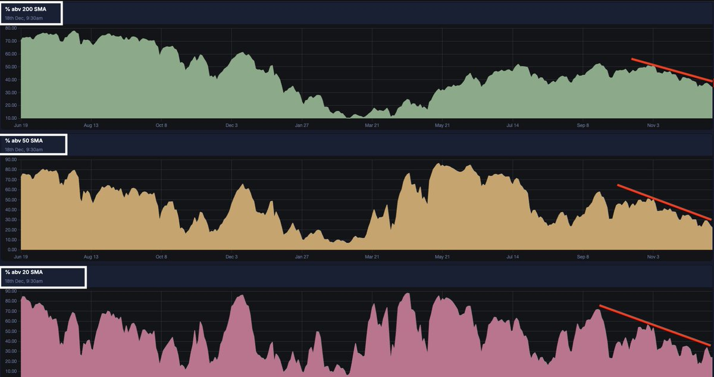
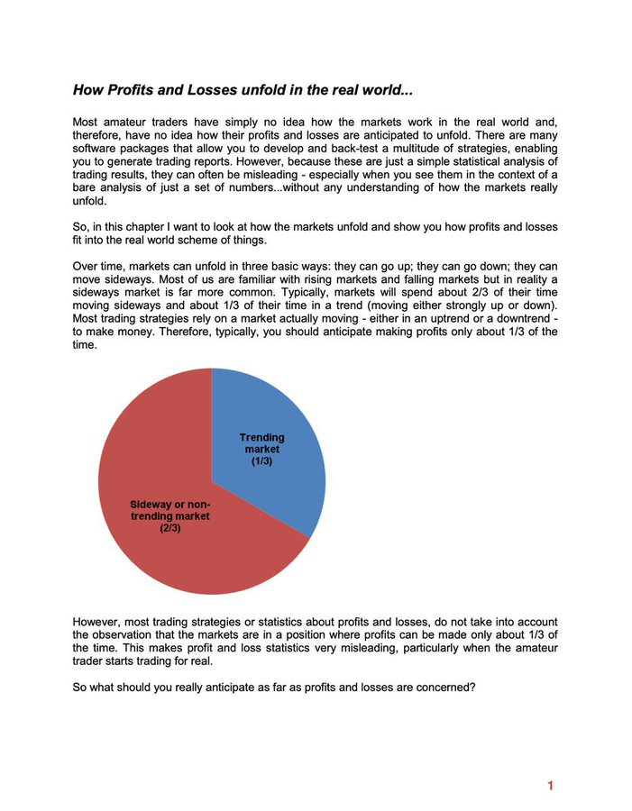
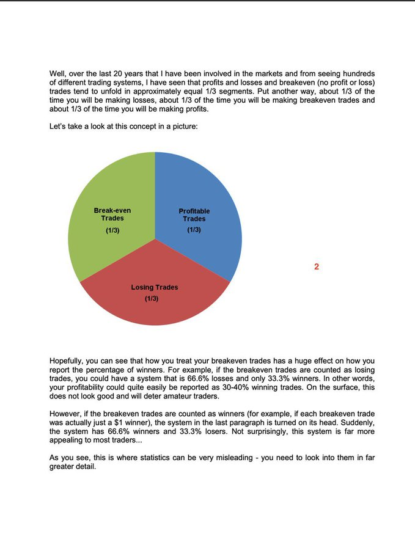
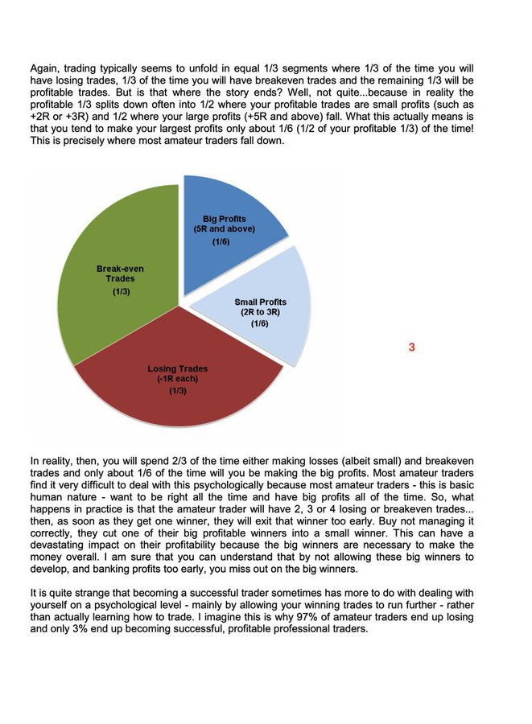
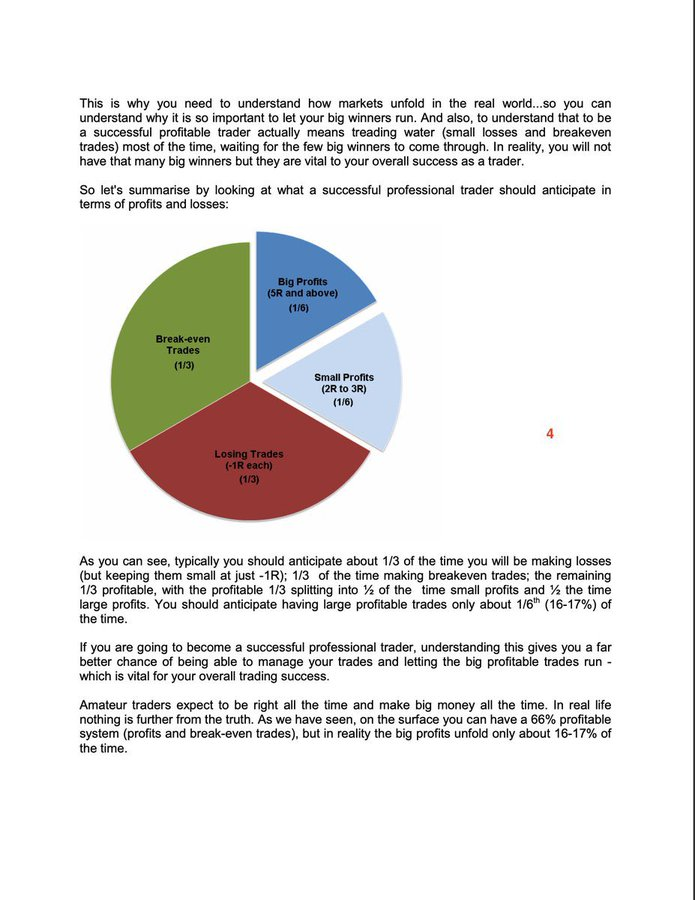
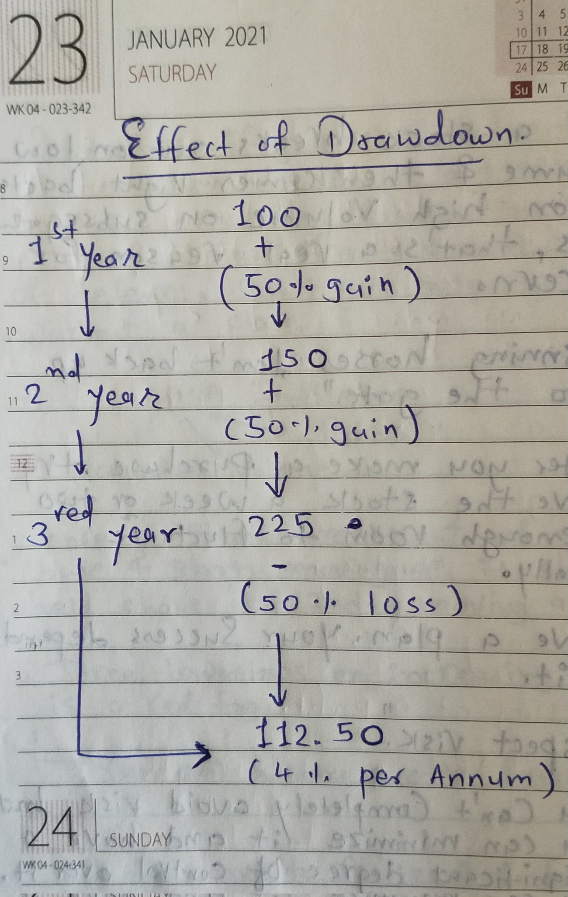

# **Himanshu Sharma Trading Vault**

## [Hiren Gabani](https://x.com/Hirengabani23)

## [Hiren Gabani](https://x.com/Hirengabani23)

[2-4 % Drawdowns](https://x.com/Hirengabani23/status/1946072354851110962)

✅If you start feeling uncomfortable by seeing 2-3% dd in your portfolio, mark my words, you're not gonna make big in this business.

✅2-4% drawdown is part of this business.

✅If you don't want big drawdowns, keep on trading with 0.1-0.2% of portfolio risk, where you do not make big nor lose big. But if you want good portfolio moves, you need to take calculated risk and press on gas in good market condition.

That's the truth.

[What creates explosive performance?✍️](https://x.com/Hirengabani23/status/1948285324649738321)

[Decrease Size in Drawdowns](https://x.com/Hirengabani23/status/1948968704433402070)

✨Increasing size to cover losses is the worst thing you can do as a trader. When in DD instead decrease size. Use progressive exposure.

✨Wait for an easy money period to change gear. Recovering 2-5% dd is easy but beyond 10% it starts getting difficult.

Save the chips💲💸

[“Cut losses short and ride the winners”](https://x.com/Hirengabani23/status/1949785109504176554)

✍️✍️

[Mark Minervini on finding bottoms✍️](https://x.com/Hirengabani23/status/1953426723283816630)

[💫Importance of managing drawdowns](https://x.com/Hirengabani23/status/1954916206059933737)

[💫How to achieve big return with a little drawdown 👇👇](https://x.com/Hirengabani23/status/1957394994953658530)

[💫Lost 1.24% of the account in #Hirect today.](https://x.com/Hirengabani23/status/1958023141961216281)

💫Faced big slippage in exit. It was too quick to handle. Placed stop loss in the system but had to exit it manually because of quick fall🥲

Happened this to me after a long time. Yes it hurts but also it’s part of this business. I can’t control uncontrollable part of this business.

[Myth buster✍️](https://x.com/Hirengabani23/status/1956337775344578873)

[Eye opener✍️✍️ @stamatoudism](https://x.com/Hirengabani23/status/1960349013435384152)

[This quote should be on your wall 🔥](https://x.com/Hirengabani23/status/1947307906371588610)

[Tennis ball action explained by @iManasArora 👏🙌](https://x.com/Hirengabani23/status/1945782167071801572)

https://x.com/Hirengabani23/status/1866748242773545284

Healthy rally?

I don't think so.

Reason👇

[Bad Market Environment](https://x.com/Hirengabani23/status/1960945334584049897)

💫The problem with this market is not the availability of setups. The issue is what happens after the breakout.

💫No follow-throughs + Stocks becoming dead after breakout + Volatility is still high.

Wait for your pitch.

[Broader Market Sentiment](https://x.com/Hirengabani23/status/1961672345224872216)

"Three out of four stocks dance to the market's tune—master the market's rhythm, and your investments will follow the beat." — William J. O'Neil

"The choice is yours: either protect your financial and mental capital by staying on the sidelines when the odds are not in your favor, or continue accumulating drawdowns by trading breakouts in a weak market."

[Stock Changes Nature](https://x.com/Hirengabani23/status/1964199864893407342)

💫Many people ask me, "Why don't you remove choppy stocks from the list and focus only on clean stocks? That way, you have to go through fewer stocks during scanning."

✅My answer: Don't make a mistake. A stock can change its nature at any time. If you remove those stocks from the list, you may miss big opportunities. Go with the flow.

Few examples👇

[Marios Stamatoudis Interview](https://x.com/Hirengabani23/status/1966495803696115891)

✅This is one of the best YouTube interview on swing trading I've ever seen. @stamatoudism
breaks it all down super clearly and in tons of detail.

✅Check it out—you'll learn a lot and find it really useful.

Video link: https://youtu.be/7UfHg8PpDZk?si=1jmtZRajejtHQ5kt

https://x.com/Hirengabani23/status/1974413401637158995

💫Mark Douglas categorized traders into three main psychological groups:

1. Consistent Winners

2. Consistent Losers

3. Boom and Bust Traders

✅The difference between these groups is psychology, not strategy.

✅Many traders have profitable systems, but only consistent winners have the mental framework to apply them with discipline and detachment.

Cheers🍻

https://x.com/Hirengabani23/status/2001513226006360183

✅Look at the underlying condition.

💫Let me repeat: It's not just about setups. Trading is way beyond setups.

✅Knowing when to sit out and when to trade aggressively is key to achieving super performance.

https://x.com/Hirengabani23/status/2000802277603660023

💫I scan the markets every day, not just to find setups, but to understand where the action is: what’s working, what isn’t, what’s holding strong, and which sectors are showing strength. I've been doing this consistently every single day since 2021.

✅This has immensely helped me decide my stance in the market.

https://x.com/Hirengabani23/status/2000531459850084652

💫 How home run trades drive long-term profitability and success in trading.

Must read✍️

https://x.com/Hirengabani23/status/1998619061987520924

💫If you truly want to become more patient and disciplined in trading, stop taking tiny 0.05–0.1% risk trades while telling yourself, “I’m just testing the water.”

✅You’re in the market to make money, not to feel excited or to stay busy.

✅Trading every day with small risks trains you to become impatient and FOMO-driven, which is the exact opposite of what builds long-term success.

✅I have been there, done that.

https://x.com/Hirengabani23/status/1996172567741141249

💫Most traders and investors are terrible at “Risk management.”

✅They make lots of money in a bull market and eventually give it back everything or even more in a bear market.

✅Manage your risk and be disciplined in this business.

