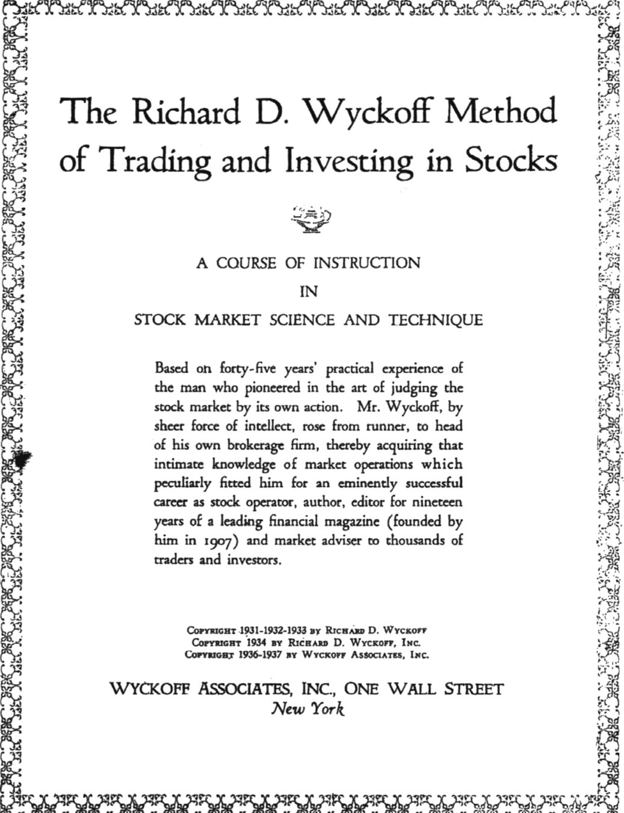
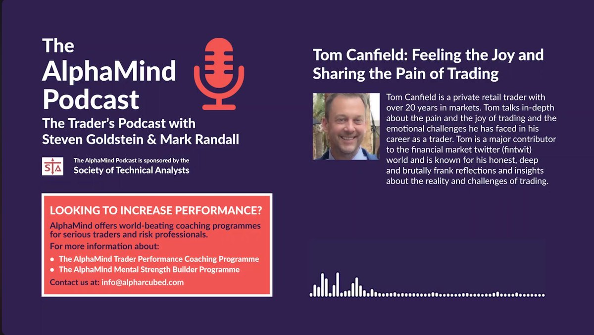

## Recommended Trading Resources

[Book to understand supply and demand](https://x.com/Hirengabani23/status/1956931077982797922)

➡️If you want to thoroughly understand supply and demand concepts with the utmost clarity.

There is no better book than this👇

Give it a try and thank me later.

[Manas Arora Tweets](https://x.com/Hirengabani23/status/1958487367192621486)

💫This is getting crazy now. 1000+ comment🫣 Even twitter is not able to load comments now.

I have tried my best to send drive link to most people. Those who didn’t get it, I’m sharing link below 👇

Link: https://drive.google.com/drive/folders/1qw5MZw9Xkm17rU46s_7it9LP-GJc6dkX?usp=sharing

[Dhanesh Giani IPO Video](https://x.com/Hirengabani23/status/1974035118420382194)

💫Watching IPO master class of @dhanesh500 with @sourabhsiso19

Clarity🔥

link: https://youtu.be/tt21OVDUcQo?si=bxjUlkSYfwj8jU7q

https://x.com/Hirengabani23/status/2003776532297515175

💫One of the best podcast on trading mindset.

"The Emotional Alchemy of Trading: Tom Canfield’s Path to Mastery"

Link: https://youtu.be/wdUwMlWzmY4?si=hu_NB0F7rV1ZoiRt

