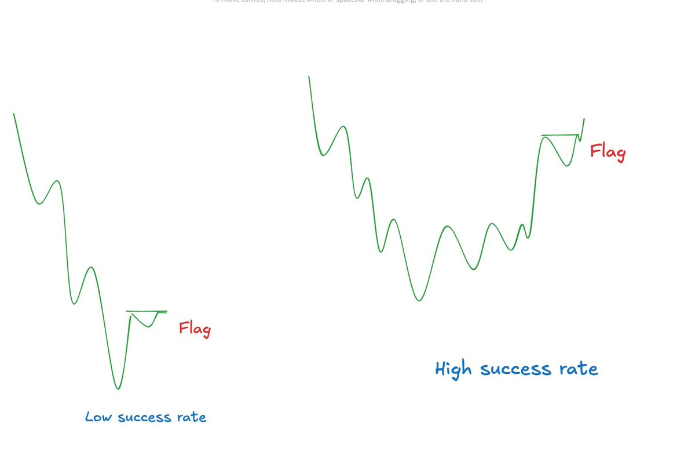
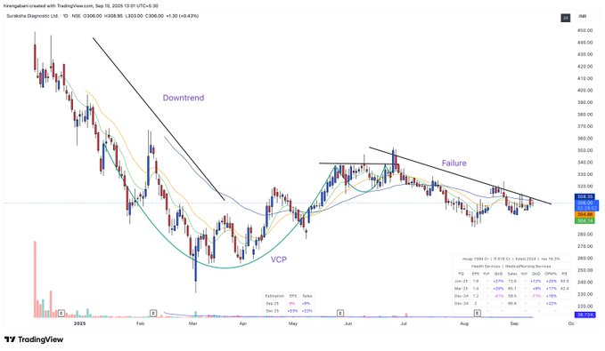
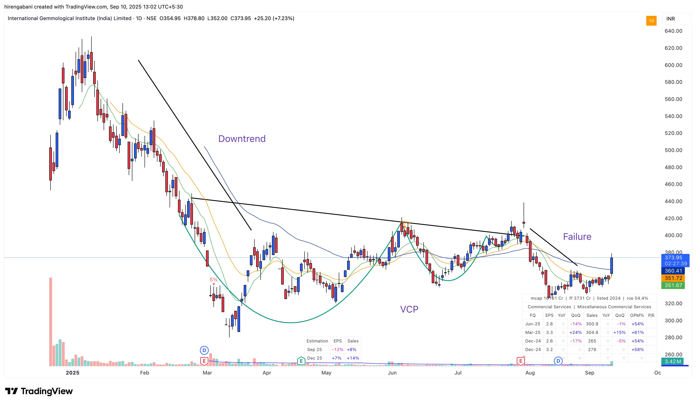
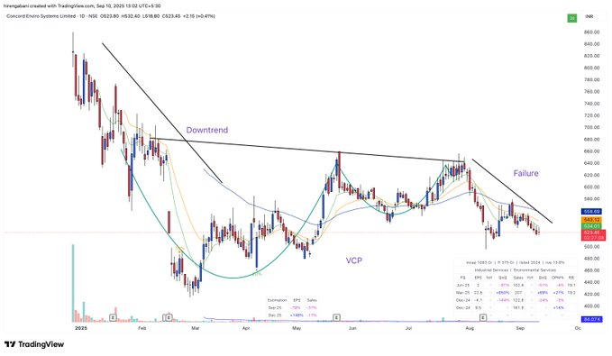

## Trading Style

[Stage Analysis](https://x.com/Hirengabani23/status/1945353308232933615)

✨ Stage analysis has proved a game changer for me.

✅Buying flag or bas in Stage-2: High chances of big move ( Stage -2 = Confirmation of institution accumulation)

✅Buy flags or base in Stage -3 or 1: High chances of breakout failures ( Stage 3 or 1 = Anticipation of institution accumulation)

✨This is the reason I always says: Don't buy anything blindly without context.




[Win Rate](https://x.com/Hirengabani23/status/1946780963327078703)

🌟My trading system in a nutshell

Few🤌🤌


[Trade Clean Setup](https://x.com/Hirengabani23/status/1966720165661602068)

💫Smooth-moving and linear stocks chop you up less than choppy or slow-moving stocks.

✅Because if your stop-loss hits in a linear and smooth stock, it doesn't hurt much as you traded one of the best stock out there. But if it hits in a choppy stock, it hurts you both financially and mentally.

✅Be very, very selective. If you don't find a clean setup, don't trade. That's it.


[Not Trading Downside Bases](https://x.com/Hirengabani23/status/1965679961693729024)

💫The day I stopped trading downside bases, I began performing well in the market.

✅The goal isn't to buy at a low price, but to buy at the right price.






```
The basic premise of VCP is that supply is absorbed.

Beginners who focuses on patterns, indicators or setups can't have first principle thinking

VCP can't work in Stage-1 or Stage-4 stocks with huge overhead supply.
```
```
The basic criteria to avoid these stocks is 
1) 50 Ema > 200 Ema 
2) Price > 200 Ema

It helps me a lot
```

