# **Himanshu Sharma Trading Vault**

## [Hiren Gabani](https://x.com/Hirengabani23)
[Cutting Noise](https://x.com/Hirengabani23/status/1932028633356312885)

How do I cut the noise from many setups to 2-3 tradable ideas?

⏩Focus on stage-2 stocks
⏩Trade stock having a linear base
⏩Trade smooth movers
⏩Trade stocks with solid volume action.

& Manage your risk well.

## [Hiren Gabani](https://x.com/Hirengabani23)

[Stage Analysis](https://x.com/Hirengabani23/status/1945353308232933615)

✨ Stage analysis has proved a game changer for me.

✅Buying flag or bas in Stage-2: High chances of big move ( Stage -2 = Confirmation of institution accumulation)

✅Buy flags or base in Stage -3 or 1: High chances of breakout failures ( Stage 3 or 1 = Anticipation of institution accumulation)

✨This is the reason I always says: Don't buy anything blindly without context.

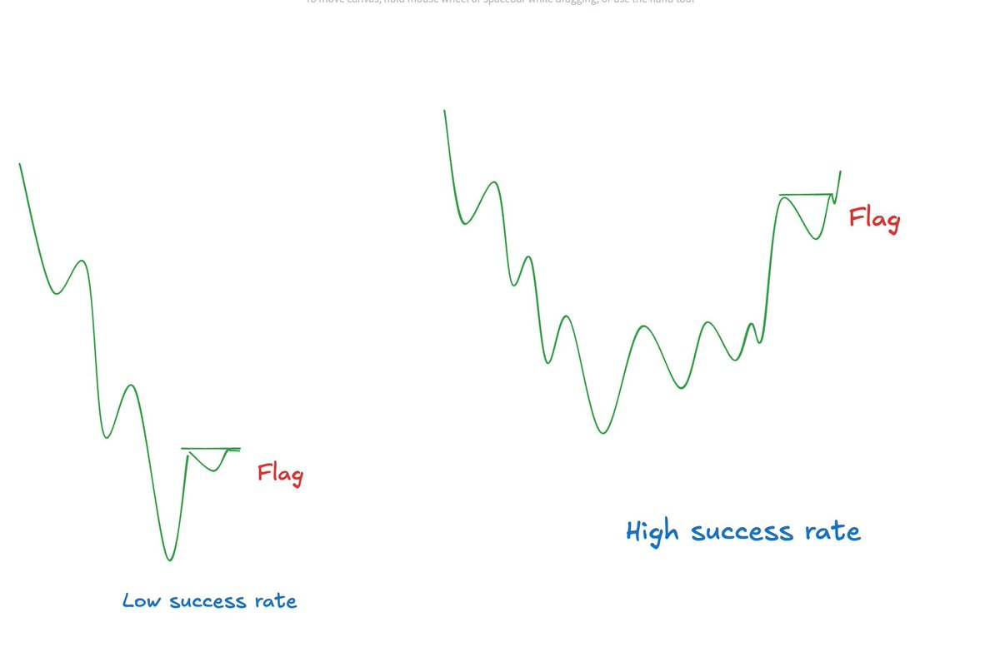

[2-4 % Drawdowns](https://x.com/Hirengabani23/status/1946072354851110962)

✅If you start feeling uncomfortable by seeing 2-3% dd in your portfolio, mark my words, you're not gonna make big in this business.

✅2-4% drawdown is part of this business.

✅If you don't want big drawdowns, keep on trading with 0.1-0.2% of portfolio risk, where you do not make big nor lose big. But if you want good portfolio moves, you need to take calculated risk and press on gas in good market condition.

That's the truth.


[Win Rate](https://x.com/Hirengabani23/status/1946780963327078703)

[🌟My trading system in a nutshell](https://x.com/Hirengabani23/status/1946780963327078703)

Few🤌🤌

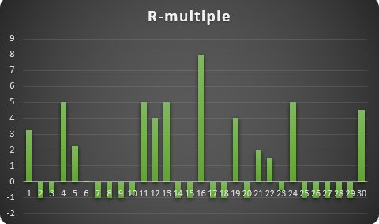

[Daily Scanning](https://x.com/Hirengabani23/status/1953712141329920210)

💫My biggest edge in swing trading is Daily scanning.

⏩By scanning daily, I gain insights into:

✅Whether breakouts are working or not.   
✅Whether the rally is led by leaders or bottom bouncers.
✅Whether there is any leadership in the market.

⏩This is how I decide whether I should jump into the market or not.

✨Scan daily and train your eyes to find future leaders.


[Book to understand supply and demand](https://x.com/Hirengabani23/status/1956931077982797922)

➡️If you want to thoroughly understand supply and demand concepts with the utmost clarity.

There is no better book than this👇

Give it a try and thank me later.


[What creates explosive performance?✍️](https://x.com/Hirengabani23/status/1948285324649738321)

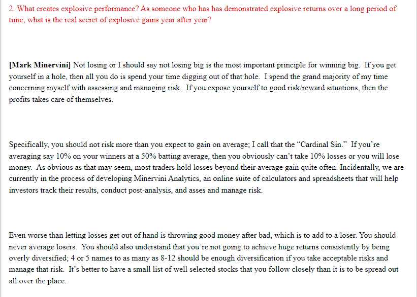

[Decrease Size in Drawdowns](https://x.com/Hirengabani23/status/1948968704433402070)

✨Increasing size to cover losses is the worst thing you can do as a trader. When in DD instead decrease size. Use progressive exposure.

✨Wait for an easy money period to change gear. Recovering 2-5% dd is easy but beyond 10% it starts getting difficult.

Save the chips💲💸

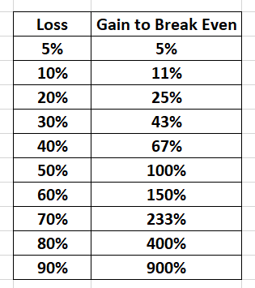

[“Cut losses short and ride the winners”](https://x.com/Hirengabani23/status/1949785109504176554)

✍️✍️

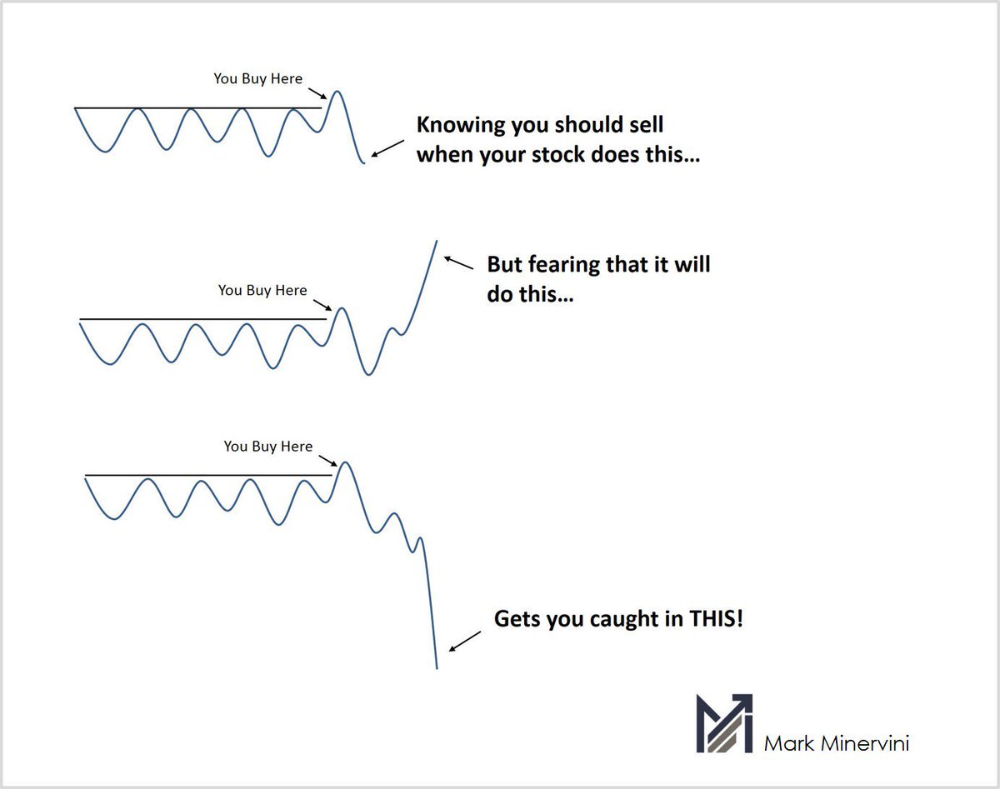

[Mark Minervini on finding bottoms✍️](https://x.com/Hirengabani23/status/1953426723283816630)


[💫Importance of managing drawdowns](https://x.com/Hirengabani23/status/1954916206059933737)

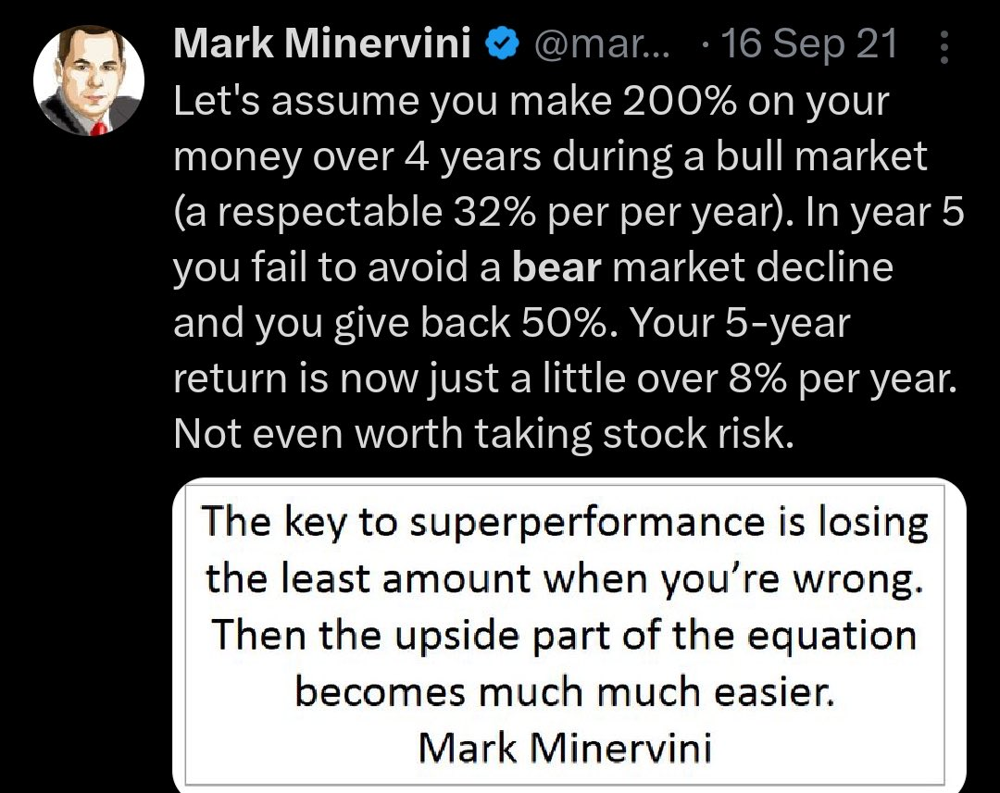

[💫How to achieve big return with a little drawdown 👇👇](https://x.com/Hirengabani23/status/1957394994953658530)

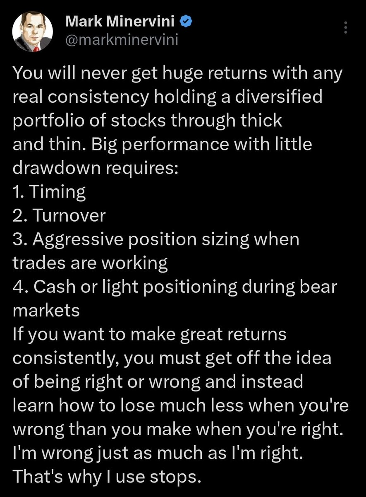


[💫Lost 1.24% of the account in #Hirect today.](https://x.com/Hirengabani23/status/1958023141961216281)

💫Faced big slippage in exit. It was too quick to handle. Placed stop loss in the system but had to exit it manually because of quick fall🥲

Happened this to me after a long time. Yes it hurts but also it’s part of this business. I can’t control uncontrollable part of this business.


[Myth buster✍️](https://x.com/Hirengabani23/status/1956337775344578873)


[Eye opener✍️✍️ @stamatoudism](https://x.com/Hirengabani23/status/1960349013435384152)

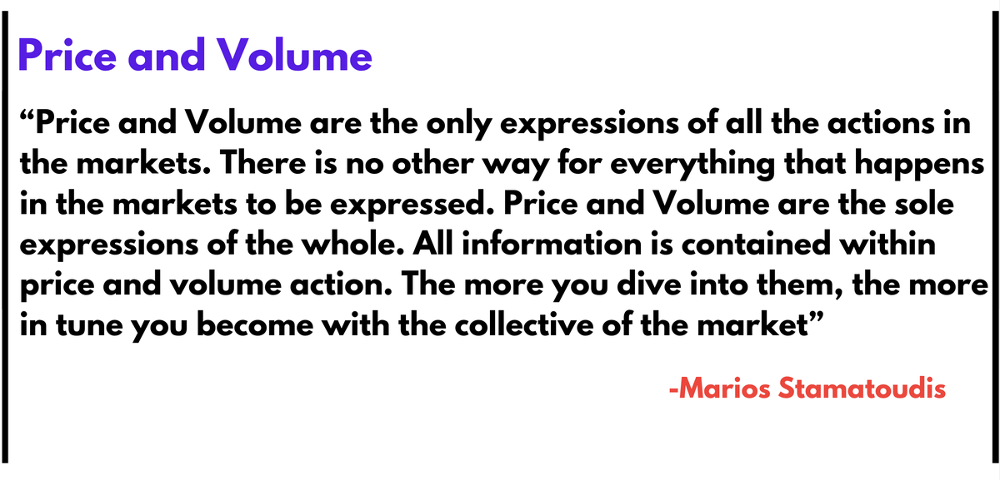

[This quote should be on your wall 🔥](https://x.com/Hirengabani23/status/1947307906371588610)

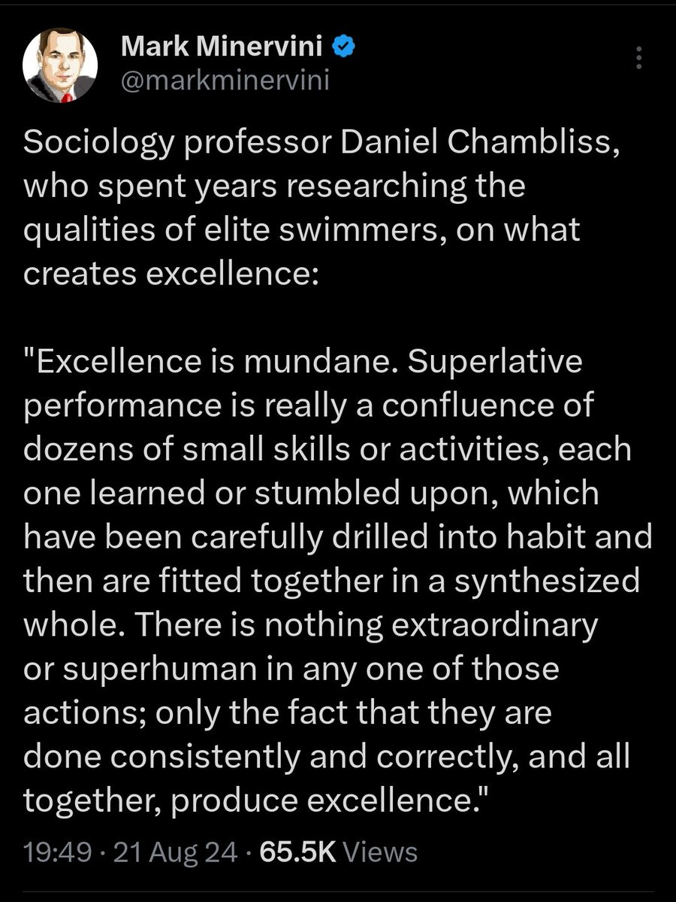

[Tennis ball action explained by @iManasArora 👏🙌](https://x.com/Hirengabani23/status/1945782167071801572)

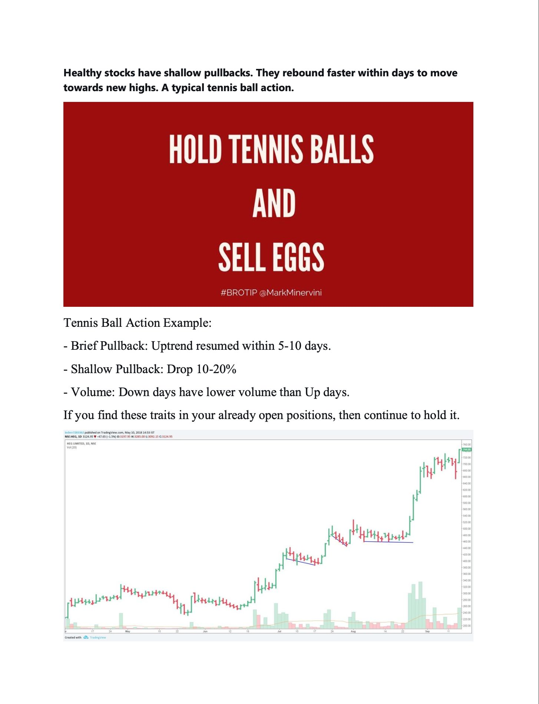

https://x.com/Hirengabani23/status/1866748242773545284

Healthy rally?

I don't think so.

Reason👇

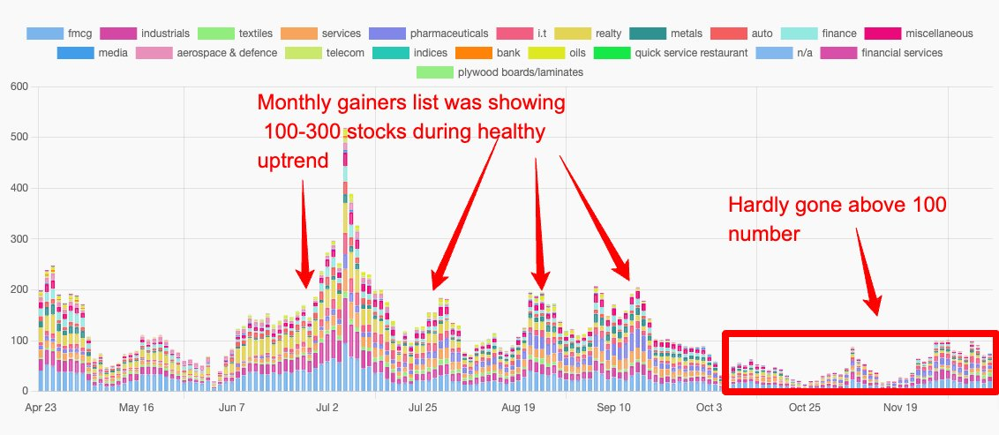

[Bad Market Environment](https://x.com/Hirengabani23/status/1960945334584049897)

💫The problem with this market is not the availability of setups. The issue is what happens after the breakout.

💫No follow-throughs + Stocks becoming dead after breakout + Volatility is still high.

Wait for your pitch.

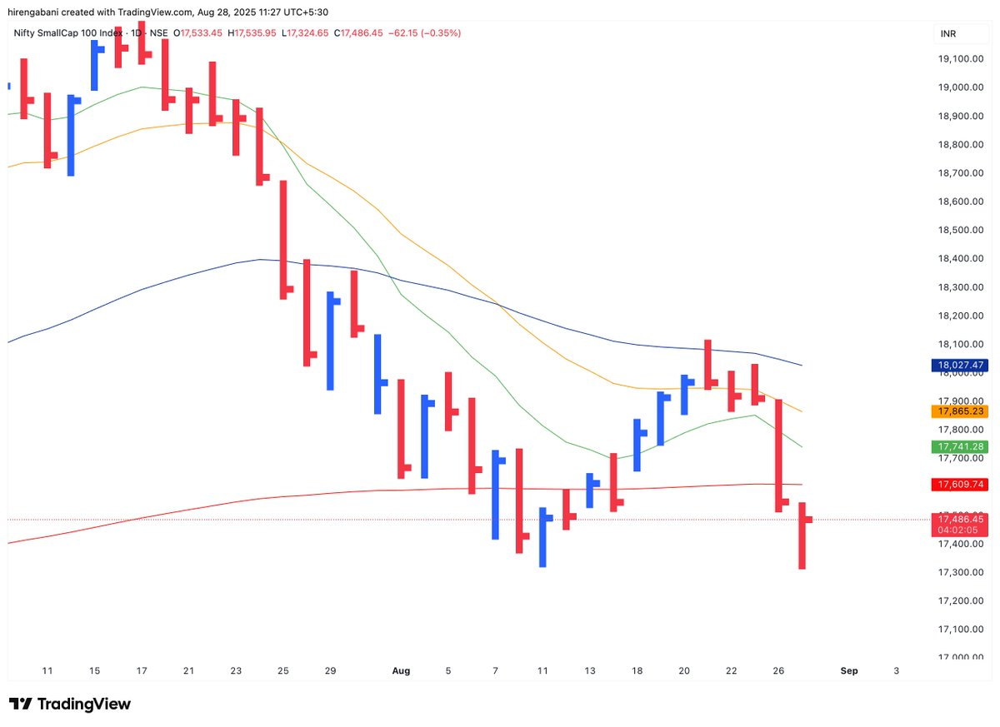

[Manas Arora Tweets](https://x.com/Hirengabani23/status/1958487367192621486)

💫This is getting crazy now. 1000+ comment🫣 Even twitter is not able to load comments now.

I have tried my best to send drive link to most people. Those who didn’t get it, I’m sharing link below 👇

Link: https://drive.google.com/drive/folders/1qw5MZw9Xkm17rU46s_7it9LP-GJc6dkX?usp=sharing

[Broader Market Sentiment](https://x.com/Hirengabani23/status/1961672345224872216)

"Three out of four stocks dance to the market's tune—master the market's rhythm, and your investments will follow the beat." — William J. O'Neil

"The choice is yours: either protect your financial and mental capital by staying on the sidelines when the odds are not in your favor, or continue accumulating drawdowns by trading breakouts in a weak market."

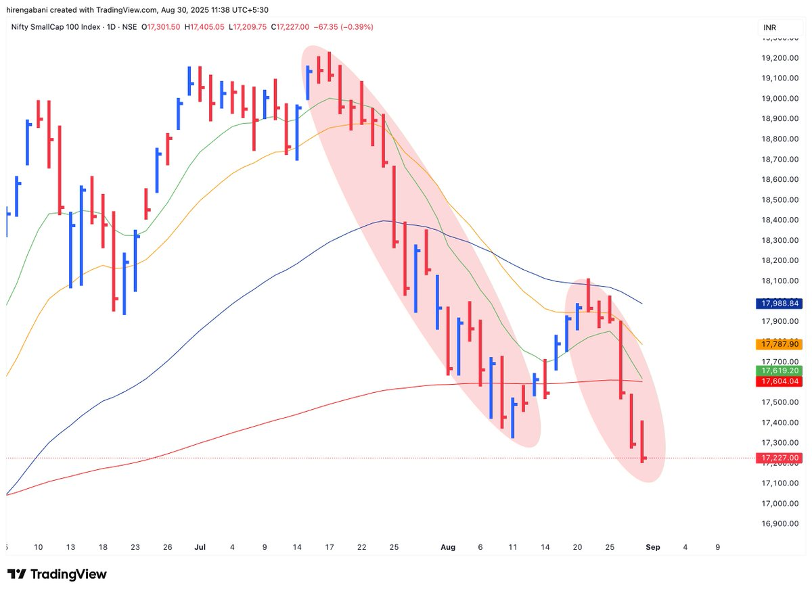

[Stock Changes Nature](https://x.com/Hirengabani23/status/1964199864893407342)

💫Many people ask me, "Why don't you remove choppy stocks from the list and focus only on clean stocks? That way, you have to go through fewer stocks during scanning."

✅My answer: Don't make a mistake. A stock can change its nature at any time. If you remove those stocks from the list, you may miss big opportunities. Go with the flow.

Few examples👇

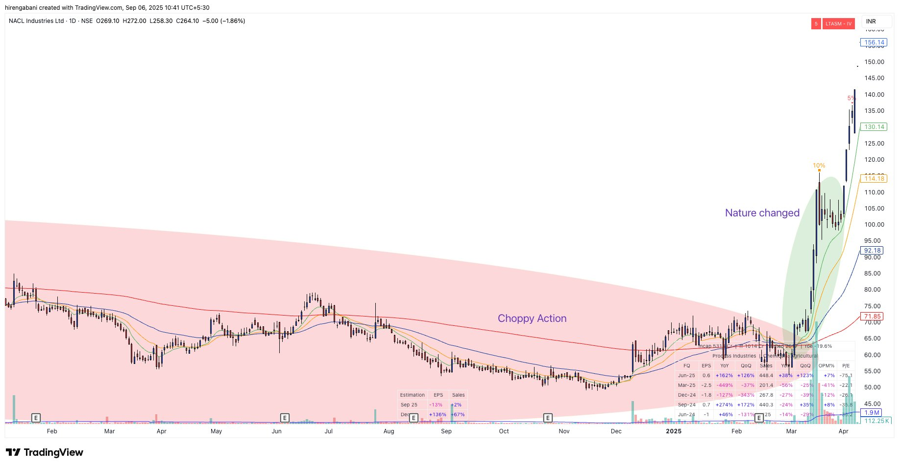
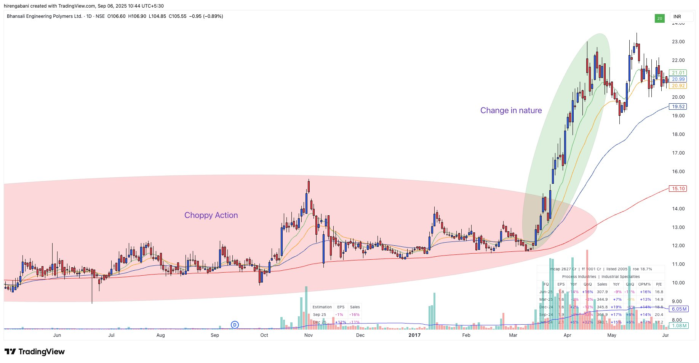
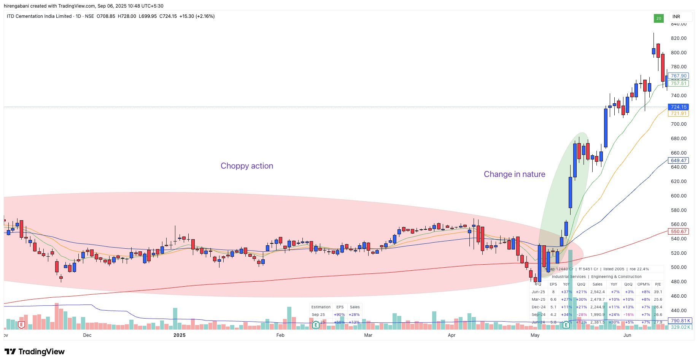


[Trade Clean Setup](https://x.com/Hirengabani23/status/1966720165661602068)

💫Smooth-moving and linear stocks chop you up less than choppy or slow-moving stocks.

✅Because if your stop-loss hits in a linear and smooth stock, it doesn't hurt much as you traded one of the best stock out there. But if it hits in a choppy stock, it hurts you both financially and mentally.

✅Be very, very selective. If you don't find a clean setup, don't trade. That's it.

[Marios Stamatoudis Interview](https://x.com/Hirengabani23/status/1966495803696115891)

✅This is one of the best YouTube interview on swing trading I've ever seen. @stamatoudism
breaks it all down super clearly and in tons of detail.

✅Check it out—you'll learn a lot and find it really useful.

Video link: https://youtu.be/7UfHg8PpDZk?si=1jmtZRajejtHQ5kt

[Not Trading Downside Bases](https://x.com/Hirengabani23/status/1965679961693729024)

💫The day I stopped trading downside bases, I began performing well in the market.

✅The goal isn't to buy at a low price, but to buy at the right price.

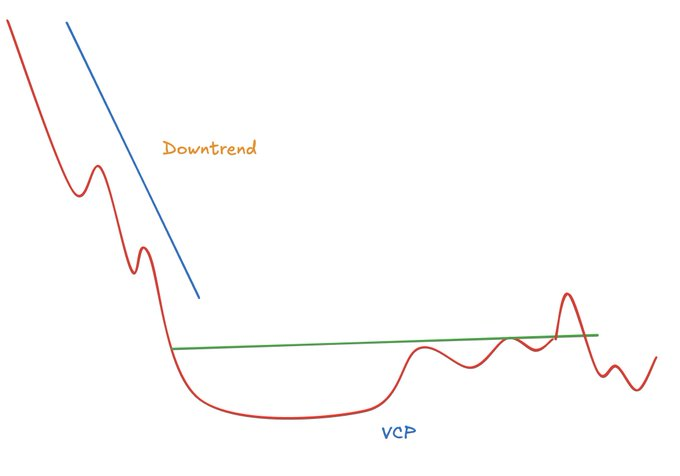
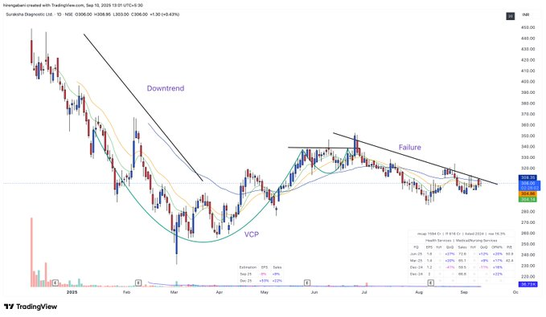
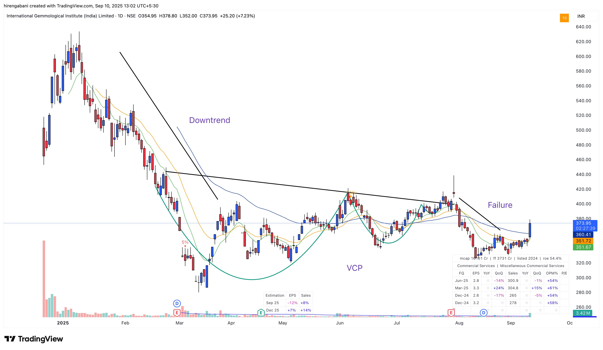
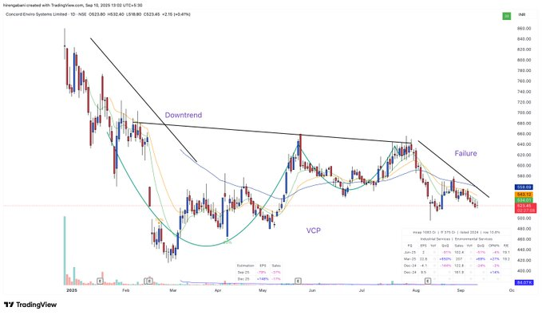

```
The basic premise of VCP is that supply is absorbed.

Beginners who focuses on patterns, indicators or setups can't have first principle thinking

VCP can't work in Stage-1 or Stage-4 stocks with huge overhead supply.
```
```
The basic criteria to avoid these stocks is 
1) 50 Ema > 200 Ema 
2) Price > 200 Ema

It helps me a lot
```
https://x.com/Hirengabani23/status/1974413401637158995

💫Mark Douglas categorized traders into three main psychological groups:

1. Consistent Winners

2. Consistent Losers

3. Boom and Bust Traders

✅The difference between these groups is psychology, not strategy.

✅Many traders have profitable systems, but only consistent winners have the mental framework to apply them with discipline and detachment.

Cheers🍻

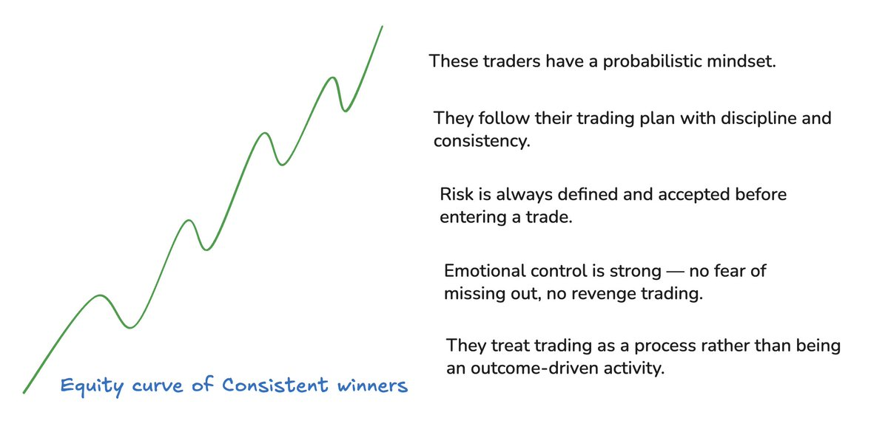
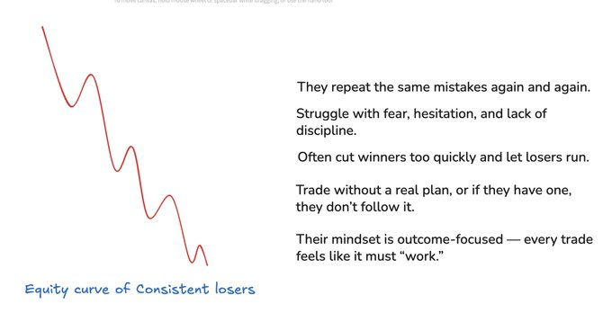
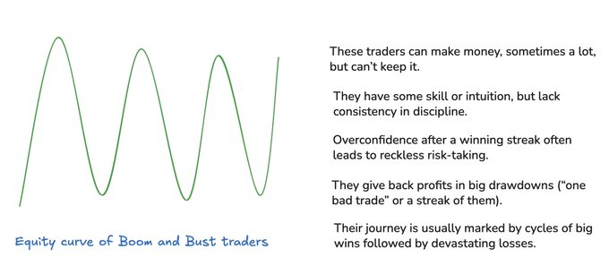

https://x.com/Hirengabani23/status/1974035118420382194

💫Watching IPO master class of @dhanesh500 with @sourabhsiso19

Clarity🔥

link: https://youtu.be/tt21OVDUcQo?si=bxjUlkSYfwj8jU7q

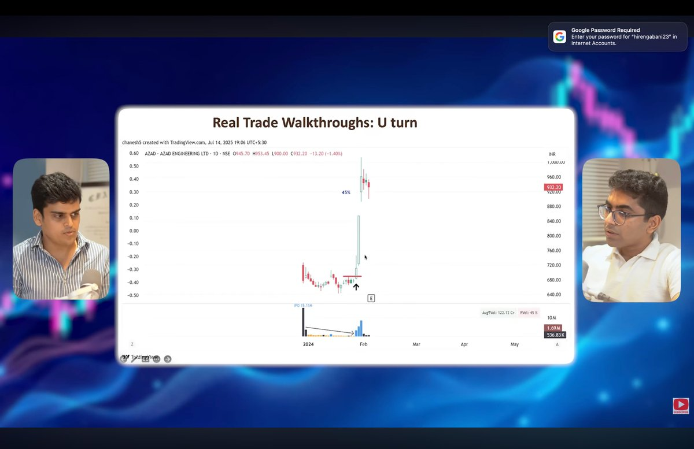

