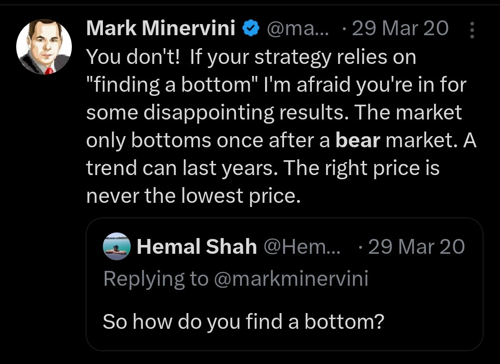
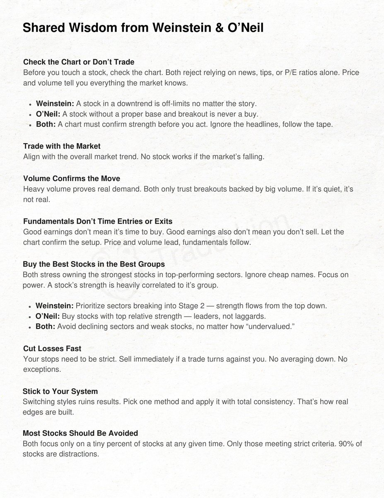

# **Himanshu Sharma Trading Vault**

## [Hiren Gabani](https://x.com/Hirengabani23)
[Cutting Noise](https://x.com/Hirengabani23/status/1932028633356312885)

How do I cut the noise from many setups to 2-3 tradable ideas?

⏩Focus on stage-2 stocks
⏩Trade stock having a linear base
⏩Trade smooth movers
⏩Trade stocks with solid volume action.

& Manage your risk well.

## [Hiren Gabani](https://x.com/Hirengabani23)

[Stage Analysis](https://x.com/Hirengabani23/status/1945353308232933615)

✨ Stage analysis has proved a game changer for me.

✅Buying flag or bas in Stage-2: High chances of big move ( Stage -2 = Confirmation of institution accumulation)

✅Buy flags or base in Stage -3 or 1: High chances of breakout failures ( Stage 3 or 1 = Anticipation of institution accumulation)

✨This is the reason I always says: Don't buy anything blindly without context.

[2-4 % Drawdowns](https://x.com/Hirengabani23/status/1946072354851110962)

✅If you start feeling uncomfortable by seeing 2-3% dd in your portfolio, mark my words, you're not gonna make big in this business.

✅2-4% drawdown is part of this business.

✅If you don't want big drawdowns, keep on trading with 0.1-0.2% of portfolio risk, where you do not make big nor lose big. But if you want good portfolio moves, you need to take calculated risk and press on gas in good market condition.

That's the truth.

[Win Rate](https://x.com/Hirengabani23/status/1946780963327078703)

🌟My trading system in a nutshell

Few🤌🤌

[Daily Scanning](https://x.com/Hirengabani23/status/1953712141329920210)

💫My biggest edge in swing trading is Daily scanning.

⏩By scanning daily, I gain insights into:

✅Whether breakouts are working or not.   
✅Whether the rally is led by leaders or bottom bouncers.
✅Whether there is any leadership in the market.

⏩This is how I decide whether I should jump into the market or not.

✨Scan daily and train your eyes to find future leaders.

[Book to understand supply and demand](https://x.com/Hirengabani23/status/1956931077982797922)

➡️If you want to thoroughly understand supply and demand concepts with the utmost clarity.

There is no better book than this👇

Give it a try and thank me later.

What creates explosive performance?✍️

✨Increasing size to cover losses is the worst thing you can do as a trader. When in DD instead decrease size. Use progressive exposure.

✨Wait for an easy money period to change gear. Recovering 2-5% dd is easy but beyond 10% it starts getting difficult.

Save the chips💲💸

“Cut losses short and ride the winners”

✍️✍️

Mark Minervini on finding bottoms✍️

💫Importance of managing drawdowns

💫How to achieve big return with a little drawdown 👇👇

💫Lost 1.24% of the account in #Hirect today.

💫Faced big slippage in exit. It was too quick to handle. Placed stop loss in the system but had to exit it manually because of quick fall🥲

Happened this to me after a long time. Yes it hurts but also it’s part of this business. I can’t control uncontrollable part of this business.

Myth buster✍️

