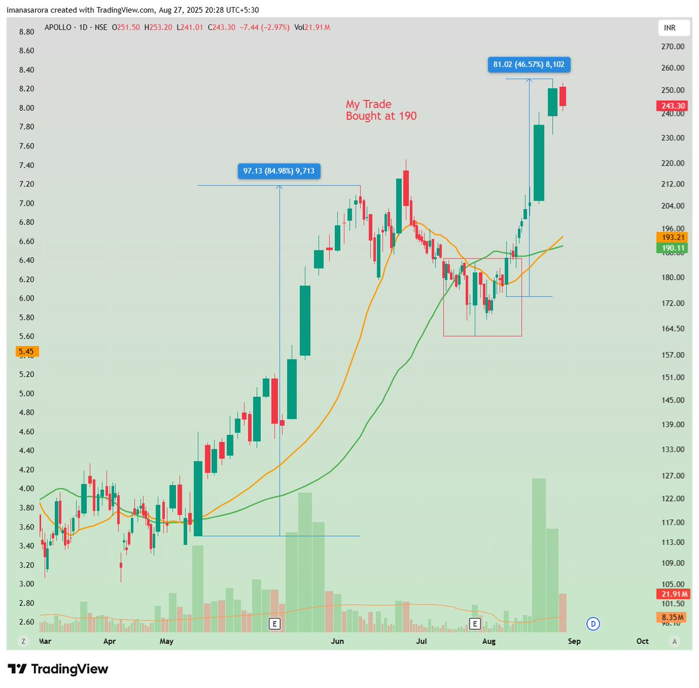
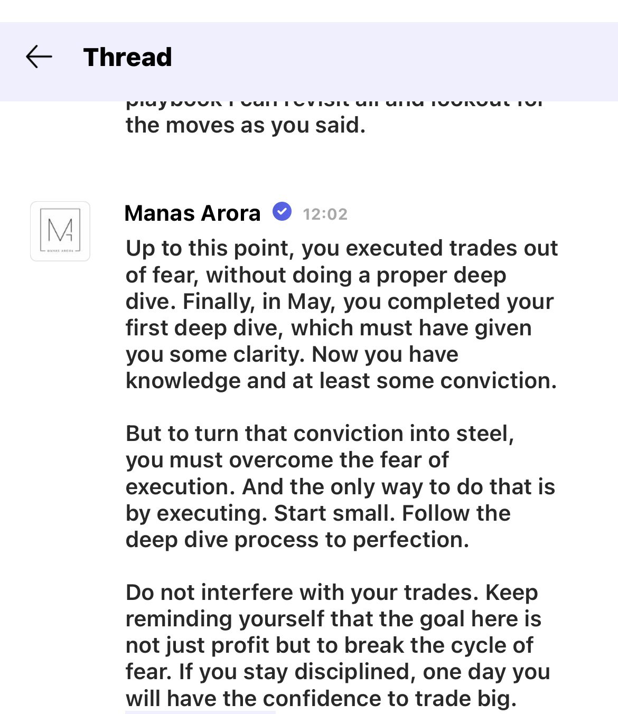
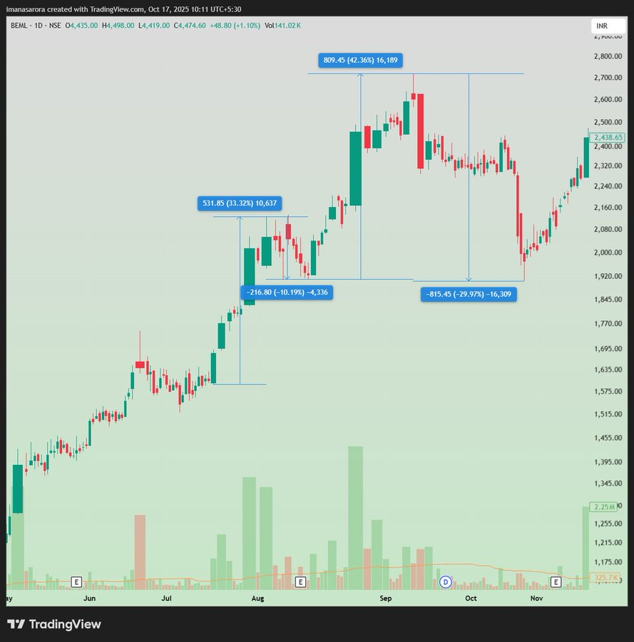

# **Manas Arora Trading Vault**

## [Manas Arora](https://x.com/iManasArora)

## Scanning Criteria
## Trading Style
## Recommended Trading Resources

[Scans Not Real Edge](https://x.com/iManasArora/status/1958008843733995682)

You're chasing the perfect scan. I’m chasing something else.

Scans are not my real edge. I have made money from stocks hitting 52-week highs, 52-week lows, one-month highs, and even from random names that never showed up in scans. 
So do not get lost in scanning alone. What really matters is building a focused list of no more than 10 to 20 names. 
These names should have liquidity, speed, clean consolidations, and a history of big moves. That focus list is where your edge will come from.
#BroTip


[Sharing Strategy](https://x.com/iManasArora/status/1957685620815307180)

People often ask, “Why do you share your strategy? Won’t too many people following it kill your edge?”

Simple answer: 9 out of 10 never learn. And out of the ones who do sign up to learn, 9 out of 10 never put in the grind needed in the early days. 
That’s why the edge stays alive and kicking. Because let’s face it - human nature hasn’t changed. The lazy and the procrastinators will always outnumber the action-takers.

So no, my edge isn’t going anywhere like it hasn't in the last many years. It’s protected by the greatest moat of all time - human laziness.
#BroTip


[Cutting Losses](https://x.com/iManasArora/status/1909201242011639830)

If you’re a swing trader, you can’t afford to take large losses. You’re aiming for 20–40% moves, so there’s no way you can hold onto a stock that’s down 20% from your entry price. 
If this sounds like you, the first change you need to make is to start cutting your losses at 2–4%.

[Win Rate](https://x.com/iManasArora/status/1948655787179380970)

“My win rate is 30 percent, and I make money year on year not trade by trade, week by week, or month by month.”

This is how I think and this mindset shift removes the constant pressure we place on ourselves after every trade. 
And of course, only those who are not fully dependent on trading income can truly afford to think this way.
#BroTip

[LIQUIDITY FORCE indicator](https://x.com/iManasArora/status/1947887759852769599)

This is my new LIQUIDITY FORCE indicator. Combine it with BUYING FORCE and you can catch crazy moves in strong markets.

Used my own interpretation of it and caught #MCLOUD, #RHIM, #DATAMATICS to name a few

Thanks @finallynitin

[First touch to the 20MA or 50MA](https://x.com/iManasArora/status/1960718632083714526)

The first touch to the 20MA or 50MA after a stock has had a strong move is often an easy money trade. 
But remember, first touch does not mean you buy the moment the stock touches the moving average. 
What you do is put such names into your focus list, observe closely, and then strike with a setup you trust whether it is SVRO, VCP, or any other buying system you follow.

Master this one set-up alone. You don't need any course.
#BroTip



[How to trade BIG one day?](https://x.com/agarwaltarun28/status/1960603661928947749)

#BroTip



Note down
the prior uptrend %
Consolidation length and depth
Consolidation quality
% rise when the trend resumed, angle and length.
Volume behaviour before and after
RS behaviour to the index

```
Manas bhai, is there any particular template or checklist to follow while doing deep dives of past winners?
```

[Video Podcasts](https://x.com/iManasArora/status/1961323938870345764)

These 3 videos contain answers to many of the questions I am asked often.

```
These three videos, spaced about three years apart, show just one thing , I keep doing the same setup again and again to make money. No fancy tricks, no constant new reinvention.

2023: https://tr.ee/xPwartb2Py
2025: https://tr.ee/9gUj2lIy7g
2025: https://tr.ee/HbGph9NUFS

If you're serious about learning, take out time to watch them before placing any real trade.
#BroTip
```

https://x.com/iManasArora/status/2001191793548009762

Forget about what you are already holding. Ask yourself if this was your first buy would you buy here?

That's how I decide to add more
#BroTip
Quote

```
Manas bhai, how you get confirmation that i need to add more ?
```

https://x.com/iManasArora/status/1302911031258177536

Watch the first 1 hour of 'How I find my super performance stocks' for FREE

A Teacher's day gift from my side.

https://www.youtube.com/watch?v=1tXWsg5bhvQ

Releasing another part for FREE (Studio sound quality)

How I position size & calculate my stop-loss

https://www.youtube.com/watch?v=eagPOn4fwkI\

https://x.com/iManasArora/status/1979046364102205508

Tight stops are not a flex. They are a necessity if you want to touch 1:5 and 1:10 trades.

Let me explain why with easy math.

Look at Indian stocks. Most swing moves happen in the 5% to 50% range. Around 20% is common. A stock usually gives one clean leg up, then pauses or corrects for a few days or even weeks before moving again. 
Now, if your stop is 8% and you’re aiming for 1:5, you need a straight 40% move without any meaningful pullback. For 1:10, you need an 80% clean move. That almost never happens. Most traders panic on a small intraday dip, let alone sitting through a multi-week correction.

So what is the only practical way left to catch 1:5 or 1:10 without holding through painful corrections? You reduce your stop. From 8 to 6, then to 4, and gradually even lower. The key word here is gradually. Yes, smaller stops get hit more often. That is expected. That is where training comes in. 
Beginners jumping straight to 2% stops without understanding entries, exits, mindset etc. are setting themselves up for disaster. I did exactly that. I started wide and now comfortable with several small hits because I know one clean trade will pay for them all and put me way ahead.

In short, if you want to trade swings without sitting through long corrections, you don’t really have a choice. Smaller stops are the only way the math works.
#BroTip


