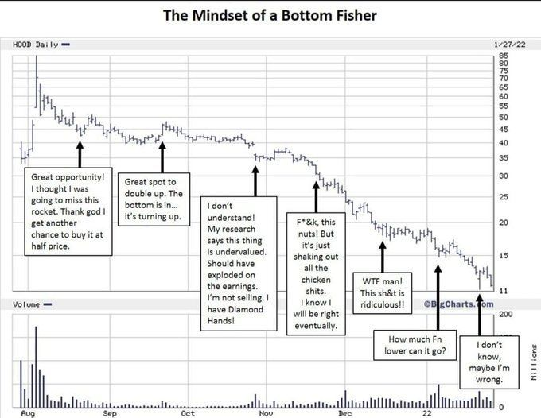

# **Mark Minervini Trading Vault**

## [Mark Minervini](https://x.com/markminervini)
[Market Doesn't Lie](https://x.com/markminervini/status/1943034662571348350)

The market doesn't lie. It speaks in price action. The problem is, depending on when and where you are in the market, the lauagauge can change. Context is everything. Nothing can be trusted in a vacuum or in perpetuity. Don't be fooled. Even timeless tactics require timing.

[Bottom Fishing](https://x.com/markminervini/status/1948574510753485145)

True story...

[Defence First](https://x.com/markminervini/status/1973592956486426675)

The Core Principle: Defense First

For 30 consecutive years, I've maintained a never-decreasing net worth. Somehow, each year I figured out a way to make net progress. And I can tell you that it wasn't by always hitting home runs. It was by rarely striking out in a catastrophic way. Most people think wealth-building is about the big score.  When in reality, it’s about minimizing drawdowns, consistently chipping up, and occasionally making a big score. By keeping losses small when you’re wrong, you make it far easier to climb back and set new highs. And by consistently making progress, you always keep your capital in tact ready for opportunities. The secret is to compound capital, not mistakes.
