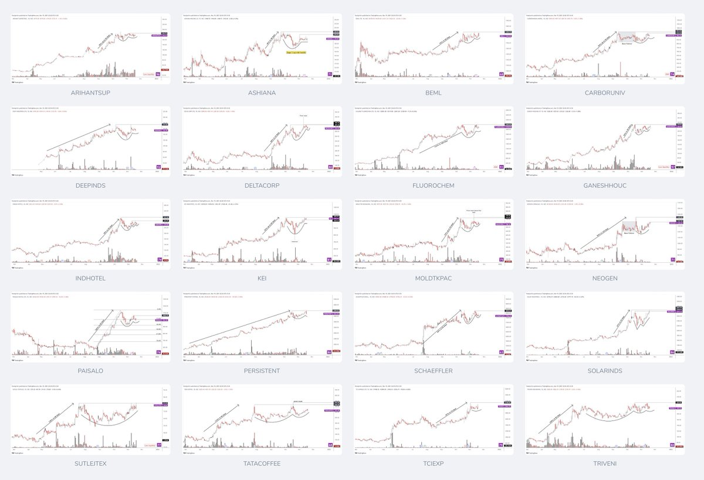

# **Nitin Kedia Trading Vault**

## [Nitin Kedia](https://x.com/finallynitin)
[Swing Vs Intraday Trading](https://x.com/finallynitin/status/1945167143982785015)


Nothing triggers a swing trader more than the mention of the word 'intraday'. I feel that intraday trading is very misunderstood. Please read on with an open mind.

(Full-time & pro traders can skip reading this)

01: Swing Trading

Most 'swing' traders are nothing but modified intraday traders, with the only difference being that they carry their positions for the next (or many) day(s) till the SL (or TSL) gets hit.

For such swing trades, most decisions get determined during the day itself. For example:

⦿ Final identification of stocks, to narrow down to 1 or 2 from a watchlist of, say, 5 or 10:
- high Rvol in the first few minutes
- open = low

⦿ Exact entry point determination:
- opening range breakout
- chart patterns on minute charts

⦿ Stop loss placement:
- low of the day
- certain % points from entry

⦿ Even exit decisions are often taken intraday on the same (or later) day(s):
- booking ½ at a certain R or UC during the day
- exiting near EOD in case of squats

So much fire-fighting is not required in proper bull markets. I still remember the mega bull run of 2017 & the post-COVID times, where I would often trade weekly inside bars and three-week tight formations. I would place the trigger at the high of the previous week and the stop-loss at the low of the last week. I would enter the stock smoothly and then only review my position on weekends. Those were easy days. Such methods don't work efficiently in bear/transitional markets.

Bear/transitional markets are, for the most part, a hard money environment where only the most experienced, laborious & disciplined traders get significantly rewarded, if at all.

The ‘solution’ then becomes evident, & it is moving to a lower timeframe to get the entries & exits fine-tuned.

So, basically it is:
Worse the market → greater the effort → lower the timeframe


02: Intraday Index Trading

Let's now compare swing to intraday index trading. Here, the trade is taken in the same 1 or 2 indices day after day, which can be either long or short, but not carried over to the next day.

To understand this, let’s first see the pros & cons of intraday index trading:

⦿ Pros of intraday index trading:
- Market breadth - not required
- Demarcation between bull & bear markets - not required
- Liquidity concerns - no concern
- Nature of the stock (linear, choppy) - not needed
- Earnings surprises- absent
- Gap down - no concern
- Price bank revision - absent
- Fundamental checks - not needed
- Scans - not needed

⦿ Cons of intraday index trading:
- Active screen time
- Not getting 20% moves in a day or 100R trades
-  All other things, like having a trading strategy, discipline, and good execution, are more or less the same.

As is evident, intraday index trading has significant advantages if:
A. You’re not a very needy or greedy person
B. You know how to trade the indices

Overall, probably not as hugely rewarding as swing trading in bull markets, where 2x or 3x returns on the portfolio are doable, but with great potential to outperform swing trading returns during bear/choppy markets.


03: Intraday stock trading

Now compare this with intraday trading in different stocks. Among all the available trading methodologies, the one that I find the most challenging is intraday trading in stocks. Here, the trader creates a watchlist and scans for opportunities throughout the day, carrying positions only if they secure a cushion.

Here, you take the maximum pain of both a swing trader & an intraday trader, as the beast named stock selection comes into play, along with all the variables such as scans, breadth, earnings, fundamentals, linearity, momentum, price bands, and whatnot. Now, all the cons of swing trading are being combined with the biggest con of intraday trading (active screen time), & you are earning money with considerable effort on your part.

Yes, you can definitely do this, only if you are a full-time trader, and have got a lot of time & energy (& skill), both during the day and in the evening.

04: Conclusions

⦿ What’s the plan, then?
The plan is to predominantly trade indices intraday until a sustainable, easy-money environment returns.

⦿ How would you know that a proper bull market has started?
We define a 'bull' market as when the percentage of stocks above the 200-day SMA exceeds 50 and stays above 50 for at least a month.

⦿ What about the FOMO of seeing stocks flying away every now & then?
Seh lenge thoda. Might take a very high conviction trade on and off.


Disclaimer:
⦿ I'm a very flexible person & my views can change at any moment. So, please don't question me if you see me posting a cash trade in the near future. 😄

⦿ Please don't post the "bhaisahab-ye-kis-line-mein-aa-gaye-aap" & "jis-raah-par-tum-chal-rahe-ho-munna" memes. 😜
Counter with logic & not emotions. I'm always ready to change my mind if provided with sufficient evidence.

[Ankur Patel Trading Youtube Presentation](https://x.com/finallynitin/status/1802510257136230883)

Here is the presentation for the Simplifying Trading YouTube session with
@AnkurPatel59


https://simplifyingtrading.my.canva.site


https://x.com/finallynitin/status/1802511279351066980

Links to all my scripts & scans mentioned in the Simplifying Trading YouTube session with @AnkurPatel59

Scripts

⦿ Simple Volume: https://tradingview.com/script/JkB0iCFp-Simple-Volume-with-Pocket-Pivots/

⦿ MARS: https://tradingview.com/script/Lv26g1XV-MARS-Moving-Average-Relative-Strength/

⦿ Quarterly Earnings: https://tradingview.com/script/oBswL9v2-Quarterly-Earnings/

⦿ Net New Highs: https://tradingview.com/script/50J8wzdW-Indian-Markets-Net-New-Highs/

⦿ Market Breadth: https://tradingview.com/script/b1gXIrNm-Market-Breadth-of-NSE-stocks-based-on-above-Moving-Averages/

Scans

⦿ Liquidity: https://chartink.com/screener/universe-atfinallynitin

⦿ HVQ/HVY: https://chartink.com/screener/hvq-hvy-hve-atfinallynitin

⦿ Bull Snort: https://chartink.com/screener/bull-snort-volume-atfinallynitin

⦿ IPO scan: https://chartink.com/screener/ipo-365-atfinallynitin

⦿ Pocket Pivot: https://chartink.com/screener/ppv-atfinallynitin

⦿ Flags: https://chartink.com/screener/flags-atfinallynitin

⦿ Stage 2 stocks: https://chartink.com/screener/stage-2-stocks-atfinallynitin

TradingView profile

https://tradingview.com/u/finallynitin/


[Watchlist](https://x.com/finallynitin/status/1952906059905155485)

Watchlist for 06-Aug-2025

Although individual setups are available, the overall market environment is relatively poor, particularly with a red MBI and zero SwiCo. I'm still in all-cash for a month now.


[Mswing Resources](https://x.com/finallynitin/status/1903856316449177707)

All the Mswing Resources by
@SakatasHomma:

📈Link to TradingView indicator:
https://in.tradingview.com/script/K6HM7Fqj-Mswing-Homma/

🎬 Link to YouTube explainer video:
https://youtu.be/NCBD5h9hLi8?si=kbh1BHUO202FATC1

📊Link to Chartink Mswing breadth dashboard:
https://chartink.com/dashboard/284632


[2021 Bullish Charts](https://x.com/finallynitin/status/1461739117704744962)

#BullishCharts CW46/2021

⦿ ARIHANTSUP*
⦿ ASHIANA
⦿ BEML
⦿ CARBORUNIV*
⦿ DEEPINDS
⦿ DELTACORP
⦿ FLUOROCHEM*
⦿ GANESHHOUC*
⦿ INDHOTEL
⦿ KEI
⦿ MOLDTKPAC
⦿ NEOGEN
⦿ PAISALO
⦿ PERSISTENT
⦿ SCHAEFFLER
⦿ SOLARINDS
⦿ SUTLEJTEX*
⦿ TATACOFFEE
⦿ TCIEXP
⦿ TRIVENI



https://x.com/finallynitin/status/1870776940476739698

The video is one of the finest. You’re a good trader & a good teacher. Rare combination. Hats off.

```
If you weren't able to make money in this rally or the year 2024, even after understanding the quality of a setup then these are the problems you need to fix 👇
(This is not Part 2 of the Trading System Series, which will come in January)
https://youtu.be/kO4buLqXAmU?si=rwIrkC6H0xzjfTP1
```

[Nifty Short](https://x.com/finallynitin/status/1960331949295202389)

Shorted Nifty today twice.

First trade hit SL, but the second one saved the day.

Short trade #1  =  -1.2%
Short trade #2 =  +2.4%
--------------------
Overall impact  =  +1.2%

[Swing Trading](https://x.com/finallynitin/status/1954482540917518751)

One of my AHA moments came a few months back, when one of my friends asked me this question:

"Does swing trading frustrate you every now and then?" 🤔

I casually wrote the reply with whatever instantaneously came to mind. But when I re-read it later, I just couldn’t stop myself from thinking about it for days. This was the answer:

"No, swing trading doesn't frustrate me 'every now & then'.

rather it 'satisfies' me every now & then;

most other times it keeps me in a constant state of frustration." 🙈

Since then, I've been sitting in cash, having realized that the least I can do is to not perform an inherently frustrating activity in a frustrating market environment.

It's like playing chess against a monkey in a hurricane.


