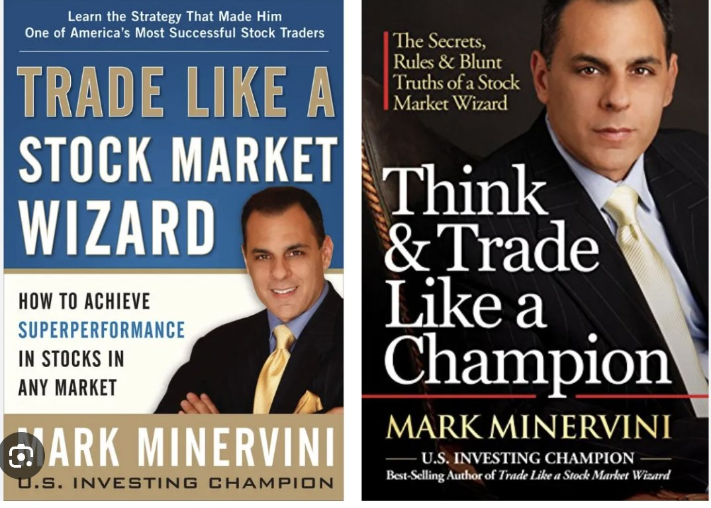
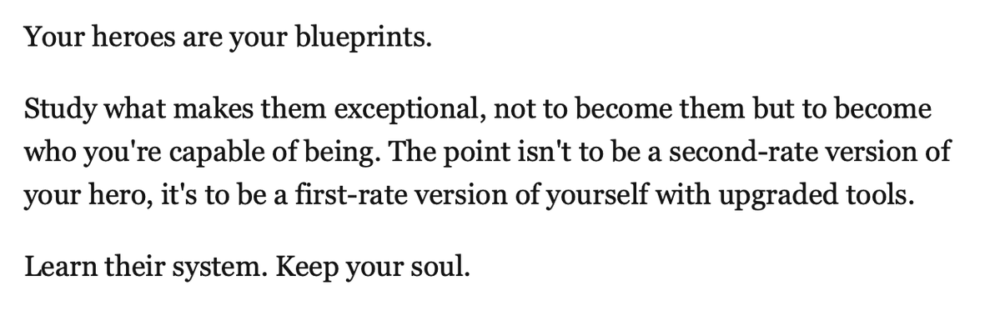

## Recommended Trading Resources

[Trader Lion Conference](https://x.com/VVVStockAnalyst/status/1949704716134351330)

Announcement 📣

Rather than burning your hands in such poor market conditions.

Spend your time learning in and out about Institutional buying with more than 10 examples to help you visualise them.

From 3:13:03 in TL Conference

Link: https://www.youtube.com/live/MKUjsaGE8wk

[1.5 hours Presentation](https://x.com/VVVStockAnalyst/status/1954870642920341575)

If you are serious about Trading and want to change your life, get really serious about it and treat it like a business.

Here is my 1.5 hours Presentation that includes tons of learnings that can help you super perform

Link : https://vvvlearn.com/blog

[Book Recommendation](https://x.com/VVVStockAnalyst/status/1947861730178068970)

If you want to read only 2 books about the stockmarket to learn about trading.

It's just these two.

The 2 legendary books by @markminervini
- They are the absolute beast books to start your understanding about the stock market and Swing trading.

[Champion Trader](https://x.com/VVVStockAnalyst/status/1955138833844208078)

How to become a Champion Trader : The Complete Guide

To everyone thinking of becoming a Champion Trader and stepping into the world of stockmarkets with a dream & desire to become Rich

Here is they way to do it professionally with longevity.

Link: https://vvvlearn.com/post/how-to-become-a-champion-trader

[Free Swing Trading Learning Content](https://x.com/VVVStockAnalyst/status/1966118405070524778)

There is 3.5 hours of High Quality Swing Trading Learning Content for FREE inside my website that can substantially improve the Quality of your returns & performance.

Link : http://vvvlearn.com/blog

This is exactly what I have used to generate superior performance in Swing trading over the last 5 years consistently beating the SmallCap index every year substantially and maintaining very low drawdowns throughout.

[Taking cues from heroes](https://x.com/VVVStockAnalyst/status/1961000167320027186)

Your heroes are your blueprints.

I took many cues from Minnervini, O'Neil and many other legends and finally brought in my own touch to the game.

The waiting game is something I have mastered and am very proud of. That was obtained from Darvas

[Dan Zanger Quote](https://x.com/VVVStockAnalyst/status/1941047374173909299)

This single Quote from Dan Zanger Changed my life.

Dan Zanger turned 10k dollars to 18M in the fastest time.

I stopped sitting in stocks that broke out and spend days and weeks there, it should move the moment it breaks out.

Few understand this magic formula but those who do will do really well in Trading.

