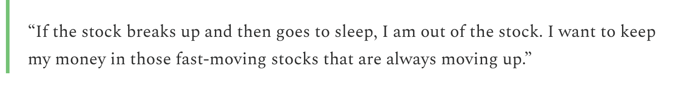
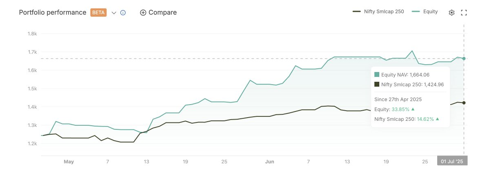
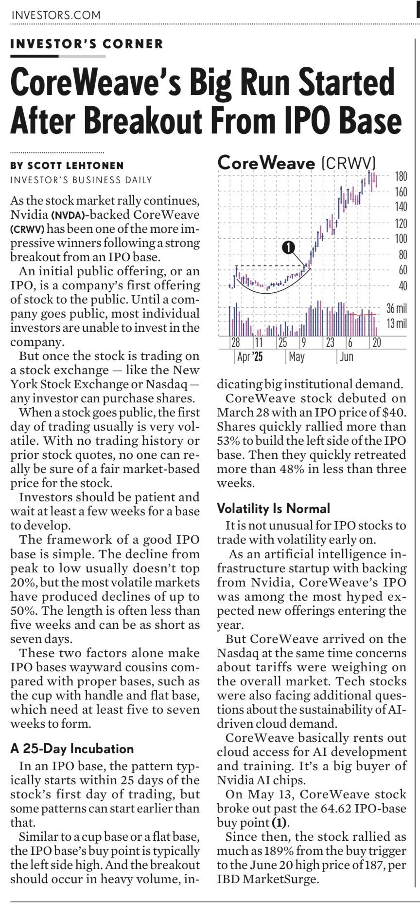
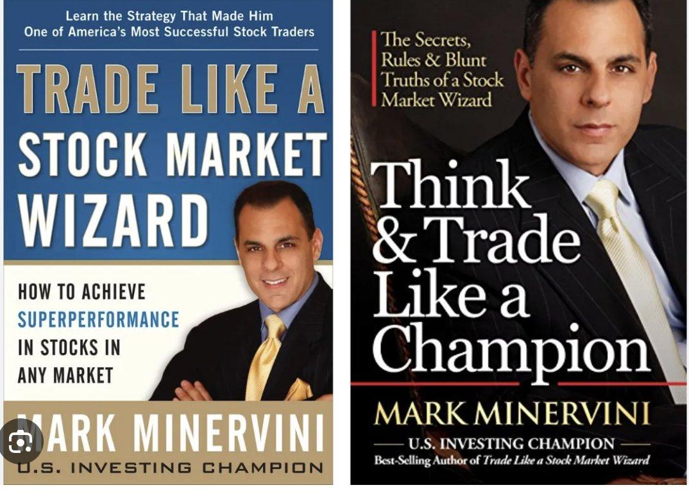
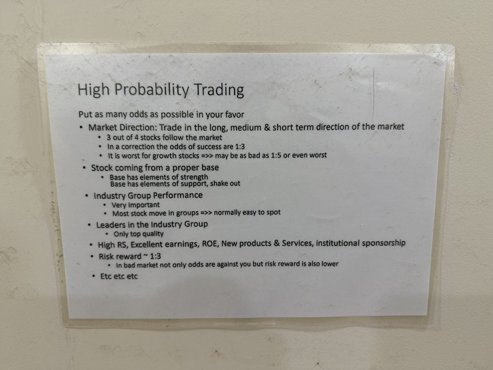
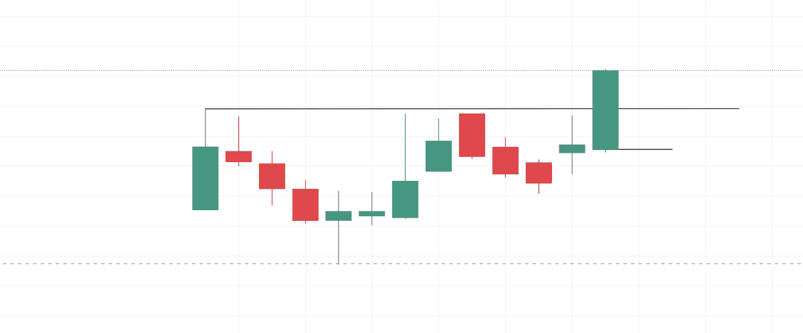
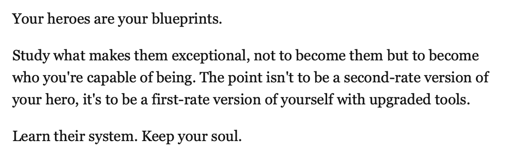
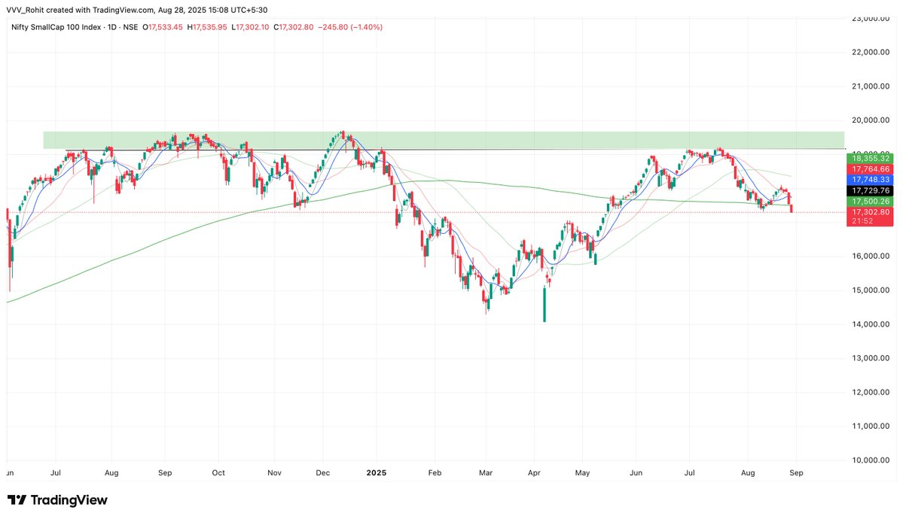

# **Rohit Vault**

## [Rohit RK aka Volatility Volume and Value](https://x.com/VVVStockAnalyst)

[Earning Charts](https://x.com/VVVStockAnalyst/status/1933178361918222553)

Start doing High RS Screening, stocks that resist this fall. They are your next winners

#VVVTip

[Highly Liquid](https://x.com/VVVStockAnalyst/status/1931288884794753533)

Choosing just highly liquid leading stocks with very clean and linear moves, good attitude after each past breakout and belonging to the leading sector is the easiest way to become rich in swing trading in Indian Markets.

[Dan Zanger Quote](https://x.com/VVVStockAnalyst/status/1941047374173909299)

This single Quote from Dan Zanger Changed my life.

Dan Zanger turned 10k dollars to 18M in the fastest time.

I stopped sitting in stocks that broke out and spend days and weeks there, it should move the moment it breaks out.

Few understand this magic formula but those who do will do really well in Trading.

[IPO Flags](https://x.com/VVVStockAnalyst/status/1940813584407449767)

I generally like IPO Flags. IPO bases are good but IPO Flags give powerful moves if they work.

Just see BAJAJ INDEF - What a clean move - It had a mix of Institutional Buying + Young IPO Base.

SCODA TUBES - Powerful Young IPO Flag structure

[Maintain Equity Curve](https://x.com/VVVStockAnalyst/status/1940261276598641094)

To maintain an equity curve for your PF like a Stage 2 stock always you need 3 things.

Large Profits
Small Profits ( To cut with small losses)
Small Losses

Avoid - Large Losses.

That's how you maintain flag ranges after the push ups.

[Making Money in Market](https://x.com/VVVStockAnalyst/status/1939542785293492674)

3 Things can make you money in the market.

Institutional Buying.
IPO Bases.
Sectoral Bets.

[Trader Lion Conference](https://x.com/VVVStockAnalyst/status/1949704716134351330)

Announcement 📣

Rather than burning your hands in such poor market conditions.

Spend your time learning in and out about Institutional buying with more than 10 examples to help you visualise them.

From 3:13:03 in TL Conference

Link: https://www.youtube.com/live/MKUjsaGE8wk

[Raging Bull Market](https://x.com/VVVStockAnalyst/status/1948645193609031865)

Trailing with moving averages alone works only for the Raging Bull Markets.

Indian markets have fooled or disguised traders in the last 4 years by acting textbook style with moves being longer and smoother making a false assumption in trader's minds that markets will remain like this forever.

The post Covid Era is just a period in Indian history of sporadic growth and excess liquidity flowing making things work really well. But to survive in this market being a trader for a very long time without getting emotionally tired one should definitely learn what works through periods of decades. We have done that research and knowing to adapt your selling is the most important thing that will help you survive in this markets for the longest period with the most clean equity curve.

[IPO Base](https://x.com/VVVStockAnalyst/status/1954464526482706667)

[1.5 hours Presentation](https://x.com/VVVStockAnalyst/status/1954870642920341575)

If you are serious about Trading and want to change your life, get really serious about it and treat it like a business.

Here is my 1.5 hours Presentation that includes tons of learnings that can help you super perform

Link : https://vvvlearn.com/blog

[When to step out](https://x.com/VVVStockAnalyst/status/1947881931594473721)

Watchlists are red, Indices are cracking the 20MA and the stocks are doing fake breakouts.

Only experienced know to notice it and step out, the rest will keep trading such markets.

Know when to step out.

[Book Recommendation](https://x.com/VVVStockAnalyst/status/1947861730178068970)

If you want to read only 2 books about the stockmarket to learn about trading.

It's just these two.

The 2 legendary books by @markminervini
- They are the absolute beast books to start your understanding about the stock market and Swing trading.

[Making and Keeping Money](https://x.com/VVVStockAnalyst/status/1947136953067155779)

The perfect recipe to making and keeping money in the stock market.

Knowing when to press the gas, and when to sit out sipping your tea is real knowledge.

Knowledge = Concepts + Experience + Practice.

[On My Wall](https://x.com/VVVStockAnalyst/status/1959849396985815236)

On my wall always since 3 years.

High Probability Trading

[Win Rate and Environment](https://x.com/VVVStockAnalyst/status/1958818358389842320)

The most important parameter for Swing trading for me is Win Rate and Environment

Even if a few stocks are doing 10-15% moves but that % win rate is too low. Im not trading such kind of markets.

I only want to play high win rate markets and environments. That's my game !

[Who I admire](https://x.com/VVVStockAnalyst/status/1958821658355278134)

A lot of you ask me, who is that one person who you respect a lot for their trading skill in twitter.

Only one man.
@KiranBhosale007

I have gone through almost everyone who is famous and I find no one having a verified PL success at all, just show a few trades here and there. No authenticity can be built. I really respect Kiran ji for the kind of returns he generated in the bull market. I have personally learnt from his trades and I find no one else who I can suggest to all of you as a super performance trader.

The one man I really respect very deeply and will be indebted to be connected to. No one else I feel has done such extraordinary performance that too in a verified way, people just talk big things, very less show proof of success !

[Clean Setup](https://x.com/VVVStockAnalyst/status/1957674058968903973)

If this is not called a clean setup, then what is clean ?

11% depth IPO Base.

[Champion Trader](https://x.com/VVVStockAnalyst/status/1955138833844208078)

How to become a Champion Trader : The Complete Guide

To everyone thinking of becoming a Champion Trader and stepping into the world of stockmarkets with a dream & desire to become Rich

Here is they way to do it professionally with longevity.

Link: https://vvvlearn.com/post/how-to-become-a-champion-trader

[Learn About Trading](https://x.com/VVVStockAnalyst/status/1849106956335919361)

The best places to learn about Trading

1. Books - Minnervini and O Neil
2. Youtube videos of Kullamagie

[Taking cues from heroes](https://x.com/VVVStockAnalyst/status/1961000167320027186)

Your heroes are your blueprints.

I took many cues from Minnervini, O'Neil and many other legends and finally brought in my own touch to the game.

The waiting game is something I have mastered and am very proud of. That was obtained from Darvas

[Game of Probability](https://x.com/VVVStockAnalyst/status/1961000661291827551)

Indices cracking below the 200MA today, was already just staying in cash since the last 45 + days majorly and I'm continuing to do the same.

Stock Market is a game of probability, not a game of fancy setups and breakouts.

If you are trying everyday, you really need to learn probability as a founding concept in Stock Trading

