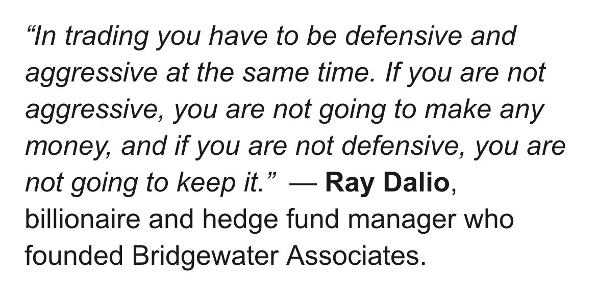

# **Rohit Vault**

## [Rohit RK aka Volatility Volume and Value](https://x.com/VVVStockAnalyst)


## Scanning Criteria

[Earning Charts](https://x.com/VVVStockAnalyst/status/1933178361918222553)

Start doing High RS Screening, stocks that resist this fall. They are your next winners

#VVVTip

[Net New Highs](https://x.com/VVVStockAnalyst/status/1965035190662861227)

The Net New Highs are breaking out from a range that has been there since the last 6 months.

The good times are coming.


## Trading Style

[Highly Liquid](https://x.com/VVVStockAnalyst/status/1931288884794753533)

Choosing just highly liquid leading stocks with very clean and linear moves, good attitude after each past breakout and belonging to the leading sector is the easiest way to become rich in swing trading in Indian Markets.

[IPO Flags](https://x.com/VVVStockAnalyst/status/1940813584407449767)

I generally like IPO Flags. IPO bases are good but IPO Flags give powerful moves if they work.

Just see BAJAJ INDEF - What a clean move - It had a mix of Institutional Buying + Young IPO Base.

SCODA TUBES - Powerful Young IPO Flag structure


[Maintain Equity Curve](https://x.com/VVVStockAnalyst/status/1940261276598641094)

To maintain an equity curve for your PF like a Stage 2 stock always you need 3 things.

Large Profits
Small Profits ( To cut with small losses)
Small Losses

Avoid - Large Losses.

That's how you maintain flag ranges after the push ups.


[Making Money in Market](https://x.com/VVVStockAnalyst/status/1939542785293492674)

3 Things can make you money in the market.

Institutional Buying.
IPO Bases.
Sectoral Bets.

[IPO Base](https://x.com/VVVStockAnalyst/status/1954464526482706667)


[Win Rate and Environment](https://x.com/VVVStockAnalyst/status/1958818358389842320)

The most important parameter for Swing trading for me is Win Rate and Environment

Even if a few stocks are doing 10-15% moves but that % win rate is too low. Im not trading such kind of markets.

I only want to play high win rate markets and environments. That's my game !

[Losing small 10 times](https://x.com/VVVStockAnalyst/status/1971446845399310699)

This game is about losing small 10 times & Winning big 3-4 times.

Using a small stoploss let's you achieve the math behind super performance.

10 failed trades of 3% SL @ 10% PS costs you 3% of PF
3 Successful trades @ 10PS of 10% gain gets that back.

I'm calculating really low win rate of 3/13 win trades, the more you improve using selection criteria, the game keeps getting better !

## Recommended Trading Resources

[Trader Lion Conference](https://x.com/VVVStockAnalyst/status/1949704716134351330)

Announcement 📣

Rather than burning your hands in such poor market conditions.

Spend your time learning in and out about Institutional buying with more than 10 examples to help you visualise them.

From 3:13:03 in TL Conference

Link: https://www.youtube.com/live/MKUjsaGE8wk


[1.5 hours Presentation](https://x.com/VVVStockAnalyst/status/1954870642920341575)

If you are serious about Trading and want to change your life, get really serious about it and treat it like a business.

Here is my 1.5 hours Presentation that includes tons of learnings that can help you super perform

Link : https://vvvlearn.com/blog


[Book Recommendation](https://x.com/VVVStockAnalyst/status/1947861730178068970)

If you want to read only 2 books about the stockmarket to learn about trading.

It's just these two.

The 2 legendary books by @markminervini
- They are the absolute beast books to start your understanding about the stock market and Swing trading.


[Champion Trader](https://x.com/VVVStockAnalyst/status/1955138833844208078)

How to become a Champion Trader : The Complete Guide

To everyone thinking of becoming a Champion Trader and stepping into the world of stockmarkets with a dream & desire to become Rich

Here is they way to do it professionally with longevity.

Link: https://vvvlearn.com/post/how-to-become-a-champion-trader


[Free Swing Trading Learning Content](https://x.com/VVVStockAnalyst/status/1966118405070524778)

There is 3.5 hours of High Quality Swing Trading Learning Content for FREE inside my website that can substantially improve the Quality of your returns & performance.

Link : http://vvvlearn.com/blog

This is exactly what I have used to generate superior performance in Swing trading over the last 5 years consistently beating the SmallCap index every year substantially and maintaining very low drawdowns throughout.


[Taking cues from heroes](https://x.com/VVVStockAnalyst/status/1961000167320027186)

Your heroes are your blueprints.

I took many cues from Minnervini, O'Neil and many other legends and finally brought in my own touch to the game.

The waiting game is something I have mastered and am very proud of. That was obtained from Darvas


[Dan Zanger Quote](https://x.com/VVVStockAnalyst/status/1941047374173909299)

This single Quote from Dan Zanger Changed my life.

Dan Zanger turned 10k dollars to 18M in the fastest time.

I stopped sitting in stocks that broke out and spend days and weeks there, it should move the moment it breaks out.

Few understand this magic formula but those who do will do really well in Trading.


[Raging Bull Market](https://x.com/VVVStockAnalyst/status/1948645193609031865)

Trailing with moving averages alone works only for the Raging Bull Markets.

Indian markets have fooled or disguised traders in the last 4 years by acting textbook style with moves being longer and smoother making a false assumption in trader's minds that markets will remain like this forever.

The post Covid Era is just a period in Indian history of sporadic growth and excess liquidity flowing making things work really well. 
But to survive in this market being a trader for a very long time without getting emotionally tired one should definitely learn what works through periods of decades. 
We have done that research and knowing to adapt your selling is the most important thing that will help you survive in this markets for the longest period with the most clean equity curve.

[When to step out](https://x.com/VVVStockAnalyst/status/1947881931594473721)

Watchlists are red, Indices are cracking the 20MA and the stocks are doing fake breakouts.

Only experienced know to notice it and step out, the rest will keep trading such markets.

Know when to step out.


[Making and Keeping Money](https://x.com/VVVStockAnalyst/status/1947136953067155779)

The perfect recipe to making and keeping money in the stock market.

Knowing when to press the gas, and when to sit out sipping your tea is real knowledge.

Knowledge = Concepts + Experience + Practice.



[On My Wall](https://x.com/VVVStockAnalyst/status/1959849396985815236)

On my wall always since 3 years.

High Probability Trading


[Who I admire](https://x.com/VVVStockAnalyst/status/1958821658355278134)

A lot of you ask me, who is that one person who you respect a lot for their trading skill in twitter.

Only one man.
@KiranBhosale007


I have gone through almost everyone who is famous and I find no one having a verified PL success at all, just show a few trades here and there. No authenticity can be built. I really respect Kiran ji for the kind of returns he generated in the bull market. I have personally learnt from his trades and I find no one else who I can suggest to all of you as a super performance trader.

The one man I really respect very deeply and will be indebted to be connected to. No one else I feel has done such extraordinary performance that too in a verified way, people just talk big things, very less show proof of success !

[Clean Setup](https://x.com/VVVStockAnalyst/status/1957674058968903973)

If this is not called a clean setup, then what is clean ?

11% depth IPO Base.


[Learn About Trading](https://x.com/VVVStockAnalyst/status/1849106956335919361)

The best places to learn about Trading

1. Books - Minnervini and O Neil
2. Youtube videos of Kullamagie


[Game of Probability](https://x.com/VVVStockAnalyst/status/1961000661291827551)

Indices cracking below the 200MA today, was already just staying in cash since the last 45 + days majorly and I'm continuing to do the same.

Stock Market is a game of probability, not a game of fancy setups and breakouts.

If you are trying everyday, you really need to learn probability as a founding concept in Stock Trading


[Prior Strong Uptrend](https://x.com/VVVStockAnalyst/status/1963891630408106160)

4 Positions Open today and what is common with everything.

Prior Strong Uptrend.

Even if 1000 people say me to look at stocks in a downtrend, I'll ignore all of them and only look at stocks in a prior uptrend.

Winning Formula


The Weekly charts of each of the above trade looks like this.


[Free CTMP Lecture](https://x.com/VVVStockAnalyst/status/1963586331956633738)

🚨Announcement

You can now watch the First lecture of CTMP 2025 as a free TRIAL where you will learn about the Journey to successful Swing Trading, Concept of Candle Sticks & Closing

A 2 hour power-packed session at http://vvvlearn.com

Signup -> CTMP 2025 -> Click Start FREE Trial

You can watch in EDGE browser - Windows & Safari Browser in Mac.


[Equiallocation on sectoral stocks](https://x.com/VVVStockAnalyst/status/1966369455803609588)

Went Equiallocation on few Large Cap Defence names.

4 names with 4% allocation each. Thematic Swing trading begins.

Disc: This is not a Buy/Sell Recomendation, If you copy my trades, you will lose your money.


Position Sizing here. 4% each name Equiallocation


```
Whenever a sector moves, I never try to be oversmart only attempting one name. I pick a basket as usual among the good names. 
That's how i have been a part of most strong rallies without being left out !
```

[Don't Read Too Many Books](https://x.com/VVVStockAnalyst/status/1966391998476411288)

To anyone asking me for resources to become a Champion Swing Trader - Here you go.

Don't read too many books and confuse yourself. Read Mark Minnervini & O Neil books. That's more than enough.

Then take all the winners of the Indian Market in the last 5 years and study every move in depth and take notes.

You will learn so much more from this activity rather than expanding your reading in books.


[Low Free Float Easily Manipulated](https://x.com/VVVStockAnalyst/status/1964943263724638520)

To the many talking about KIOCL, I absolutely will not touch such stocks. It feels fully manipulated to me all the time it breakouts.

It has a MCAP of 20000Cr. which makes people feel its a large stocks but it has a mere "200 Cr" Free float which is why it moves erratically when people post about it. 
That's a kind of stock that can be moved by a gang of retail and i feel Institutions dont even come there for long run,its just volume based entries and scalping

https://x.com/VVVStockAnalyst/status/1969003753828163703
The answer is simple.

Do the same thing 1000 times.
I have traded the same setup probably 100's of times and you really know how to judge when things are working.

Fear the man who has practiced the same kick 1000 times. That's what I would suggest to everyone, practice one setup to excellence.

Rules and experience. Have been doing this everyday. This is my bread and butter setup - Institutional buying and IPO
```
How the hell you scale so well?

Are there some rules you follow before taking some more exposure?

Or it’s based on gut and a bit of your stocks in profit?
```


https://x.com/VVVStockAnalyst/status/1968238662640132345

I'm in 100% Cash in a uptrend. You might feel I'm missing out on moves, but I don't think so.

Yes. I need feedback, I need many names to work smoothly and swiftly, without which I cannot trade confidently in large size, and conversely trading small sizes makes no impact on PF


https://x.com/VVVStockAnalyst/status/1968238044479381617

Going home with 100% Cash. Absolutely weak markets that is definitely something I personally being a very aggressive momentum trader cannot trade. I need more push everywhere and more success rate %.

Tried to initiate a few small positions but there was no strength anywhere.

Had a loss of 47k ( <0.1% PF) Impact in those small attempts to initiate a position.

Absolutely no strength and failure of BO is all I can look at.

Closed the small left over Moschip also.


https://x.com/VVVStockAnalyst/status/1968192572766966198

Focusing on just the names I had posted earlier the day. Not having a very broad list to focus as i cant concentrate and build large positions then.

For me everything is SIZING UP BIG with very SMALL RISK.

And even if one of the names work really well, Ill make a big push in PF


https://x.com/VVVStockAnalyst/status/1968180762550865977

Another very highly liquid name that gave a recent entry out of the large base and now is in process of forming a very nice OTB setup here.

Disc: Not a buy/sell recomendation


https://x.com/VVVStockAnalyst/status/1967840727796269453


The Complete Checklist apart from Indices that you should be considering to judge overall market conditions.

If you are looking at just the Indices moving up and starting to increase your exposure in this market, that wouldn't be prudent.

The Breadth is declining, thrust is missing, probability of stocks working is really low on D-1 and even if they do, the follow throughs are still missing. No sectoral pocket of strength is visible.

Make sure you also take feedback from recent trades about how the market is and how big is your executable watchlist. All of these matter a lot for performance


https://x.com/VVVStockAnalyst/status/1967432435479790073

Legend Quallamagie shares golden nuggets.

Read if you want to change your trading career.


https://x.com/VVVStockAnalyst/status/1966825533490299162

Selling Rules and learning the art of optimally adjusting selling rules with respect to market conditions is 10X more important than Buying Rules and Entry.

#VVVTip

https://x.com/VVVStockAnalyst/status/1966528094787047646

Our Valvo Sector Dashboards clearly signified today morning with leading positions for Defence in all our counters.

#1 in 20MA
#3 in 50MA
#1 in 200MA

The Verdict is clear for us. Very systematic, less opinions.


https://x.com/VVVStockAnalyst/status/1966524858231349492

After a large Uptrend in the Mar-July period of 81%, the whole sector went through a regular pullback

You heard me right, the whole defence sector went up by almost 80% altogether and now seems like the next upmove is starting, Im positioned myself today with almost 25% in the Defence names with a tight stop.

Right when the SmallCap indices are looking like they are coming above the MA's, the defence sector as a whole is taking leadership. Something great to watch so far and if they all give the essential follow through, that's definitely something very positive as a sector as multiple upmoves will be possible in many names.

I made almost 60% of this year's profits from Defence rally in that season. It's always easy for me to play Liquid names that setup as a sector on a whole rather than individual names.

Disc: This is not a Buy/Sell Reco and is just for educational purposes.


Market Breadth is improving strongly even though the NNH has still not shown positive growth.

Defence seems to be the sector picking up steam with the smallcaps attempting to move above the KMA's


https://x.com/VVVStockAnalyst/status/1966418136942731731

Stock trading is by far the hardest profession in town.

There is nothing called easy money, money here comes after putting years of hardwork with 10hr+ days learning and backtesting.

Never Ever leave your job to become a full time trader unless you reach a very big PF size.

Don't ever think of this as some easy side business, only if you are ready to put in so much hardwork, money can be made and only the most serious of traders can ever make money here.

It's a 2% winners game. Only 2% of traders make consistent money, be very careful

Also anything more than 20-25% is not possible every year in swing trading except the bull markets. So keep expectations in check always and no one can expect too high returns and if you do you will lose everything you have

https://x.com/VVVStockAnalyst/status/1966062042357592442

The Probable reason Data based that can be attributed to why breakouts are not working well

With indices moving higher slowly, the NNH is going down, clearly which means that market health is bad but just masked by Indices


New Highs - QPOWER

Clean Stage 2 bases do clean moves.


https://x.com/VVVStockAnalyst/status/1964972865847189840

The market is still not ready for a easy money environment. Select high liquid setups are working and even in that the follow throughs are still not very evident.

Im having 4 open positions with 35.7% of PF invested now. This is after almost 60 days of inactivity

https://x.com/VVVStockAnalyst/status/1963953626571038845

Happy Teachers day to my Mentor @markminervini, I first found his books, read them in 2020 fell in love with the concepts. I have never seen you or met you. 
Would love to definitely meet you once for all that you have done by imparting all the knowledge through books and lectures.

Thanks a lot Mark for paving my career in the stockmarket, you and William O Neil are actually the 2 people because of whom, Im doing what I do.

Grateful

https://x.com/VVVStockAnalyst/status/1963516639863087423

To everybody wanting to catch Ola Electric and many other subsequent stocks in a downtrend, here is my message

You cant capture all the moves happening in the market, focus on 1 setup/strategy, master it, and when it's time for that strategy don't hit singles but smash SIXES


https://x.com/VVVStockAnalyst/status/1963484380539785448

My Portfolio Returns curve v/s SmallCap 250

For almost 2 months now, it's a absolute flat line.

FY26 returns at 31.5% v/s SmallCap Index @ 5.81%

A 25% Outperformance and not giving back anything by doing "Nothing"

Once market gets good, one more sharp rise in my curve


https://x.com/VVVStockAnalyst/status/1962026309275861343


https://x.com/VVVStockAnalyst/status/1961000661291827551

Indices cracking below the 200MA today, was already just staying in cash since the last 45 + days majorly and I'm continuing to do the same.

Stock Market is a game of probability, not a game of fancy setups and breakouts.

If you are trying everyday, you really need to learn probability as a founding concept in Stock Trading


https://x.com/VVVStockAnalyst/status/1960252469222789239

Go through the last 25 stock breakouts that happened in the last 5-6 days

All of them have by far failed and come back even below the Pivot Buy Point.

https://x.com/VVVStockAnalyst/status/1959862080816992756

To everyone screaming about the few breakouts happening

Are they holding on Day 2
Are you able to book a handy gain

Think about all these, all names are returning back even before giving a solid 10% move from pivot.

https://x.com/VVVStockAnalyst/status/1959825813400179155

In the last 173 trading days, I traded with more than 50% of my Capital invested only for 23 days.

Totally traded only for 46 days ( Majorly Small Testing )

I'm up 33% in FY26 and had just 3.3% drawdown in Jan to March 2025.

#VVVTip

https://x.com/VVVStockAnalyst/status/1959183671036170315

Only 4 trades contribute to 90% of my profits this FY26

FY 26 gains at 33.7%

1. RPOWER
2. GRSE
3. COCHIN
4. APOLLO MICRO
5. KITEX

Forget doing too many trades, pareto principle works so fine in Swing trading.

Rest of the times, do nothing, in good times smash BIG


Here is the Video of
@KiranBhosale007
about whom my last post was fully about where he explains everything he does.

Please subscribe to Ankur Patel's youtube channel without fail as some great interviews are available.

Here is the video : https://www.youtube.com/watch?v=QXve5QBA5jY


https://x.com/VVVStockAnalyst/status/1958818358389842320

The most important parameter for Swing trading for me is Win Rate and Environment

Even if a few stocks are doing 10-15% moves but that % win rate is too low. Im not trading such kind of markets.

I only want to play high win rate markets and environments. That's my game !

https://x.com/VVVStockAnalyst/status/1958772996908433848

Concept Clarity Check Questions

Comment the right answers for these Questions

 


https://x.com/VVVStockAnalyst/status/1958460986643693824

Squat Ratio which is very essential to understand the health of the market which is still poor.
The Follow through ratio is also really pathetic.

Squat % = 83%
FT % = 8%

Pathetic numbers so far !

Just a few moves here and there are present, and index is kind of reversing !

https://x.com/VVVStockAnalyst/status/1958059109997019390

Really got lucky by not trying Hirect and TI even though it was among the clean Institutional Buying Setups

The fall was brutal and its a reminder that when market environment is bad, such pathetic BO failures occur. Staying with more liquid names can help avoid such cracks

https://x.com/VVVStockAnalyst/status/1957340063672459353

Observe the downward curve in SmallCap 250 v/s My flat equity curve.

Relative strength is not only for stocks, it's also for your Equity curve and portfolio.

```
This is how the curves are for your understanding between my Equity curve and the Smallcap 250 index.
```


https://x.com/VVVStockAnalyst/status/1957287588433142171

A Slide from CTMP 1.0 during the choppy markets of 2024 end before the January decline of 2025.

This has been my aim and that's a single reason for me to keep outperforming the markets.

The resilience to remain bored but still choosing to do nothing rather than gambling.


https://x.com/VVVStockAnalyst/status/1955595431133794483

How long does it take to become a successful trader ?

The quicker you want to, the longer you will take


https://x.com/VVVStockAnalyst/status/1955928544548438189

HPL Electric Power is another reminder to not gamble during earnings season.

20% down today.


https://x.com/VVVStockAnalyst/status/1955909763776369087


Feedbacks to your Watchlists are the most essential part in learning to Swing Trade.

We do it at a depth at CTC which makes every member understand from the comments and improve their selections over time.

Join us : http://vvvlearn.com


https://x.com/VVVStockAnalyst/status/1955903474841133235

The only EDGE that had a 25%+ win rate was Institutional Buying in this current market

But even in that EDGE - All stocks in WL are red and most breakouts of the last 2 days are coming back without even moving 10% from the pivot

Pathetic Environment continues.


https://x.com/VVVStockAnalyst/status/1955566492080283886

HBLPOWER

After 1.5 years of consolidation, this stock has finally pushed out of this large Supply zone with a lot of force & volume backed by strong results ( 79% EPS ) along with Kavach News acting as trigger.

Will be focusing on the next small base HBLPOWER forms to attack


```
Will be watching carefully for a small base formation in the coming days & weeks and pull my entry in such names with focus and LARGE sizes. 

Preparing for my hunt !
```

https://x.com/VVVStockAnalyst/status/1955537333807354124

Transrail was a good setup, many aksed me why I didnt buy it today.

So was Garuda 2 weeks ago

So was Sambhav 3 weeks ago

Why did they all squat or fail.

Environement >> Setups

```
Also if you are feeling its worth trying these names in such pathetic markets, you really dont know about risk reward and how to stay away from bad environments patiently
```


https://x.com/VVVStockAnalyst/status/1955516785903677643

Every small move in the markets doesn’t deserve your attention.

Wait for the easy money environment and play big !

https://x.com/VVVStockAnalyst/status/1955475648975343778

Good Morning Everyone. Hope all of you are doing great

No specific sector is showing strong relative strength in this correction yet.

Looking keenly, the best performing pharma is still having only 40% above the 50MA - Poor breadth in displaying strength.


This book changed my life when it comes to losing nothing in bad markets.

Just read the book cover, it summarises everything.


https://x.com/VVVStockAnalyst/status/1954075057229377576

The only magic you need for filtering good stock that give clean moves from the junk stocks that chop you in and out is called "Attitude of a Stock"

Solves 90% of your screening issues.

Train your eyes by going through all my past trades from my Handle and you will get it

https://x.com/VVVStockAnalyst/status/1975063797338624266

The legend Quallamagie has an average of 35% Win rate over his massive career

The Legend Mark Minervini had an average of 25-50% Win rate in his trading career.

Learn to ingest the fact that only 3/10 of your trades could be winners over the long run.


https://x.com/VVVStockAnalyst/status/1974131052341076016

After spending 100s of hours studying all the past winners by simulating even the then present market environment & breakout success rates & generating super performance for the last 5 years consistently.

I can say one thing confidently.

You just need 2-5 weeks of extremely strong rally and breakout follow throughs to make all that you need for the year. Rest of the times just make sure your dabbling but never losing a lot. Keep the EC flat as long as possible for most part of the year and we can make a massive push in a small favourable period of the market which happens almost for a window of few weeks every year.

This is a lesson through my experience, so dont ever lose hope & you can make FY26 a massive performing year if you can wait patiently for that sweet easy money environment.

If you liked my perspective, comment & Like to let me know if you are able to resonate

