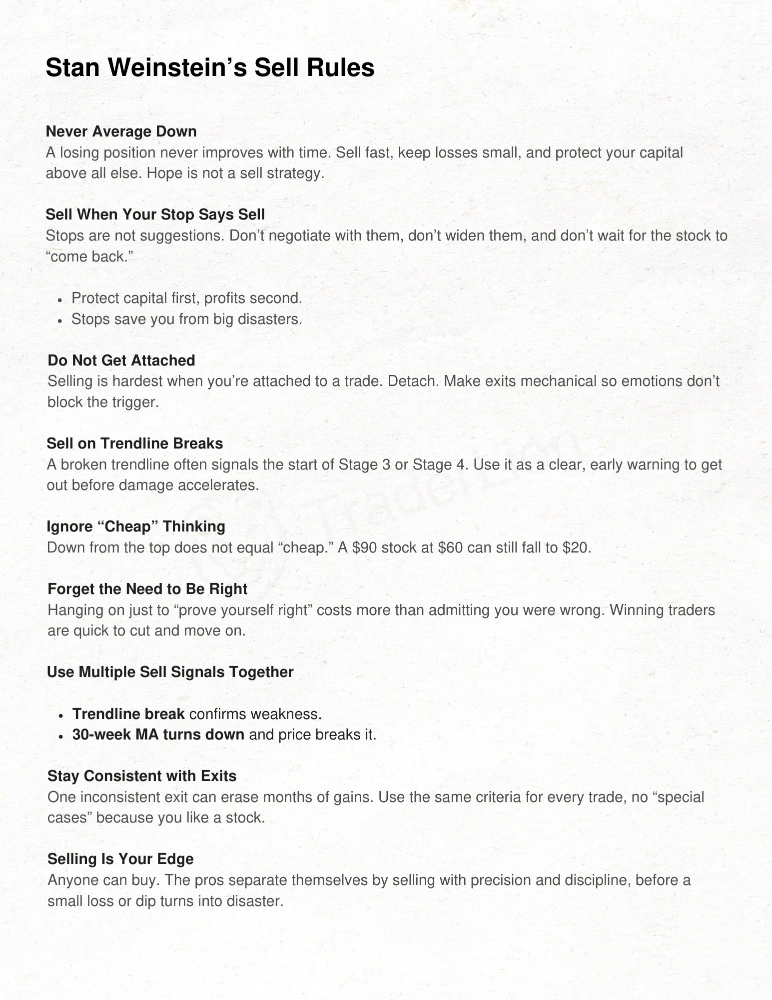
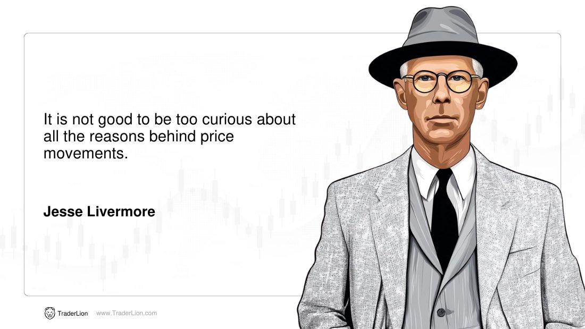
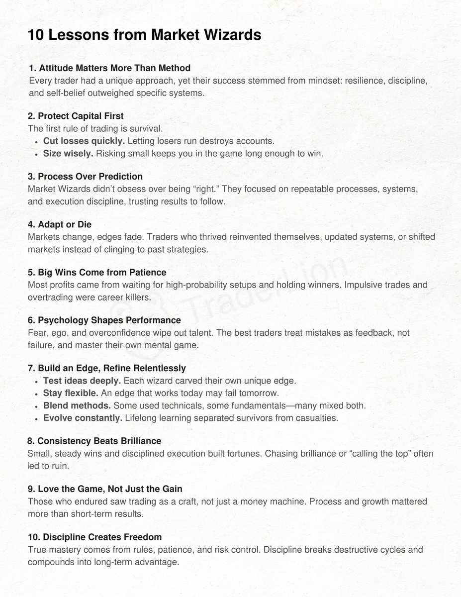
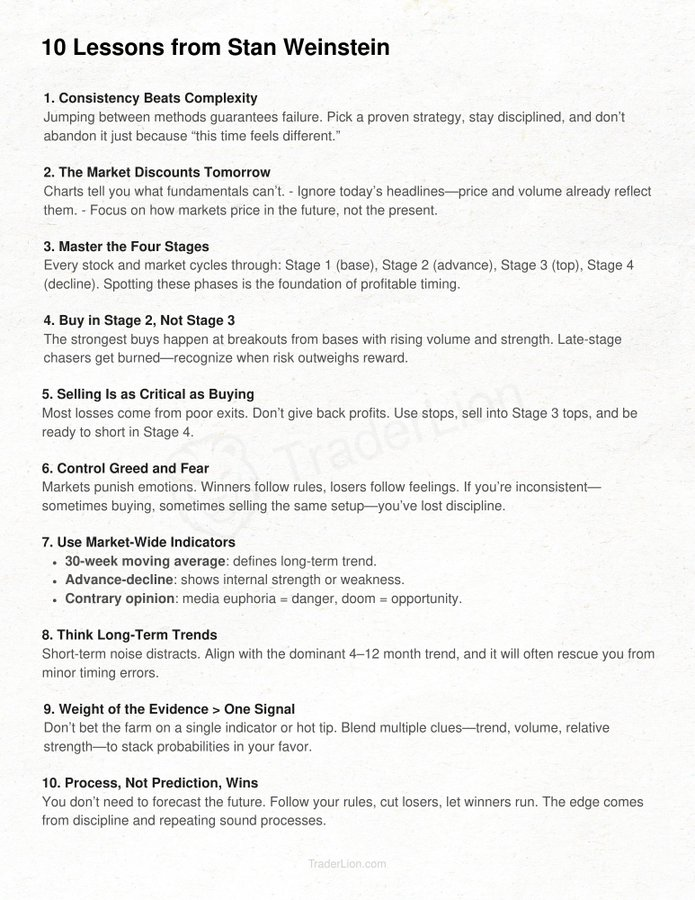
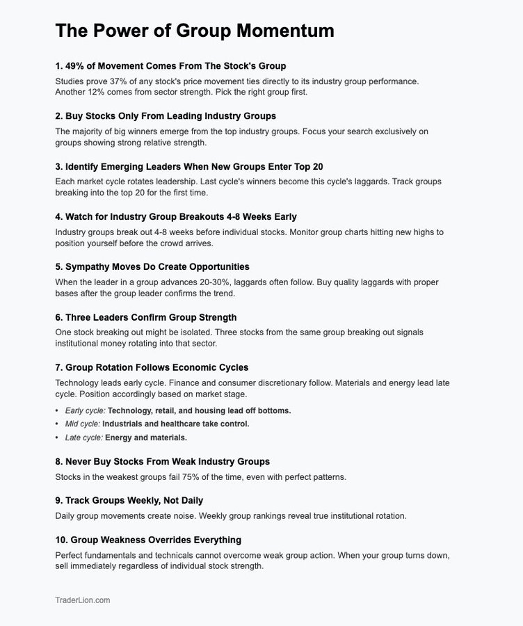

# **Trader Lion Vault**

## [Trader Lion](https://x.com/TraderLion_)
[Stan Weinstein’s sell rules](https://x.com/TraderLion_/status/1954586676409561268)

Stan Weinstein’s sell rules are a masterclass in keeping your gains

[Why Focused Traders Outperform @AmeetRai_](https://x.com/TraderLion_/status/1956330765895012552)

https://x.com/TraderLion_/status/1960366574939869449

https://x.com/TraderLion_/status/1957467682959188277

https://x.com/TraderLion_/status/1957467682959188277

The top 10 lessons from Market Wizards by Jack Schwager

[Stan Weinstein System](https://x.com/TraderLion_/status/1966458332408844735)

Decades later, traders still follow Stan Weinstein.

His system is simple, repeatable, and still works today.

Here is his blueprint:

https://x.com/TraderLion_/status/1973736592885030974

William O'Neil's studies show finding winning stocks is easier when you filter by group strength first.

https://x.com/TraderLion/status/2001767246348140626

If you are not aggressive, you are not going to make money, and if you are not defensive, you are not going to keep money.

– Ray Dalio